# Interface for the Communication between Mobile Robots and a Fleet Control

## VDA 5050

## Version 3.0.0 - Release Candidate (not released by the VDA)


### Brief information

Definition of a communication interface for driverless transport systems (DTS).
This recommendation describes the communication interface for exchanging information between a central fleet control and mobile robots.


### Disclaimer

The following explanations serve as an indication for the execution of an interface for communication between mobile robots and a fleet control. It is meant to be freely applicable to everyone and is non-binding.
Those who apply them shall ensure that they are applied properly in the specific case.

They shall take into account the state of the art prevailing at the time of each issue.
By applying the proposals, no one is evasive of responsibility for their own actions.
The statements do not claim to be exhaustive or to the exact interpretation of the existing legislation.
They may not replace the study of relevant policies, laws and regulations.
Furthermore, the special features of the respective products as well as their different possible applications shall be taken into account.
Everyone acts at their own risk in this regard.
Liability of the VDA and those involved in the development or application of the proposals is excluded.

If you encounter any inaccuracies in the application of the proposals or the possibility of an incorrect interpretation, please inform the VDA immediately so that any defects can be rectified.

**Publisher**
Verband der Automobilindustrie e.V. (VDA)
Behrenstraße 35, 10117 Berlin,
Germany
www.vda.de

**Copyright**
Association of the Automotive Industry (VDA)
Reproduction and any other form of reproduction is only permitted with specification of the source.

Version 3.0.0


## Table of contents
[1 Foreword](#1-foreword)<br>
[2 Scope](#2-scope)<br>
  [2.1 Exclusions](#21-exclusions)<br>
  [2.2 Other applicable documents](#22-other-applicable-documents)<br>
  [2.3 Protocol version](#23-protocol-version)<br>
[3 Transport protocol (MQTT)](#3-transport-protocol-mqtt)<br>
  [3.1 Connection handling, security and QoS](#31-connection-handling-security-and-qos)<br>
  [3.2 Topic levels](#32-topic-levels)<br>
  [3.3 Topics for communication](#33-topics-for-communication)<br>
[4 Definitions](#4-definitions)<br>
[5 Process and content of communication](#5-process-and-content-of-communication)<br>
[6 Protocol specification](#6-protocol-specification)<br>
  [6.1 Order](#61-order)<br>
    [6.1.1 Concept and logic](#611-concept-and-logic)<br>
    [6.1.2 Orders and order updates](#612-orders-and-order-update)<br>
    [6.1.3 Order cancellation](#613-order-cancellation)<br>
    [6.1.4 Order rejection](#614-order-rejection)<br>
    [6.1.5 Corridors](#615-corridors)<br>
  [6.2 Actions](#62-actions)<br>
    [6.2.1 Instant actions](#621-instant-actions)<br>
    [6.2.2 Action blocking types and sequence](#622-action-blocking-types-and-sequence)<br>
    [6.2.3 Predefined actions](#623-predefined-actions)<br>
  [6.3 Maps](#63-maps)<br>
    [6.3.1 Map distribution](#631-map-distribution)<br>
    [6.3.2 Maps in mobile robot state](#632-maps-in-the-mobile-robot-state)<br>
    [6.3.3 Map download](#633-map-download)<br>
    [6.3.4 Enable downloaded maps](#634-enable-downloaded-maps)<br>
    [6.3.5 Delete maps on the mobile robot](#635-delete-maps-on-the-mobile-robot)<br>
  [6.4 Zones](#64-zones)<br>
    [6.4.1 Zone types](#641-zone-types)<br>
    [6.4.2 Zone set transfer](#642-zone-set-transfer)<br>
    [6.4.3 Communication for interactive zones](#643-communication-for-interactive-zones)<br>
    [6.4.4 Interaction between zones](#644-interactions-between-zones)<br>
    [6.4.5 Error handling within zones](#645-error-handling-within-zones)<br>
  [6.5 Connection](#65-connection)<br>
  [6.6 State](#66-state)<br>
    [6.6.1 Concept and logic](#661-concept-and-logic)<br>
    [6.6.2 Traversal of nodes and entering/leaving edges, triggering of actions](#662-traversal-of-nodes-and-enteringleaving-edges-triggering-of-actions)<br>
    [6.6.3 Base request](#663-base-request)<br>
    [6.6.4 Information](#664-information)<br>
    [6.6.5 Errors](#665-errors)<br>
    [6.6.6 Operating Mode](#666-operating-mode)<br>
    [6.6.7 Clearing the order](#667-clearing-the-order)<br>
    [6.6.8 Idle state of the mobile robot](#668-idle-state-of-the-mobile-robot)<br>	
    [6.6.9 Action states](#669-action-states)<br>
    [6.6.10 Request use of Corridors](#6610-request-use-of-corridors)<br>
  [6.7 Visualization](#67-visualization)<br>
  [6.8 Sharing of planned paths for freely navigating mobile robots](#68-sharing-of-planned-paths-for-freely-navigating-mobile-robots)<br>
  [6.9 Request/response mechanism](#69-requestresponse-mechanism)<br>
    [6.9.1 Response for edge requests](#691-response-for-edge-requests)<br>
  [6.10 Factsheet](#610-factsheet)<br>
[7 Message specification](#7-message-specification)<br>
  [7.1 Symbols of the tables and meaning of formatting](#71-symbols-of-the-tables-and-meaning-of-formatting)<br>
    [7.1.1 Optional fields](#711-optional-fields)<br>
    [7.1.2 Permitted characters and field lengths](#712-permitted-characters-and-field-lengths)<br>
    [7.1.3 Notation of fields, topics and enumerations](#713-notation-of-fields-topics-and-enumerations)<br>
    [7.1.4 JSON data types](#714-json-data-types)<br>
  [7.2 Protocol header](#72-protocol-header)<br>
  [7.3 Implementation of the order message](#73-implementation-of-the-order-message)<br>
    [7.3.1 Format of action parameters](#731-format-of-action-parameters)<br>
  [7.4 Implementation of the instantAction message](#74-implementation-of-the-instantaction-message)<br>
  [7.5 Implementation of the response message](#75-implementation-of-the-response-message)<br>
  [7.6 Implementation of the zoneSet message](#76-implementation-of-the-zoneset-message)<br>
  [7.7 Implementation of the connection message](#77-implementation-of-the-connection-message)<br>
  [7.8 Implementation of the state message](#78-implementation-of-the-state-message)<br>
  [7.9 Implementation of the visualization message](#79-implementation-of-the-visualization-message)<br>
  [7.10 Implementation of the factsheet message](#710-implementation-of-the-factsheet-message)<br>


# 1 Foreword

The objective of this recommendation is to facilitate the integration and efficient operation of mobile robot fleets under the supervision of a centralized fleet control system. This is achieved through the implementation of a standardized, vendor-neutral communication interface that enables interoperability between the fleet control system and individual mobile robots.
The specification for this interface was jointly developed by the Verband der Automobilindustrie e.V. (VDA) and the VDMA e. V..
Stakeholders are invited to submit proposals for modifications or enhancements to the interface. Such proposals shall be submitted via the GitHub-Repository (https://github.com/vda5050/vda5050).

# 2 Scope
This document specifies a standardized, vendor-neutral communication interface between a fleet control system and individual mobile robots to:
- Reduce integration complexity when connecting mobile robots to a fleet control system.
- Enable heterogeneous fleet operation, allowing mobile robots from different manufacturers to operate collaboratively within a shared physical environment.
- Provide a generic toolkit applicable across diverse mobile robot configurations, including variations in navigation principles, mobile robot dimensions, load-handling or manipulation devices, and levels of autonomy.

The interface is designed to be independent of proprietary solutions and applicable across all domains where mobile robots are deployed.
The document also defines a foundational concept for coordinated multi-robot systems, serving as the basis for traffic management and specifying the required logic and expected behavior of mobile robots within such systems.

## 2.1 Exclusions
The following aspects are explicitly outside the scope and are not covered:
- Safety Requirements
	- This document does not constitute a safety standard.
- Traffic Management Logic
	- Strategies and algorithms for traffic control (e.g., routing, prioritization, deadlock resolution).
- Other Communication Interfaces
	- Interfaces beyond fleet control and mobile robots (e.g., peripheral devices, external IT systems)
- Project Coordination
	- Topics such as project management, integration processes, commissioning procedures, and acceptance criteria
- Operational Responsibilities
	- Allocation of responsibilities among operators, integrators, vehicle manufacturers, and fleet control suppliers for planning, operation, maintenance, and safety
- Cybersecurity Aspects
	- This document does not define how to ensure secure data exchange.

## 2.2 Other applicable documents

Document | Version | Description
---|---|---
VDI Guideline 2510 | October 2005 | Driverless transport systems (DTS)
VDI Guideline 4451 Sheet 7 | October 2005 | Compatibility of driverless transport systems (DTS) - Fleet control
ISO 9787 | May 2013 | Robots and robotic devices — Coordinate systems and motion nomenclatures 
DIN EN ISO 3691-4 | December 2023 | Industrial Trucks Safety Requirements and Verification-Part 4: Driverless trucks and their systems
LIF – Layout Interchange Format| March 2024 | Definition of a format of track layouts for exchange between the integrator of the driverless transport mobile robots and a (third-party) fleet control system.

>Table 1 Overview of other applicable documents

## 2.3 Protocol version

The protocol uses a semantic versioning schema.

Examples for major version changes (x.0.0):
- Breaking changes, e.g., new non-optional fields

Examples for minor version changes (3.x.0):
- New features like an additional optional parameter for visualization

Examples for patch version (3.0.x):
- Fixing of typos in the documentation

# 3 Transport protocol (MQTT)

Communication is expected to be done via wireless networks, considering the effects of connection failures and potential loss of messages.

The message protocol is Message Queuing Telemetry Transport (MQTT), which is to be used in combination with a JSON format.
MQTT 3.1.1 is the minimum required version for compatibility.
MQTT allows the distribution of messages to subchannels, which are called "topics".
Participants in the MQTT network subscribe to these topics and receive information that concerns them.

The JSON format allows for future extensions of the protocol with additional parameters as well as validation against schemas.

### 3.1 Connection handling, security and QoS

The MQTT protocol provides the option of setting a last will message for a client.
If the client disconnects unexpectedly for any reason, the last will is distributed by the broker to other subscribed clients.
The use of this feature is described in Section [6.8 Connection](#68-connection).

If the mobile robot disconnects from the broker, it keeps all the order information and fulfills the order up to the last released node.

To reduce the communication overhead, the MQTT QoS level 0 (Best Effort) shall be used for the topics `order`, `instantActions`, `state`, `factsheet`, `zoneSet`, `response` and `visualization`.

Protocol security needs to be taken into account by broker configuration, but is not addressed within this guideline.


### 3.2 Topic levels

The MQTT topic structure is not strictly defined due to the mandatory topic structure of cloud providers.
For a cloud-based MQTT broker the topic structure might have to be adapted individually, but it should roughly follow the proposed structure.
The topic names defined in the following sections are mandatory.

For a local broker the MQTT topic levels are suggested as followed:

**interfaceName/majorVersion/manufacturer/serialNumber/topic**

Example:
```
uagv/v2/KIT/0001/order
```

MQTT Topic Level | Data type | Description
---|---|---
interfaceName | string | Name of the used interface
majorVersion | string | Major version number of the VDA 5050 recommendation, preceded by "v"
manufacturer | string | Manufacturer of the mobile robot.
serialNumber | string | Unique mobile robot serial number consisting of the following characters: <br>A-Z <br>a-z <br>0-9 <br>_ <br>. <br>: <br>-
topic | string | Topic (e.g., order or state) see Section [3.1.3 Topics for Communication](#313-topics-for-communication)

>Table 2 Explanation of suggested MQTT topic levels

Note: Since the `/` character is used to define topic hierarchies, it shall not be used in any of the aforementioned fields.
Wildcard characters `+` and `#` as well as the character `$` that is reserved for broker internal topics should not be used either.

### 3.3 Topics for communication

The mobile robot protocol uses the following topics for information exchange between fleet control and mobile robot.

Topic name | Published by | Subscribed by | Used for | Implementation | Schema
---|---|---|---|---|---
order | fleet control | mobile robot | Communication of orders | mandatory | order.schema
instantActions | fleet control | mobile robot | Communication of the actions that are to be executed immediately | mandatory | instantActions.schema
state | mobile robot | fleet control | Communication of the mobile robot state | mandatory | state.schema
visualization | mobile robot | visualization systems | High frequency communication of position and planned path | optional | visualization.schema
connection | broker / mobile robot | fleet control | Indicates when mobile robot connection is lost. Not to be used by fleet control for checking the mobile robot health, added for an MQTT protocol level check of connection | mandatory | connection.schema 
factsheet | mobile robot | fleet control | Parameters or vendor-specific information to assist set-up of the mobile robot in fleet control | mandatory | factsheet.schema
zoneSet | fleet control | mobile robot | Transfer of zone sets from fleet control to the mobile robot | optional | zoneSet.schema
response | fleet control | mobile robot | Fleet control's responses to requests from within the mobile robot's state | optional | response.schema

>Table 3 Topics for communication between fleet control and mobile robot

# 4 Definitions

To ensure a common understanding across all stakeholders and implementations, this chapter defines key terms that are used throughout this document.

Term | Definition
---|---
Moving | Any change in the spatial position or orientation of the mobile robot or its components. This includes the motion of wheels, load handling devices, or the mobile robot body.
Driving | The mobile robot is considered to be driving when any component of its velocity vector (translational or rotational) is non-zero.
Automatic Driving | The mobile robot is driving without human intervention.
Manual Driving | The mobile robot is driving while under control of a human.

>Table 4 Definitions of terms used in this document


# 5 Process and content of communication

There are at least the following participants for the operation of DTS:

- The operator of the DTS provides basic information
- The fleet control organizes and manages the operation
- The mobile robot carries out the orders

Figure 1 describes the communication content during the operational phase.
During implementation or modification, the mobile robot and the fleet control are manually configured.


>Figure 1 - Structure of the information flow

During the implementation phase, the DTS consisting of fleet control and mobile robots is set up.
The necessary framework conditions are defined by the operator and the required information is either entered manually by them or stored in the fleet control by importing from other systems.
Essentially, this concerns the following content:

- Definition of routes:
Using the Layout Interchange Format (LIF), routes can be imported to the fleet control. The LIF is a file format of track layouts for exchange between the integrator of the driverless transport mobile robots and a (third-party) fleet control system (see Section [2.2 Other applicable documents](#22-other-applicable-documents)).
Alternatively, routes can also be implemented manually in the fleet control by the operator.
Routes can be one-way streets, restricted for certain mobile robot groups (based on the size ratios), etc.
- Route network configuration:
Within the routes, stations for loading and unloading, battery charging stations, peripheral environments (gates, elevators, barriers), waiting positions, buffer stations, etc. are defined.
- Mobile robot configuration: The physical properties of a mobile robot (size, available load carrier mounts, etc.) are stored by the operator.
The mobile robot shall communicate this information via the topic `factsheet` in a specific way that is defined in Section [7.10 Implementation of the factsheet message](#710-implementation-of-the-factsheet-message) of this document.

The configuration of routes and the route network described above are not part of this document.
They form the basis for enabling order control and driving course assignment by the fleet control based on this information and the transport requirements to be completed.
The resulting orders to be executed by the robotic fleet are then transferred to the individual mobile robots via an MQTT message broker. 
The mobile robot then continuously reports its status to the fleet control in parallel with the execution of the order.
This is also done using the MQTT message broker.

Functions of the fleet control are:
- Assignment of orders to the mobile robots
- Route calculation and guidance of line-guided mobile robots (taking into account the limitations of the individual physical properties of each mobile robot, e.g., size, maneuverability, etc.)
- Detection and resolution of blockages ("deadlocks")
- Energy management: Charging orders can interrupt transfer orders
- Traffic control: Buffer routes and waiting positions
- (Temporary) changes in the environment, such as freeing certain areas or changing the maximum speed
- Communication with peripheral systems such as doors, gates, elevators, etc.
- Detection and resolution of communication errors

Functions of the mobile robots are:

- Localization
- Execution of associated routes (line-guided or freely navigating)
- Execution of actions
- Continuous transmission of its status


# 6 Protocol specification

The following section describes the details of the communication protocol.
The protocol specifies the communication between the fleet control and the mobile robot.

## 6.1 Order

The topic `order` is the MQTT topic via which the mobile robot receives an order, containing instructions for the robot to move or execute actions.


### 6.1.1 Concept and logic

The core of a transport order is a node-edge-graph segment defining the route to be travelled.
The mobile robot is expected to traverse the nodes and edges to fulfill the order.
The full graph of all connected nodes and edges is held by fleet control.
Remark: An edge inside an order defines a logical connection between two nodes and not necessarily the (real) trajectory that a mobile robot follows when driving from the start node to the end node. For freely navigating mobile robots, this trajectory is calculated onboard at runtime and shared with fleet control through the `plannedPath` field of its state. For line-guided mobile robots, the trajectory that a mobile robot takes between the start and end nodes is either defined by fleet control via the `trajectory` edge attribute or assigned to the mobile robot as a predefined trajectory. Depending on the internal state of the mobile robot, the selected trajectory may vary.
The graph representation in the fleet control contains restrictions, e.g., which mobile robot is allowed to traverse which edge.
These restrictions will not be communicated to the mobile robot.
The fleet control only includes edges in a mobile robot order which the concerning mobile robot is allowed to traverse.

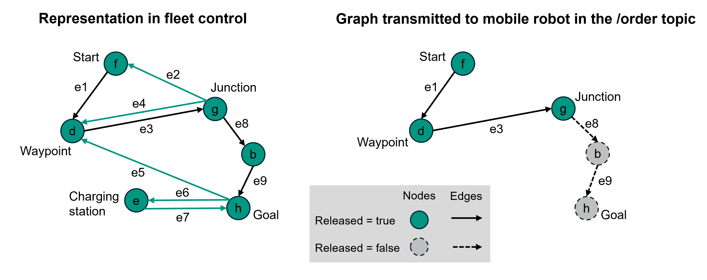
>Figure 3 - Graph representation in fleet control and graph transmitted in orders

The nodes and edges are passed as two lists in the order message.
The order of the nodes and edges within those lists also governs in which sequence the nodes and edges shall be traversed.

For a valid order, there shall be at least one node and the number of edges shall be equal to the number of nodes minus one.

The first node of an order (`sequenceId` = 0) shall be trivially reachable for the mobile robot and always be released.
This means either that the mobile robot is already standing on the node, or that the mobile robot is in the node's deviation range. As such, the first node shall not be reported in the `nodeStates`.

Nodes and edges both have a boolean attribute `released`.
If a node or edge is released, the mobile robot is expected to traverse it.
If a node or edge is not released, the mobile robot shall not traverse it.

An edge can be released only if both the start and the end node of the edge are released.

After an unreleased edge, no released nodes or edges can follow in the sequence.

The set of released nodes and edges are called the "base".
The set of unreleased nodes and edges are called the "horizon".

It is valid to send an order without a horizon.

An order message does not necessarily describe the full transport order.
For traffic control and to accommodate resource constrained mobile robots, the full transport order (which might consist of many nodes and edges) can be split up into many sub-orders, which are connected via their `orderId` and `orderUpdateId`.
The process of updating an order is described in the next section.


### 6.1.2 Orders and order update

To support traffic management, fleet control can split the path communicated via order into two parts:

- *"Base"*: This is the defined route that the mobile robot is allowed to travel. All nodes and edges of the base route have already been released by the fleet control for the mobile robot. The last node of the base is called decision point.
- *"Horizon"*: This is the route currently planned by fleet control for the mobile robot to travel after the decision point. The horizon route has not yet been released by the fleet control.

The mobile robot shall stop at the decision point if no further nodes and edges are added to the base. In order to ensure a fluent movement, the fleet control should extend the base before the mobile robot reaches the decision point, if the traffic situation allows for it.

Since MQTT is an asynchronous protocol and transmission via wireless networks is not reliable, the base cannot be changed. The fleet control shall therefore assume that the base has already been executed by the mobile robot. A later section describes a procedure to cancel an order, but this is also considered unreliable due to the communication limitations mentioned above.

The fleet control has the possibility to change the horizon by sending an updated route to the mobile robot which includes the changed list of nodes and edges. The procedure for changing the horizon route is shown in Figure 4.

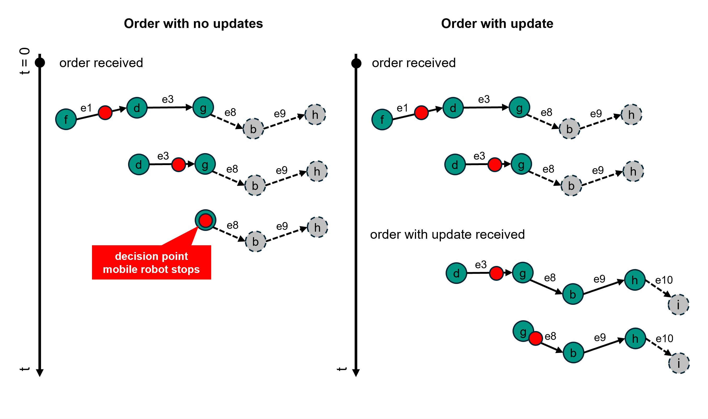
>Figure 4 - Procedure for expanding the driving route "Horizon"

In Figure 4, an initial order is first sent by the fleet control at time t = 0.
Figure 5 shows the pseudocode of a possible order.
For the sake of readability, a complete JSON example has been omitted here.

```
{
	orderId: "1234"
	orderUpdateId:0,
	nodes: [
	 	 f {released: true},
	 	 d {released: true},
	 	 g {released: true},
	 	 b {released: false},
	 	 h {released: false}
	],
	edges: [
		e1 {released: true},
		e3 {released: true},
		e8 {released: false},
		e9 {released: false}
	]
}
```
>Figure 5 Pseudocode of an order.

At a later point in time, the order is extended by sending an order update (see pseudocode in Figure 6).
Note that the `orderUpdateId` is incremented and that the first node of the order update corresponds to the last shared base node of the previous order message, the stitching node. The other nodes and edges from the previous base are not resent.

This ensures that the mobile robot can also perform the order update, i.e., that the first node of the order update is reachable by executing the edges already known to the mobile robot.

```
{
	orderId: "1234",
	orderUpdateId: 1,
	nodes: [
		g {released: true},
		b {released: true},
		h {released: true},
		i {released: false}
	],
	edges: [
		e8 {released: true},
		e9 {released: true},
		e10 {released: false}
	]
}
```
>Figure 6 Pseudocode of an order update. Note the change of the `orderUpdateId`.

This also aids in the event that an order update is lost (e.g., due to an unreliable wireless network).
The mobile robot can always check that the last known base node has the same `nodeId` (and `sequenceId`) as the first node of a new order update.

Also note that node g is the only base node that is sent again.
Since the base cannot be changed, a retransmission of nodes f and d is not valid.

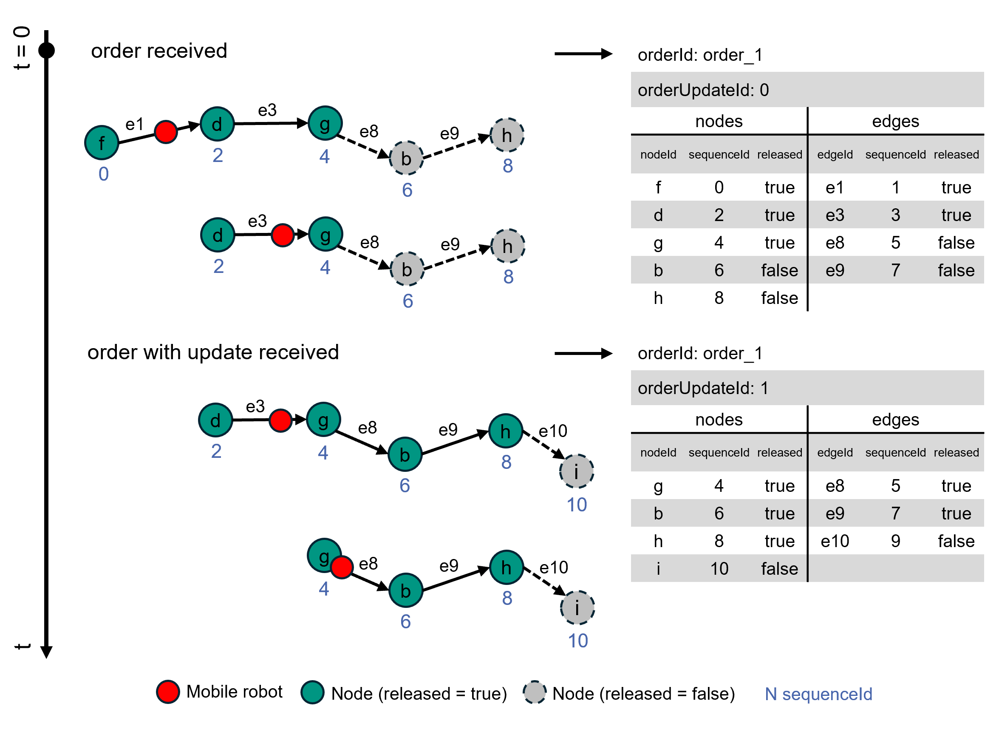
>Figure 7 - Regular update process - order extension.

Figure 7 describes how an order should be extended.
It shows the information that is currently available on the mobile robot.
The `orderId` stays the same and the `orderUpdateId` is incremented.

It is important that the contents of the decision point (node g in Figure 7) are not changed. This means actions, deviation range, etc., shall be resent (see Figure 8, `orderUpdateId` 1).
In order to release actions for the mobile robot to execute on a node it is already positioned on through an order update, the fleet control must re-send this node once with all meta-data (including potentially already 'FINISHED'/'RUNNING' actions) from the previous order update, which will not be executed again by the mobile robot, and then add a node with the now newly released actions to be executed with this order update. This node can have the same `nodeId` as the decision node or a different `nodeId` but the same position as the decision node. The `sequenceId` of the new node is always the `sequenceId` of the decision node plus 2.


>Figure 8 - Order update with additional stitching node (e.g., to execute new actions on decision point)

The horizon may be modified or deleted entirely with any order update, or the base may be extended in a way different from the previous horizon.

To allow loops in orders (like going from node a to b and then back to a) a `sequenceId` is assigned to the node and edge objects.
This `sequenceId` runs over the nodes and edges (first node of an order: `sequenceId` = 0, first edge: `sequenceId` = 1, second node: `sequenceId` = 2, and so forth).
This allows for easier tracking of the order progress.

Once a `sequenceId` is assigned and the node is released, it does not change with order updates (see Figure 7).
This is necessary to unambiguously refer to nodes of the order, as nodes may be contained more than once (e.g., when driving a circular path).

Figure 9 describes the process of accepting an order or order update.

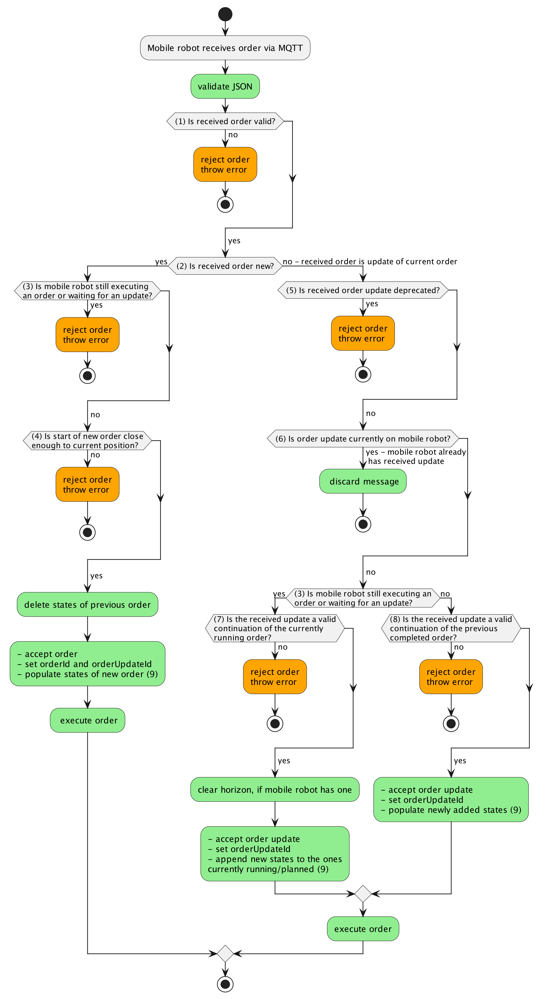
>Figure 9 - The process of accepting an order or order update.

1)	**is received order valid?**:
All formatting and JSON data types are correct?

2)	**is received order new or an update of the current order?**:
Is `orderId` of the received order different to `orderId` of order the mobile robot currently holds?

3)	**is mobile robot idle and not waiting for an update?**:
Is the mobile robot in an idle state according to [6.6.8 Idle state of the mobile robot](#668-idle-state-of-the-mobile-robot) and not waiting for an update? Since nodes and edges and the corresponding action states of the order horizon are also included inside the state, the mobile robot might still have a horizon and therefore is waiting for an update and executing an order.

4) **is start of new order close enough to current position?**:	Is the mobile robot already standing on the node, or is it in the node's deviation range ([6.1.1 Concept and logic](#611-concept-and-logic))?

5) **is received order update deprecated?**: Is `orderUpdateId` smaller than the one currently on the mobile robot?

6)	**is received order update currently on mobile robot?**: Is `orderUpdateId` equal to the one currently on the mobile robot?

7)	**is the received update a valid continuation of the currently still running order?**:	Is the first node of the received order the current decision point according to the order update chapter? The mobile robot is still moving or executing actions related to the base released in previous order updates or still has a horizon and is therefore waiting for a continuation of the order. In this case, the order update is only accepted if the first node of the new base is equal to the last node of the previous base.

8)	**is the received update a valid continuation of the previously completed order?**: Is the first node of the received order the current decision point according to the order update chapter? The mobile robot is not executing any actions anymore neither is it waiting for a continuation of the order (meaning that it has completed its base with all related actions and does not have a horizon). In this case, the order update is only accepted if the first node of the new base is equal to the last node of the previous base.

9)	populate/append new states to the `actionStates`/`nodeStates`/`edgeStates`.

#### 6.1.2.1 Finishing an order  

After the mobile robot has traversed the last node of an order and has finished all order related movement and actions, it is idle and shall be ready to receive a new order (see [6.6.8 Idle state of the mobile robot](#668-idle-state-of-the-mobile-robot)).

### 6.1.3 Order cancellation

In the event of an unplanned change in the base nodes, the order shall be canceled by using the instantAction `cancelOrder`.

Fleet control can optionally pass an `orderId` to reference which order it wants to cancel.
After receiving the instantAction `cancelOrder`, the mobile robot shall attempt to stop as soon as possible, for mobile robots with line-guided behavior this could be the next feasible node.
A mobile robot which plans and replans the trajectory between two nodes by itself shall stop at its current position, not merely at the next node.

If there are actions in the `actionStates` scheduled, these actions shall be cancelled and report 'FAILED' in their `actionState`.
If there are actions in the `actionStates` running, those actions should be cancelled and also be reported as 'FAILED'.
If the action cannot be cancelled, the `actionState` of that action should reflect that by reporting 'RUNNING' while it is running, and after that the respective state ('FINISHED', if successful and 'FAILED', if not).
While there are running actions in the `actionStates`, the cancelOrder action shall report 'RUNNING', until all actions are cancelled/finished. Actions that cannot be cancelled (cancelAllowed = false) shall be finished.
After all movement of the mobile robot and all of the actions in the `actionStates` are stopped, the `cancelOrder` action status shall report 'FINISHED'.
This means that the mobile robot is idle and ready to receive new orders.

The `orderId` and `orderUpdateId` are kept.

Figure 10 shows the expected behavior for different mobile robot capabilities.

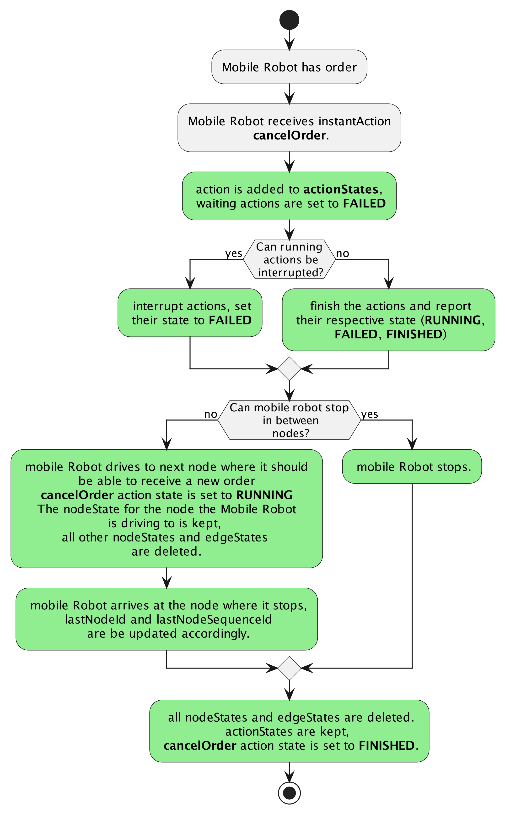
>Figure 10 - Expected behavior after a `cancelOrder`.

#### 6.1.3.1 Receiving a new order after cancellation

After the cancellation of an order, the mobile robot is idle and shall be ready to receive a new order.

In the case of a mobile robot that can only localize itself on a node, the new order has to begin on the node the mobile robot is now standing on (see also Figure 5).

In case of a mobile robot that can stop in between nodes, the choice is up to fleet control how the next order should be started.
The mobile robot shall accept both methods.

There are two options:

- Send an order, where the first node is a temporary node that is positioned where the mobile robot currently stands. The mobile robot shall then realize that this node is trivially reachable and accept the order.
- Send an order, where the first node is the last traversed node of the previous order but set the allowed deviation so large that the mobile robot is within this range. Thus, the mobile robot shall immediately treat this node as traversed and accept the order.

#### 6.1.3.2 Receiving a cancelOrder action when mobile robot is idle

If the mobile robot receives a `cancelOrder` instant action but the mobile robot is currently idle, or the previous order was canceled, or the `orderId` specified in the action does not match the `orderId` of the mobile robot’s currently active order, the `cancelOrder` action shall be reported as 'FAILED'.

The mobile robot shall report an error of type 'NO_ORDER_TO_CANCEL' with the level set to 'WARNING'.
The `actionId` of the `instantAction` shall be passed as an `errorReference`.


### 6.1.4 Order rejection

There are several scenarios, when an order shall be rejected.
These scenarios are shown in Figure 9 and described below.


#### 6.1.4.1 Mobile robot gets a malformed new order

Resolution:

1. Mobile robot does NOT take over the new order in its internal buffer.
2. The mobile robot reports an error of type 'VALIDATION_FAILURE' and level 'WARNING‘
3. The warning shall be reported until the mobile robot has accepted a new order.


#### 6.1.4.2 Mobile robot receives an order with actions it cannot perform or with fields that it cannot use

Examples:

- Non-executable actions: lifting height higher than maximum lifting height, lifting actions although no stroke is installed, etc.
- Non-useable fields: trajectory, etc.

Resolution:

1. Mobile robot does NOT take over the new order in its internal buffer
2. Mobile robot reports an error of type 'INVALID_ORDER' with level 'WARNING' and the erroneous fields as errorReferences
3. The warning shall be reported until the mobile robot has accepted a new order.


#### 6.1.4.3 Mobile robot gets a new order with the same orderId, but a lower orderUpdateId than the current orderUpdateId

Resolution:

1. Mobile robot does NOT take over the new order in its internal buffer.
2. Mobile robot keeps the previous order in its buffer.
3. The mobile robot reports an error of type 'OUTDATED_ORDER_UPDATE' and level 'WARNING'.
4. The mobile robot continues with executing the previous order.

If the mobile robot receives an order with the same `orderId` and `orderUpdateId` twice, the second order will be ignored. 
This might happen, if the fleet control resends the order because the state message was received too late by fleet control and it could therefore not verify that the first order had been received.

### 6.1.5 Corridors

The optional `corridor` edge attribute allows the mobile robot to deviate from the edge trajectory for obstacle avoidance and defines the boundaries within which the mobile robot is allowed to operate.
To use the `corridor` attribute, a predefined trajectory is required that the mobile robot would follow if no `corridor` attribute was defined. This can be either the trajectory defined on the mobile robot known to the fleet control or the trajectory sent in an order. The behavior of a mobile robot using the `corridor` attribute is still the behavior of a line-guided mobile robot, except that it's allowed to temporarily deviate from a trajectory to avoid obstacles.
Note that a corridor communicated within an order is released for the mobile robot by default. If the `releaseRequired` flag is set to true, the mobile robot must request approval from fleet control before using the corridor as described in chapter [6.5.10 Request use of Corridors](#6510-request-use-of-corridors).
*Remark:
An edge inside an order defines a logical connection between two nodes and not necessarily the (real) trajectory that a mobile robot follows when driving from the start node to the end node.
Depending on the mobile robot type, the trajectory that a mobile robot takes between the start and end nodes is either defined by fleet control via the trajectory edge attribute or assigned to the mobile robot as a predefined trajectory.
Depending on the internal state of the mobile robot, the selected trajectory may vary.*

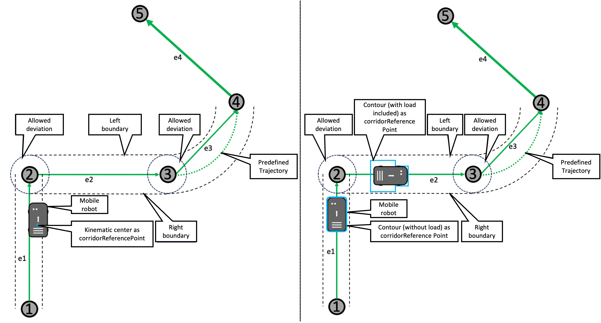
>Figure 11 - Edges with a `corridor` attribute that defines the left and right boundaries within which a mobile robot is allowed to deviate from its predefined trajectory to avoid obstacles. On the left, the kinematic center defines the allowed deviation, while on the right, the contour of the mobile robot, possibly extended by the load, defines the allowed deviation. This is defined by the `corridorReferencePoint` parameter.
The area in which the mobile robot is allowed to navigate independently (and deviate from the original edge trajectory) is defined by a left and a right boundary.
The optional `corridorReferencePoint` field specifies whether the mobile robot control point or the mobile robot contour should be inside the defined boundary.
The boundaries of the edges shall be defined in such a way that the mobile robot is inside the boundaries of the new and now current edge as soon as it passes a node.
Instead of setting the corridor boundaries to zero, fleet control shall not use the `corridor` attribute if the mobile robot shall not deviate from the trajectory.

The mobile robot's motion control software shall constantly check that the mobile robot is within the defined boundaries.
If not, the mobile robot shall stop because it is out of the allowed navigation space and report an error of type 'OUTSIDE_OF_CORRIDOR' with level 'CRITICAL'.
The fleet control can decide if user interaction is required or if the mobile robot can continue by canceling the current order and sending a new order to the mobile robot with corridor information that allows the mobile robot to move again.

*Remark: Allowing the mobile robot to deviate from the trajectory increases the possible footprint of the mobile robot during driving. This circumstance shall be considered during initial operation, and when the fleet control makes a traffic control decision based on the mobile robot's footprint.*
See also Section [6.5.2 Traversal of nodes and entering/leaving edges, triggering of actions](#652-traversal-of-nodes-and-enteringleaving-edges-triggering-of-actions) for further information.


## 6.2 Actions

If the mobile robot supports actions other than driving, these actions are instructed via the `actions` array that is attached to a node or an edge, sent via the separate topic `instantActions` (see section [6.2.1 Instant actions](#621-instant-actions)) or configured via action zones (see section [6.4.1 Zone types](#641-zone-types)).
Actions that are to be executed on an edge shall only run while the mobile robot is on the edge (see Section [6.5.2 Traversal of nodes and entering/leaving edges, triggering of actions](#652-traversal-of-nodes-and-enteringleaving-edges-triggering-of-actions)).

Actions that are triggered on nodes can run as long as they need to run and should be self-terminating (e.g., an audio signal that lasts for five seconds or a pick action, that is finished after picking up a load) or formulated pairwise (e.g., "activateWarningLights" and "deactivateWarningLights"), although there may be exceptions.

### 6.2.1 Instant Actions

In certain cases, it is necessary to send actions to the mobile robot that need to be performed immediately.
This is made possible by publishing an `instantAction` message to the topic `instantActions`.
These shall not conflict with the content of the mobile robot's current order (e.g., `instantAction` to lower fork, while order says to raise fork).

Some examples for which instant actions could be relevant are:
- pause the mobile robot without changing anything in the current order;
- resume order after pause;
- activate signal (optical, audio, etc.).

For additional information, see Section [8 Best practice](#8-best-practice).

When a mobile robot receives an `instantAction`, an appropriate `actionStatus` is added to the `instantActionStates` array of the mobile robot's state.
The `actionStatus` is updated according to the progress of the action.
See also Figure 18 for the different transitions of an `actionStatus`.
The `blockingType` of an instant action is always 'NONE'.

### 6.2.2 Action blocking types and sequence

The order of multiple actions in a list define the sequence, in which those actions are to be executed.
The parallel execution of actions is governed by their respective `blockingType`.

Actions can have four distinct blocking types, described in Table 3.

-| Parallel execution allowed | Parallel execution not allowed
---|---|---
Automatic driving allowed | NONE | SINGLE
Automatic driving not allowed | SOFT | HARD

>Table 3 Definition of action blocking types dependent on driving and parallel execution

Figure 18 describes how the mobile robot shall handle the blocking type of actions. Whenever the mobile robot arrives at a point where new actions are to be executed (i.e., when it reaches a node, edge, or action zone), the actions are enqueued in the same sequence as the actions array. This queue is continually processed as shown in Figure 18. If the blocking type of any action in the queue is 'SOFT' or 'HARD', the mobile robot shall stop automatic driving. Actions are collected for parallel execution if the action's blocking type is 'NONE' or 'SOFT'. If an action with blocking type 'SINGLE' or 'HARD' is to be executed, all collected parallel actions shall be 'FINISHED' or 'FAILED' before starting the action. If there are no more actions with blocking type 'SOFT' or 'HARD' in the queue, the mobile robot can resume automatic driving. 'FINISHED' or 'FAILED' actions shall be removed from the queue.


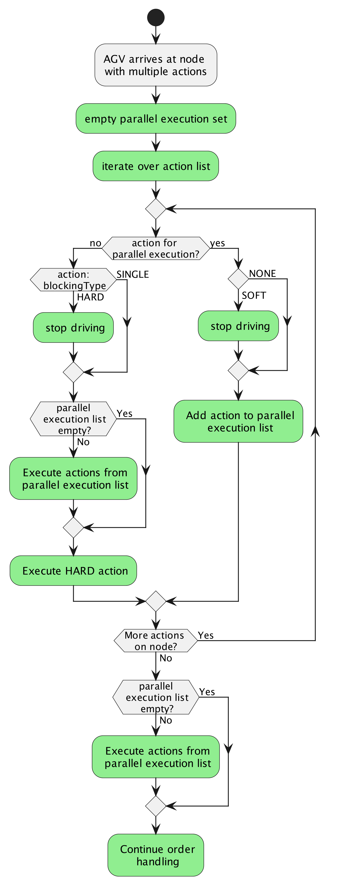
>Figure 18 - Handling multiple actions

### 6.2.3 Predefined Actions

This section presents predefined actions that shall be used by the mobile robot, if the mobile robot's capabilities map to the action description.
If there is a sensible way to use the defined parameters, they shall be used.
Additional parameters can be defined, if they are needed to execute an action successfully.
The actions `cancelOrder`, `startPause` and `stopPause` shall be supported by every mobile robot.

If there is no way to map some action to one of the actions of the following section, the mobile robot manufacturer can define additional actions that shall be used by fleet control.

#### 6.2.3.1 Definition, parameters, effects and scope

action | counter action | description | idempotent | parameters | linked state | instant | node | edge
---|---|---|---|---|---|---|---|---
startPause | stopPause | Activates the pause mode. <br>A linked state is required, because many mobile robots can be paused by using a hardware switch. <br>No more automatic driving - reaching next node is not necessary. Actions that can be paused (`pauseAllowed`=`true`), shall be paused, other actions continue. Order execution is resumed after stopPause. | yes | - | paused | yes | no | no
stopPause | startPause | Deactivates the pause mode. <br>Movement and all other actions will be resumed (if any).<br>A linked state is required because many mobile robots can be paused by using a hardware switch. <br>stopPause can also restart mobile robots that were stopped with a hardware button that triggered startPause (if configured). | yes | - | paused | yes | no | no
startHibernation | stopHibernation | Initiates hibernate mode, in which the mobile robot shall remain connected to the MQTT broker but no longer needs to send state messages.<br>Before entering this mode, the mobile robot shall publish a connection state of 'HIBERNATING'. <br>While in 'HIBERNATING' connection state, no further driving shall occur, reaching the next node is not required. The mobile robot shall only receive and respond to the instantAction stopHibernation and shall not respond to any other commands, such as orders or additional instant actions. If there was previously an active order, it is either resumed upon exiting the 'HIBERNATING' connection state or must be resent, depending on the mobile robot's orderHandling.clearOrderOnStopHibernation value. <br>If the mobile robot's battery becomes critically low while in this mode, the mobile robot may stop 'HIBERNATING' autonomously to report an error. In case a wake‑up time is set, the mobile robot is able to autonomously exit the 'HIBERNATING' connection state at the specified time and will publish the corresponding connection state transition before resuming normal operation| yes | wakeUpTime (string, optional) | - | yes | no | no
stopHibernation | startHibernation | Ends hibernate mode. To initiate wake‑up while the mobile robot is in the 'HIBERNATING' state, a control device (onboard or external) shall subscribe to the instantAction topic and remain connected to the MQTT broker. Because the mobile robots standard control device may be partially shut down during hibernation, the wake‑up may be triggered by a distinct MQTT client (separate from the mobile robots usual communication client).<br>Upon success, the mobile robot shall publish the connection state ONLINE.<br>Driving and actions may be immediately resumed, dependent on the mobile robot's orderHandling.clearOrderOnStopHibernation value. | yes | clearOrderOnStopHibernation (boolean) | - | yes | no | no
shutdown | - | Initiates a coordinated shutdown of the mobile robot, where it disconnects from the MQTT broker and clears all orders. Action execution requires the mobile robot to be in an idle state. There is no way using the VDA 5050 protocol to automatically restart due to the connection being terminated.<br>If a mobile robot is in hibernate mode but should be shut down, it must first exit hibernation (via stopHibernation) before executing shutdown.| yes | - | - | yes | no | no
startCharging | stopCharging | Activates the charging process. <br>Charging can be done on a charging spot (mobile robot stopped) or on a charging lane (while driving). <br>Protection against overcharging is the responsibility of the mobile robot. | yes | - | batteryState.charging | yes | yes | no
stopCharging | startCharging | Discontinues the charging process to send a new order. <br>The charging process can also be interrupted by the mobile robot or the charging station, e.g., if the battery is full. <br>The `charging` flag is only allowed to be set to "false", if the mobile robot is ready to receive orders. | yes | - |.batteryState.charging | yes | yes | no
initializePosition | - | Resets (overrides) the pose of the mobile robot with the given parameters. | yes | x (float64)<br>y (float64)<br>theta (float64)<br>mapId (string)<br>lastNodeId (string) | mobileRobotPosition.x<br>mobileRobotPosition.y<br>mobileRobotPosition.theta<br>mobileRobotPosition.mapId<br>lastNodeId<br>.maps | yes | yes<br>(Elevator) | no
enableMap | - | Enable a previously downloaded map explicitly to be used in orders without initializing a new position. | yes | mapId (string)<br>mapVersion (string) | maps | yes | yes | no
downloadMap | - | Trigger the download of a new map. Active during the download. Errors reported in mobile robot state. Finished after verifying the successful download, preparing the map for use and setting the map in the state. | yes | mapId (string)<br>mapVersion (string)<br>mapDownloadLink (string)<br>mapHash (string, optional) | maps | yes | no | no
deleteMap | - | Trigger the removal of a map from the mobile robot's memory. | yes | mapId (string)<br>mapVersion (string) | maps | yes | no | no
clearInstantActions | - | Removes all finished or failed instant actions from the mobile robot state. | yes | - | instantActionStates | yes | yes | no
clearZoneActions | - | Removes all finished or failed zone actions from the mobile robot's state. | yes | - | zoneActionStates | yes | yes | no
stateRequest | - | Requests the mobile robot to send a new state report. | yes | - | - | yes | no | no
logReport | - | Requests the mobile robot to generate and store a log report. | yes | reason<br>(string) | - | yes | no | no
pick | drop<br><br>(if automated) | Request the mobile robot to pick a load. <br>Mobile robots with multiple load handling devices can process multiple pick operations in parallel. <br>In this case, the parameter lhd needs to be present (e.g., LHD1). <br>The parameter stationType informs how the pick operation is handled in detail (e.g., floor location, rack location, passive conveyor, active conveyor, etc.). <br>The load type informs about the load unit and can be used to switch field for example (e.g., EPAL, INDU, etc). <br>For preparing the load handling device (e.g., pre-lift operations based on the height parameter), the action could be announced in the horizon in advance. <br>But, pre-Lift operations, etc., are not reported as 'RUNNING' in the mobile robot state, because the associated node is not released yet.<br>If on an edge, the mobile robot can use its sensing device to detect the position for picking the node. | no |lhd (string, optional)<br>stationType (string, optional)<br>stationName (string, optional)<br>loadType (string) <br>loadId (string, optional)<br>height (float64, optional)<br>defines bottom of the load related to the floor<br>depth (float64, optional) for forklifts<br>side (string, optional) e.g., conveyor | .load | no | yes | yes
drop | pick<br><br>(if automated) | Request the mobile robot to drop a load. <br>See action pick for more details. | no | lhd (string, optional)<br>stationType (string, optional)<br>stationName (string, optional)<br>loadType (string, optional)<br>loadId (string, optional)<br>height (float64, optional)<br>depth (float64, optional) <br>… | .load | no | yes | yes
detectObject | - | Mobile robot detects object (e.g., load, charging spot, free parking position). | yes | objectType (string, optional) | - | no | yes | yes
finePositioning | - | On a node, mobile robot will position exactly on a target.<br>The mobile robot is allowed to deviate from its node position.<br>On an edge, the mobile robot will e.g., align on stationary equipment while traversing an edge. | yes | stationType (string, optional)<br>stationName (string, optional) | - | no | yes | yes
waitForTrigger | - | Mobile robot has to wait for a trigger of the type defined specified in the triggerType parameter, which is an array of strings. Two predefined values shall be used when semantically appropriate: 'FLEET_CONTROL' if the trigger originates from the fleet control, and 'LOCAL' if the trigger comes from an input on the mobile robot (e.g., button press, manual loading). If none of the predefined values meet the specific requirements, custom values can be defined. <br>Fleet control is responsible for handling the timeout and shall cancel the order if necessary. | yes | triggerType [string] (array) | - | no | yes | no
trigger | - | Fleet control system notifies the mobile robot that a waitForTrigger action has been released. Typically, this occurs when the fleet control system receives information from a third-party system indicating that the process the mobile robot was waiting for has completed. | yes | - | - | yes | no | no
retry | - | Mobile robot retries action defined via actionId that is currently in state RETRIABLE. | yes | actionId (string) | - | yes | no | no
skipRetry | - | Mobile robot has to skip action defined via actionId that is currently in state RETRIABLE, setting action to FAILED. | yes | actionId (string) | - | yes | no | no
cancelOrder | - | Mobile robot stops as soon as possible. This could be immediately or on the next node. See Chapter 6.6.3 Order cancellation (by fleet control). | yes | orderId (string, optional) | - | yes | no | no
factsheetRequest | - | Requests the mobile robot to send a factsheet | yes | - | - | yes | no | no
updateCertificate | - | Request the mobile robot to download and activate a new certificate set, the service parameter is an extensible enum with the predefined parameter 'MQTT' to be used for mqtt connection. | yes | service (string)<br>keyDownloadLink (string)<br>certificateDownloadLink (string)<br>certificateAuthorityDownloadLink (string, optional) | - | yes | no | no |

>Table 4 - Predefined actions and their scope (instant, node, edge, zone)


#### 6.2.3.2 Action states

action | 'INITIALIZING' | 'RUNNING' | 'PAUSED' | 'FINISHED' | 'FAILED'
---|---|---|---|---|---
startPause | - | Activation of the mode is in preparation.<br>If the mobile robot supports an instant transition, this state can be omitted. | - | Mobile robot stands still. <br>All pauseable actions are paused. <br>The pause mode is activated. <br>The mobile robot reports paused: "true". | The pause mode cannot be activated for some reason (e.g., overridden by hardware switch).
stopPause | - | Deactivation of the mode is in preparation. <br>If the mobile robot supports an instant transition, this state can be omitted. | - | The pause mode is deactivated. <br>All paused actions are resumed. <br>The mobile robot reports paused: "false". | The pause mode cannot be deactivated for some reason (e.g., overridden by hardware switch).
startHibernation | - | Activation of the hibernate mode is in preparation. If the mobile robot supports an instant transition, this state can be omitted.| - | Mobile robot stands still. All pausable actions are paused. No state messages are sent by the mobile robot.<br>Hibernate mode is activated. The mobile robot reports connection state "HIBERNATING".| The HIBERNATING connection state could not be published (e.g., overridden by a hardware switch).
stopHibernation | - | Deactivation of the hibernate mode is in preparation. If the mobile robot supports an instant transition, this state can be omitted.| - | Hibernate mode is deactivated. Movement and all other actions will resume if the order is retained or once the order is resent.<br>The mobile robot reports connectionState "ONLINE".| The hibernate mode could not be deactivated (e.g., overridden by a hardware switch).
shutdown | - | Activation of the OFFLINE connection state is in preparation. If the mobile robot supports an instant transition, this state can be omitted.| - |Mobile robot shall not be moving. All actions are in an end state, and all orders are cleared. The connection between mobile robot and broker is terminated in a coordinated way.<br>The mobile robot reports connection state "OFFLINE".| The shutdown cannot be executed for some reason (e.g., mobile robot is not in idle state, overridden by a hardware switch).
startCharging | - | Activation of the charging process is in progress (communication with charger is running). <br>If the mobile robot supports an instant transition, this state can be omitted. | - | The charging process is started. <br>The mobile robot reports batteryState.charging: "true". | The charging process could not be started for some reason (e.g., not aligned to charger). Charging problems should correspond with an error.
stopCharging | - | Deactivation of the charging process is in progress (communication with charger is running). <br>If the mobile robot supports an instant transition, this state can be omitted. | - | The charging process is stopped. <br>The mobile robot reports batteryState.charging: "false" | The charging process could not be stopped for some reason (e.g., not aligned to charger).<br> Charging problems should correspond with an error.
initializePosition | - | Initializing of the new pose in progress (confidence checks, etc.). <br>If the mobile robot supports an instant transition, this state can be omitted. | - | The pose is reset. <br>The mobile robot reports <br>mobileRobotPosition.x = x, <br>mobileRobotPosition.y = y, <br>mobileRobotPosition.theta = theta <br>mobileRobotPosition.mapId = mapId <br>mobileRobotPosition.lastNodeId = lastNodeId | The pose is not valid or cannot be reset. <br>General localization problems should correspond with an error.
| downloadMap | Initialize the connection to the map server. | Mobile robot is downloading the map, until download is finished. | - | Mobile robot updates its state by setting the mapId/mapVersion and the corresponding mapStatus to 'DISABLED'. | The download failed, updated in mobile robot state (e.g., connection lost, Map server unreachable, mapId/mapVersion not existing on map server). |
| enableMap | - | Mobile robot enables the map with the requested mapId and mapVersion while disabling other versions with the same mapId. | - | The mobile robot updates the corresponding mapStatus of the requested map to 'ENABLED' and the other versions with same mapId to 'DISABLED'. | The requested mapId/mapVersion combination does not exist.|
| deleteMap | - | Mobile robot deletes map with requested mapId and mapVersion from its internal memory. | - | Mobile robot removes mapId/mapVersion from its state. | Can not delete map, if map is currently in use. The requested mapId/mapVersion combination was already deleted before. |
| clearInstantActions | - | | - | The instant actions array has been cleaned from all FINISHED or FAILED instantActions. | -
| clearZoneActions | - | | - | The zone actions array has been cleaned from all FINISHED or FAILED instantActions. | -
stateRequest | - | - | - | The state has been communicated | -
logReport | - | The report is in generating. <br>If the mobile robot supports an instant generation, this state can be omitted. | - | The report is stored. <br>The name of the log will be reported in status. | The report can not be stored (e.g., no space).
pick | Initializing of the pick process, e.g., outstanding lift operations. | The pick process is running (mobile robot is moving into station, load handling device is busy, communication with station is running, etc.). | The pick process is being paused, e.g., if a safety field is violated. <br>After removing the violation, the pick process continues. | Pick is done. <br>Load has entered the mobile robot and mobile robot reports new load state. | Pick failed, e.g., station is unexpected empty. <br> Failed pick operations should correspond with an error.
drop | Initializing of the drop process, e.g., outstanding lift operations. | The drop process is running (mobile robot is moving into station, load handling device is busy, communication with station is running, etc.). | The drop process is being paused, e.g., if a safety field is violated. <br>After removing the violation the drop process continues. | Drop is done. <br>Load has left the mobile robot and mobile robot reports new load state. | Drop failed, e.g., station is unexpected occupied. <br>Failed drop operations should correspond with an error.
detectObject | - | Object detection is running. | - | Object has been detected. | Could not detect the object.
finePositioning | - | Mobile robot positions itself exactly on a target. | The fine positioning process is being paused, e.g., if a safety field is violated. <br>After removing the violation, the fine positioning continues. | Goal position in reference to the station is reached. | Goal position in reference to the station could not be reached.
waitForTrigger | - | Mobile robot is waiting for the trigger | - | Trigger has been triggered. | waitForTrigger fails, if order has been canceled.
cancelOrder | - | Mobile robot is stopping or driving, until it reaches the next node. | - | Mobile robot stands still and has canceled the order. | <br>Mobile robot has no active order<br>The previous order has already been canceled.<br>Passed orderId does not match the currently active orderId.
factsheetRequest | - | - | - | The factsheet has been communicated | -
updateCertificate | - | Mobile robot is downloading and installing certificates | - | Certificates are downloaded, installed and active. | Download or installation failed. |

>Table 5 - Expected behavior in action states of predefined actions

#### 6.2.3.3 Update mobile robot certificate

For security reasons, mobile robot communication (at least for fleet management) should be secured. Typically, communication to the MQTT broker is secured via TLS, which requires one or more root certificates and a mobile robot-specific key pair. The parameter `service` specifies the service (e.g., 'MQTT') for which the certificates are to be used. The parameter `certificateAuthorityDownloadLink ` specifies the URL for the root certificate(s). The parameters `certificateDownloadLink` and `keyDownloadLink` specify the URLs for the mobile robot-specific public and private keys.

It is recommended to secure the download via TLS as well, since the sender of the instantAction cannot be verified. It is also advisable to validate the certificate chain before it is activated.


## 6.3 Maps

To ensure consistent navigation among different types of mobile robots, the position is always specified in reference to the project-specific coordinate system (see Figure 12). The project-specific coordinate system is referring to the coordinate system that is defined for the interaction between fleet control and the mobile robot.
For the differentiation between different levels of a site or location, a unique `mapId` is used.
The map coordinate system is to be specified as a right-handed coordinate system with the z-axis pointing skywards.
A positive rotation therefore is to be understood as a counterclockwise rotation.
The mobile robot coordinate system is also specified as a right-handed coordinate system (ISO 9787 4.1) with the x-axis pointing in the forward direction of the mobile robot and the z-axis pointing upward (ISO 9787 5.5). The mobile robot reference point is defined as (0,0,0) in the mobile robot reference frame, unless specified otherwise.

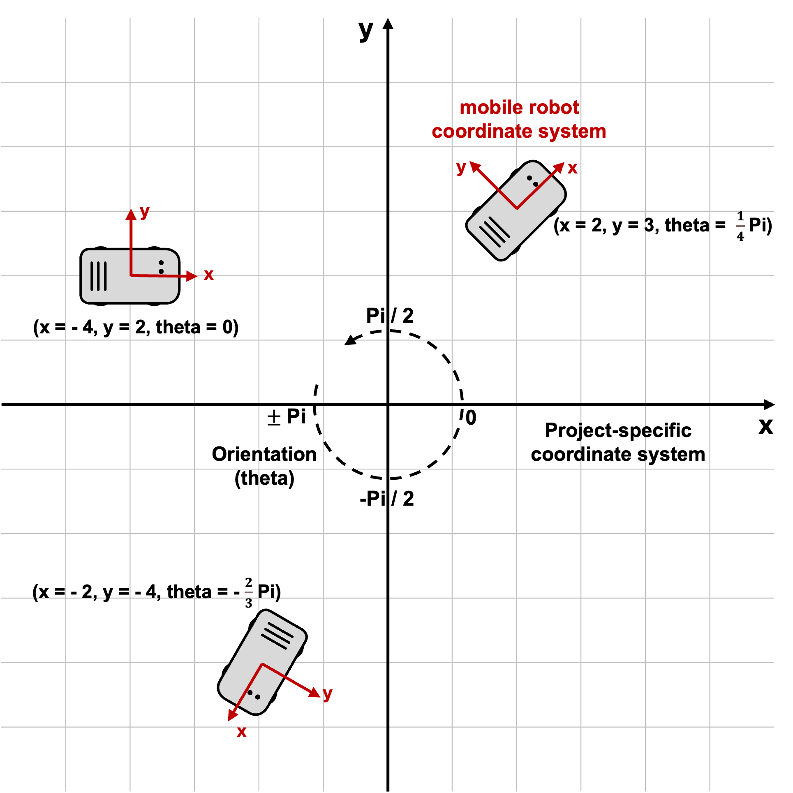
>Figure 12 - Coordinate system with sample mobile robot and orientation

The X, Y, and Z coordinates shall be given in meters. 
The orientation shall be in radians and shall be within -Pi and +Pi.


### 6.3.1 Map distribution

To enable an automatic map distribution and intelligent management of restarting the mobile robots if necessary, fleet control can manage the maps on the mobile robot.

The map files to be distributed are stored on a dedicated map server that is accessible by the mobile robots. To ensure efficient transmission, each transmission should consist of a single file. If multiple maps or files are required, they should be bundled or packed into a single file. The process of transferring a map from the map server to a mobile robot is a pull operation, initiated by the fleet control triggering a download command using an `instantAction`.

Each map is uniquely identified by a combination of a map identifier (field `mapId`) and a map version (field `mapVersion`). The map identifier describes a specific area of the mobile robot's physical workspace, and the map version indicates updates to previous versions. Before accepting a new order, the mobile robot shall check that there is a map on the mobile robot for each map identifier in the requested order. It is the responsibility of the fleet control to ensure that the correct maps are activated to operate the mobile robot.
In order to minimize downtime and make it easier for the fleet control to synchronize the activation of new maps, it is essential that maps are pre-loaded or buffered on the mobile robots. The status of the maps on the mobile robot can be accessed via the mobile robot state channel. It's important to note that transferring a map to an mobile robot and then activating the map are different processes. To activate a pre-loaded map on a mobile robot, the fleet control sends an instant action. In this case, any other map with the same map identifier but a different map version is automatically disabled. Maps can be deleted by the fleet control with another instant action. The result of this process is shown in the mobile robot state.

The map distribution process is shown in Figure 13.

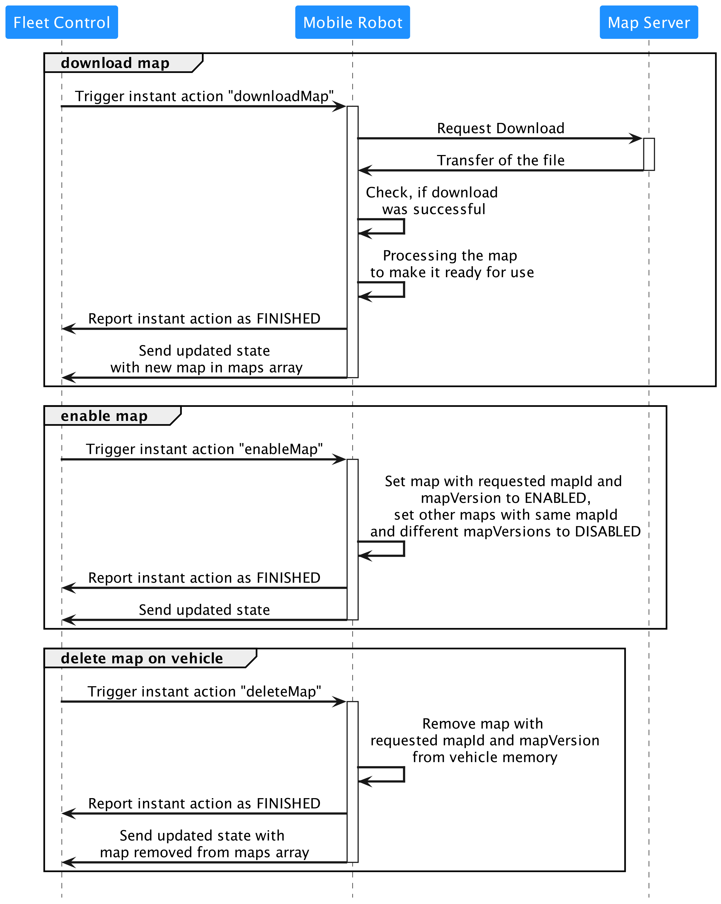
>Figure 13 - Communication required between fleet control, mobile robot and map server to download, enable, and delete a map.

### 6.3.2 Maps in the mobile robot state

The `mapId` field in the `mobileRobotPosition` of the state represents the currently active map. Information about the maps available on a mobile robot is presented in the `maps` array, which is a component of the state message. Each entry in this array is a JSON object consisting of the mandatory fields `mapId`, `mapVersion`, and `mapStatus`, which can be either 'ENABLED' or 'DISABLED'. An 'ENABLED' map can be used by the mobile robot if necessary. A 'DISABLED' map shall not be used. The status of the download process is indicated by the current action not being completed. Errors are also reported in the state.
Note that multiple maps with different `mapId` can be enabled at the same time. There can only be one version of maps with the same `mapId` enabled at a time. If the `maps` array is empty, this means that there are currently no maps available on the mobile robot.


### 6.3.3 Map download

The map download is triggered by the `downloadMap` instant action from the fleet control. This command contains the mandatory parameters `mapId` and `mapDownloadLink` under which the map is stored on the map server and which can be accessed by the mobile robot.

The mobile robot sets the `actionStatus` to 'RUNNING' as soon as it starts downloading the map file. If the download is successful, the `actionStatus` is updated to 'FINISHED'. If the download is unsuccessful, the status is set to 'FAILED'. Once the download has been successfully completed, the map shall be added to the array of `maps` in the state. Maps shall not be reported in the state, before they are ready to be enabled.

It is important to ensure that the process of downloading a map does not modify, delete, enable, or disable any existing maps on the mobile robot.
The mobile robot shall reject the download of a map with a `mapId` and `mapVersion` that is already on the mobile robot. An error of type 'DUPLICATE_MAP' and level 'WARNING' shall be reported, and the status of the instant action shall be set to 'FAILED'. The fleet control shall first delete the map on the mobile robot and then restart the download.


### 6.3.4 Enable downloaded maps

There are two ways to enable a map on a mobile robot:

1. **Fleet control enables map**: Use the `enableMap` instant action to set a map to 'ENABLED' on the mobile robot. Other Versions of the same `mapId` with different `mapVersion` are set to 'DISABLED'.
2. **Manually enable a map on the mobile robot**: In some cases, it might be necessary to enable the maps on the mobile robot directly. The result shall be reported in the mobile robot state.

It is the responsibility of the fleet control to ensure that the correct maps are activated on the mobile robot when sending the corresponding `mapId` as part of a `nodePosition` in an order.
If the mobile robot is to be set to a specific position on a new map, the `initializePosition` instant action is used.


### 6.3.5 Delete maps on the mobile robot
The fleet control can request the deletion of a specific map from a mobile robot. This is done with the instant action `deleteMap`. When a mobile robot runs out of memory, it should report this to the fleet control, which can then initiate the deletion of maps. The mobile robot itself is not allowed to delete maps.
After successfully deleting a map, it is important to remove that map's entry from the mobile robot's array of maps in the mobile robot state.

## 6.4 Zones

Zones are used to define rules for specific areas of the mobile robot workspace. In this way, zones allow mobile robots to navigate freely between nodes while giving the fleet control the ability to manage traffic. Zones can be used to locally deny mobile robots access to areas or to link access to conditions (zone types: 'BLOCKED' and 'RELEASE'). It is also possible to enforce specific behavior while within the zone (zone types: 'LINE_GUIDED', 'SPEED_LIMIT', 'COORDINATED_REPLANNING', and 'ACTION') or influence the driving behavior by incentivizing or penalizing certain areas (zone types: 'PRIORITY' and 'PENALTY') or giving a predefined driving direction (zone types: 'DIRECTED', 'BIDIRECTED'). The zone types are defined in the following sections.

Potential conflicts in orders due to overlapping of zones or combination of zone and edge properties and how to resolve them are addressed in section [6.4.4 Interaction between zones](#644-interactions-between-zones).
Some mobile robots cannot process zones at all, while other mobile robots might only be able to work with a certain subset of zone types, such as 'BLOCKED'. All mobile robots must therefore report to fleet control which zones they are able to understand by adding the according zone names to the `supportedZones` array under `typeSpecifications` in their factsheet.
Also (virtually) line-guided mobile robots can choose to support zone-based navigation if they can implement the logic of the corresponding zone types defined in the following. 
A zone set shall only be changed and distributed by fleet control to keep consistency in the system.

### 6.4.1 Zone types

Two categories of zones are distinguished: contour-based zones and kinematic center-based zones. This distinction is based on the different conditions for when the mobile robot is considered to be entering and exiting zones.

#### 6.4.1.1 Contour-based zones

For contour-based zones, the contour of the mobile robot (including its load) determines zone entry and exit. Any part of the contour entering the zone is considered a zone entry. A zone exit shall be reported only when no part of the contour remains inside the zone. At what point a zone is reported as exited is decided by the mobile robot. 

>Figure 14 - Depiction of a mobile robot entering a zone based on its contour (left) and a loaded mobile robot with corresponding extended bounding box exiting a zone (right)

The following contour-based zones are defined:

| **Zone Type**| **Zone Parameters** | **Data type** | **Description** | 
| --- | --- | --- | --- |
| BLOCKED | none | | Mobile robots shall not enter this zone. If a mobile robot has entered the zone or finds itself within one, it shall stop and throw an 'BLOCKED_ZONE_VIOLATION' error with level set to 'CRITICAL'.| 
| LINE_GUIDED | none | | No free navigation is allowed in this zone, mobile robots shall follow the predefined trajectories on edges. Mobile robots may only enter this zone if the route is explicitly specified by the fleet control in the form of a node-edge graph. Any movement of the mobile robot that requires it to enter this zone shall follow a predefined trajectory. When entering the zone, the mobile robot shall be on the trajectory of the edge that crosses the zone. The edges that enter and are inside the line-guided zone require a trajectory sent from the fleet control or a predefined trajectory on the mobile robot. A corridor can be sent to allow the mobile robot to deviate from the trajectory. | 
| RELEASE | | - | Mobile robots are only allowed entering this zone once they have been granted access through fleet control. | 
| | releaseLossBehavior | string | Enum {'STOP', 'CONTINUE', 'EVACUATE'}</br>When the access to this zone is revoked or expired, the mobile robot can either 'STOP', 'CONTINUE', or 'EVACUATE' the zone. This action is only executed, when the mobile robot is already in the zone and the release expires or is revoked. If not defined, the mobile robot is expected to STOP and report an error. 'STOP': Mobile robot stops and sends a 'RELEASE_LOST' error with level 'CRITICAL'. 'EVACUATE': Execute the evacuation behavior of the mobile robot to leave the zone, keeping the `zoneRequest` object granting release in its state until the zone is left. 'CONTINUE': If the release is revoked or expires after the mobile robot has already entered the zone, the mobile robot continues its path, keeping the zoneRequest object granting the zone release in its state. If the order ends inside the zone, the mobile robot waits for a new order.|
| COORDINATED_REPLANNING | none | | No autonomous replanning is allowed within this zone. Mobile robots are only allowed adjusting their path if granted permission by fleet control. | 
| SPEED_LIMIT | | | Mobile robots must not drive faster than the defined maximum speed within this zone. | 
| | maximumSpeed | float64 | Maximum permitted speed for mobile robot within the zone in m/s. The speed limit shall already be reached upon entering the zone.|
| ACTION | | | The mobile robot shall perform predefined actions when entering, traversing, or exiting the zone. The factsheet defines which actions can be executed when. |
| | entryActions[action] | array | Actions to be triggered when entering the zone. Empty array, if no actions required. |
| | duringActions[action] | array | Actions to be executed while crossing the zone. Empty array, if no actions required. |
| | exitActions[action] | array | Actions to be triggered when leaving the zone. Empty array, if no actions required. |

>Table 6 - Contour-based zone types and their parameters

#### 6.4.1.2 Kinematic center-based zones

In kinematic center-based zones, the mobile robot's kinematic center determines its entry and exit of the zones. When the mobile robot's kinematic center is inside a zone, the mobile robot shall follow the defined behavior.
'PRIORITY' and 'PENALTY' zones are zones which only influence the path planning of mobile robots.
'DIRECTED' zones define a preferred direction of travel within the zone. 'BIDIRECTED' zones define a travel direction and its opposite direction to be used. Other directions shall be avoided. The `directedLimitation` and `bidirectedLimitation` enums specify the limits within which the mobile robot may deviate from its direction of travel. The direction of travel is the velocity vector in the project-specific coordinate system.


>Figure 15 - Depiction of a mobile robot entering a zone based on its kinematic center (left) and a loaded mobile robot exiting a zone based on its kinematic center (right)

| **Zone Type**| **Zone Parameters** | **Data type** | **Description** | 
| --- | --- | --- | --- |
| PRIORITY | | | The workspace encompassed by this zone is associated with an incentive for the mobile robot to plan its route through this zone compared to an otherwise equivalent area without such a zone on the map.| 
| | priorityFactor | float64 | [0.0...1.0]<br>Relative factor that determines the preference of the zone over a workspace without a zone. 0.0 means no preference, as if there was no zone, 1.0 is maximum preference.|
| PENALTY | | | The workspace encompassed by this zone is associated with a disincentive for the mobile robot to plan its route through this zone compared to an otherwise equivalent area without such a zone on the map.|
| | penaltyFactor | float64 | [0.0...1.0]<br> Relative factor that determines the penalty of the zone compared to a workspace without that zone. 0.0 means no penalty, as if there was no zone, 1.0 is the maximum penalty, causing the mobile robot to take this path only if it cannot find any other feasible route. |
| DIRECTED | | | Mobile robots shall traverse this zone in a specific direction of travel. | 
| | direction | float64 | Preferred direction of travel within the zone in radians. The direction of travel is the angular orientation of the mobile robot's velocity vector in the project-specific coordinate system. |
| | directedLimitation | string | Enum {'SOFT','RESTRICTED','STRICT'}<\br>SOFT: Mobile robots may deviate from the defined direction of travel, but should avoid it, RESTRICTED: The mobile robot may deviate from the defined direction of travel, e.g., to avoid an obstacle, but shall never traverse opposite to the defined direction of travel, STRICT: The mobile robot shall maintain the defined direction of travel as precisely as its technical capabilities allow. |
| BIDIRECTED | | | While in this zone, mobile robots shall only move in the defined direction of travel and its direct opposite (+ Pi), mobile robots should not cross this zone in any other direction. | 
 | direction | float64 | Preferred direction of travel within the zone in radians. The direction of travel is the angular orientation of the mobile robot's velocity vector in the project-specific coordinate system.|
| | bidirectedLimitation | string | Enum {'SOFT', 'RESTRICTED'}<\br>SOFT: Mobile robots may deviate from the defined directions of travel, but should avoid it, RESTRICTED: The mobile robot should not traverse in any other direction than the directions of travel, except for obstacle avoidance.|

>Table 7 - Kinematic center-based zone types and their parameters

### 6.4.2 Zone set transfer

While this guideline  does not explicitly define a map format, both a zone and a zone set are well-defined JSON objects. This structure shall be maintained when providing the download as well as sending the zones via the separate `zoneSet` topic.

Zone sets shall only be changed and distributed by fleet control to keep consistency in the system.

A `zoneSet` is an array of `zone` objects with a globally unique identifier, `zoneSetId`. It must be associated with a single map referenced through the `mapId`. The `mapVersion` shall not be referenced, as the same zone set might be intended to be used for several versions of one map. In general, several zone sets can be defined in addition to a single map and it is upon fleet control to ensure that the right zone set is enabled for each map on the mobile robot. As with maps, the `zoneSetStatus` indicates which zone set is currently used by the mobile robot. Only a single zone set can be active at once for each `mapId` on the mobile robot. Zones shall not extend beyond the spatial boundaries of a map.
The content of a zone set with a unique `zoneSetId` shall not change. If changes are required within a zone set, it shall be referenced with a new `zoneSetId`.


## 6.4.3 Communication for interactive zones 

For communicating requests for the interactive zones 'RELEASE' and 'COORDINATED_REPLANNING', the field `zoneRequests` in the state message is used. The separate topic `response` is used by fleet control to respond to these requests.

Before entering an interactive zone, the mobile robot shall state a request.
A request before entry of an interactive zone is necessary, even if the order contains released nodes within the zone.
The mobile robot decides at which point before entering the zone to make its requests.
If the response is not received in time, the mobile robot shall not enter the zone.

Requests shall only be made for zones of enabled zone sets. Zone requests can also be made for zone sets belonging to maps that the mobile robot is not currently on.

The `requestId` allows fleet control to distinguish between different requests and allows the mobile robot to issue several alternative requests for the same zone at the same time.
Each request attempt shall use a unique identifier per mobile robot. Ids can be reused after a mobile robot restart.

For requests to enter a 'RELEASE' zone, a `zoneRequest` object of `requestType` 'ACCESS' shall be added to the state message.
For permission to enter a 'COORINATED_REPLANNING' zone with a planned path or for replanning its path within the zone, the `requestType` shall be set to 'REPLANNING'.
For a 'REPLANNING' request, the planned path shall be added as NURBS to the `trajectory` field of the `zoneRequest`. Multiple requests with different trajectories for the same zone can be made. Each path shall be requested with its own `zoneRequest` object.
If a mobile robot requires access to a workspace covered by two or more 'RELEASE' zones, it shall request access and receive approval for all necessary zones before entering the area.
If a mobile robot navigates through a workspace on the map that is covered by two or more 'COORDINATED REPLANNING' zones, it shall request its path within this area individually for each zone and receive approval from the fleet control before entering or changing paths.

The parameter `requestStatus` shall be initially set to 'REQUESTED' by the mobile robot when stating its request.

Fleet control responds to zone requests via the `response` topic.
The response message contains an array of `zoneResponse` objects. Each `zoneResponse` shall only respond to a single request referenced by the `requestId`.
Each response has a `responseType` that is either 'GRANTED', 'QUEUED', 'REVOKED', or 'REJECTED'.
If the `responseType` is 'GRANTED', the mobile robot is allowed to enter the zone or use the requested trajectory.
Fleet control can set the `responseType` to 'QUEUED' to acknowledge the mobile robot's request without giving permission, informing the mobile robot that its request is being processed.
If the `responseType` is 'REJECTED', the mobile robot shall not enter the zone or use the requested trajectory.
The `responseType` 'REVOKED' indicates that the permission is no longer valid. The fleet control shall assume a 'REVOKED' request as still being 'GRANTED', until the `requestStatus` of the mobile robot is set to 'REVOKED'.
The `zoneResponse` object can include a `leaseExpiry` which specifies until when a 'GRANTED' request is valid. To extend the `leaseExpiry` fleet control can resend a response message with an updated `leaseExpiry` time.

The mobile robot keeps the requests for as long as it consideres thie information relevant.

The mobile robot shall acknowledge the fleet controls response by setting the `requestStatus` accordingly.

The interaction between the mobile robot and the fleet control for 'RELEASE' zones shall be according to figure 16.

While the mobile robot remains in the 'RELEASE' zone, it keeps the `zoneRequest` object in its state and continues to report `requestStatus` as 'GRANTED' to inform fleet control that it is still inside the zone. After mobile robot has exited the zone, it shall remove the corresponding `zoneRequest` entry from its state message.
When receiving a response with `responseType` 'REVOKED', the mobile robot shall remove the request from its state. When the `leaseExpiry` has passed, the requestStatus shall be set to 'EXPIRED' and the zone shall not be entered. If the mobile robot is already inside the 'RELEASE' zone when the `leaseExpiry` has passed or the request is 'REVOKED', it shall report a warning and react according to the `releaseLossBehavior` defined in the zone definition.

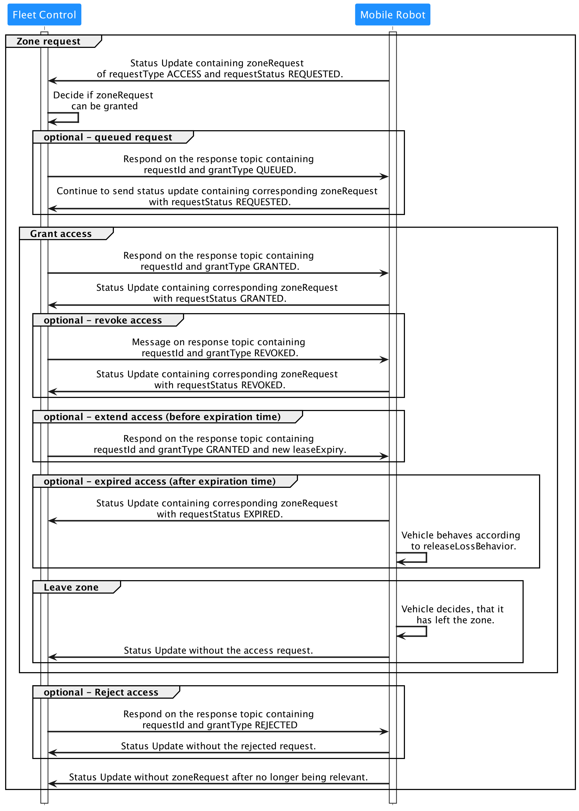
>Figure 16 - Zone request behavior for a RELEASE zone.

The interaction between the mobile robot and the fleet control for 'COORDINATED_REPLANNING' zones shall be according to figure 17.

The mobile robot shall choose one of the trajectories of all 'GRANTED' requests to the zone and set the corresponding `requestStatus`to 'GRANTED' while removing all other requests from its state.
When receiving a response with `responseType` 'REVOKED', the mobile robot shall remove the request from its state and not enter the 'COORDINATED_REPLANNING' zone. When the `leaseExpiry` has passed, the `requestStatus` shall be set to 'EXPIRED' and the zone shall not be entered. If the mobile robot is already inside the 'RELEASE' zone when the `leaseExpiry` has passed or the request is 'REVOKED', it shall stop driving and report a warning. To continue, the mobile robot shall state a new request.

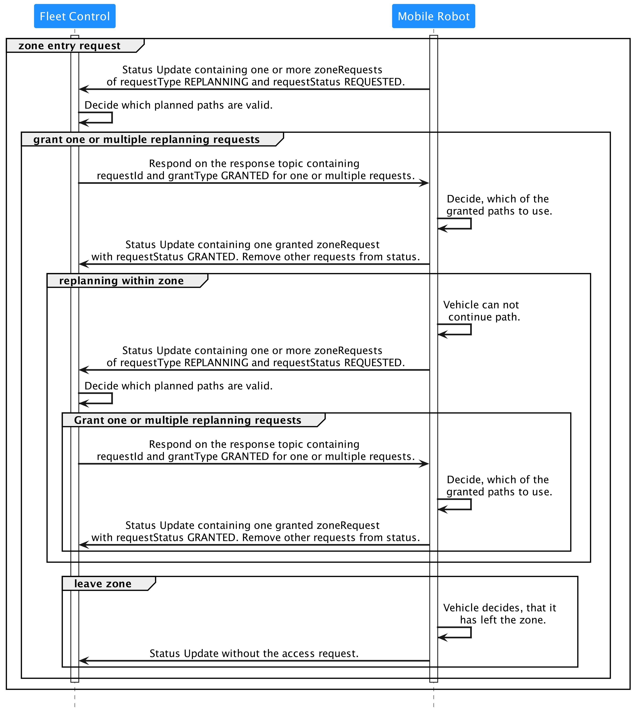
>Figure 17 - Zone request behavior for a COORDINATED_REPLANNING zone.


### 6.4.4 Interactions between zones

In the following matrix possible interactions between zones are described. The matrix is symmetric, as the interaction between two zones is the same, regardless of the order in which they are considered. For each combination, there is either a zone behavior that is overrulling the other (e.g., a 'BLOCKED' zone overrules a 'LINE_GUIDED' zone) or there is no conflict (e.g., a 'LINE_GUIDED' zone and a 'COORDINATED_REPLANNING' zone). 'DIRECTED' and 'BIDIRECTED' zones shall not overlap, since this might lead to an undefined behavior. The column No Zone defines the behavior for contour-based zones, where mobile robots can be inside a defined zone type and an area without a zone at the same time. For kinematic center-based zones the mobile robot can only be completely within or outside the zone, so there is no possible interaction.

| |**BLOCKED**|**RELEASE**|**LINE_GUIDED**|**COORDINATED_REPLANNING**|**SPEED_LIMIT**|**ACTION**|**PRIORITY**|**PENALTY**|**DIRECTED**|**BIDIRECTED**|**No Zone**|**EDGE-PROPERTIES**
---|---|---|---|---|---|---|---|---|---|---|---|---
**BLOCKED**|BLOCKED|BLOCKED|BLOCKED|BLOCKED|BLOCKED|BLOCKED|BLOCKED|BLOCKED|BLOCKED|BLOCKED|BLOCKED|BLOCKED|
**RELEASE**||No Conflict|No Conflict|No Conflict|No Conflict|No Conflict|No Conflict|No Conflict|No Conflict|No Conflict|No Conflict|No Conflict
**LINE_GUIDED**|||No conflict|LINE_GUIDED|No Conflict| (1) |LINE_GUIDED|LINE_GUIDED|LINE_GUIDED|No conflict|LINE_GUIDED|No conflict
**COORDINATED_REPLANNING**||||(2)|No conflict|(1)|No conflict|No conflict|No conflict|No conflict|COORDINATED_REPLANNING|(3)
**SPEED_LIMIT** |||||(4)|No conflict|No conflict|No conflict|No conflict|No conflict|SPEED_LIMIT|(4)
**ACTION** ||||||(5)|No conflict|No conflict|No conflict|No conflict|ACTION|(5)
**PRIORITY** |||||||(6)|(6)|No conflict|No conflict|(7)|No conflict
**PENALTY** ||||||||(6)|No conflict|No conflict|(7)|No conflict
**DIRECTED** |||||||||(8)|(8)|(7)|(9)
**BIDIRECTED** ||||||||||(8)|(7)|(9)

>Table 8 - Interaction matrix for zones

1) If actions would conflict with other zones' behavior, report a 'ZONE_ACTION_CONFLICT' error with level 'CRITICAL' (order error) and stop the mobile robot.
2) Planned trajectory must be granted for all 'COORDINATED_REPLANNING' zones.
3) If a trajectory is predefined for the edge, it shall be sent in the zone request.
4) The lowest of the competing speeds applies.
5) Execute all actions.
6) The most restrictive one is always selected here; for PRIORITY zones, the lowest priority factor is used; for overlapping PRIORITY and PENALTY zones, the highest penalty factor is used; for overlapping PENALTY zones, the highest penalty factor is used.
7) For kinematic center-based zones the mobile robot can only be completely within or outside the zone, so this overlap is not possible.
8) Zones shall not overlap, since the behavior is not defined.
9) A trajectory as part of the edge properties shall override the directed and bidirected zone property.

### 6.4.5 Error handling within zones

If at any point of the order execution, a mobile robot realizes, that it can not reach a node in its order, it shall report a 'NODE_UNREACHABLE' error with level 'CRITICAL' to the fleet control. The fleet control shall then decide how to proceed. The mobile robot shall not try to reach the node again, but wait for further instructions from the fleet control.


## 6.5 Connection

During the connection of a mobile robot client to the broker, a last will topic and message shall be set, which is published by the broker upon disconnection of the mobile robot client from the broker.
Thus, the fleet control can detect a disconnection event by subscribing the connection topics of all mobile robots.
The disconnection is detected via a heartbeat that is exchanged between the broker and the client.
The interval is configurable in most brokers and should be set around 15 seconds.
The Quality of Service level for the `connection` topic shall be 1 (At Least Once).

The last will message will not be sent when a connection is ended in a graceful way by using an MQTT disconnection command.
The last will message is only sent by the broker if the connection is unexpectedly interrupted.

**Note**: Due to the nature of the last will feature in MQTT, the last will message is defined during the connection phase between the mobile robot and the MQTT broker.
As a result, the timestamp and headerId fields will always be outdated.

Mobile robot wants to disconnect gracefully:

1. Mobile robot sends "uagv/v3/manufacturer/serialNumber/connection" with `connectionState` set to `OFFLINE`.
2. Disconnect the MQTT connection with a disconnect command.

Mobile robot comes online:

1. Set the last will to "uagv/v3/manufacturer/serialNumber/connection" with the field `connectionState` set to 'CONNECTION_BROKEN', when the MQTT connection is created.
2. Send the topic "uagv/v3/manufacturer/serialNumber/connection" with `connectionState` set to 'ONLINE'.

All messages on this topic shall be sent with a `retained` flag.

When connection between the mobile robot and the broker stops unexpectedly, the broker will send the last will topic: "uagv/v3/manufacturer/serialNumber/connection" with the field `connectionState` set to 'CONNECTION_BROKEN'.


## 6.6 State

The mobile robot state will be transmitted on only one topic.
Compared to separate messages (e.g., for orders, battery state and errors) using one topic will reduce the workload of the broker and the fleet control for handling messages, while also keeping the information about the mobile robot state synchronized.

The mobile robot state message will be published with occurrence of relevant events or at the latest every 30s via MQTT broker to fleet control.

Events that trigger the transmission of the state message are:
- Receiving an order
- Receiving an order update
- Changes in the `load` object
- Change in the `errors` array
- Change in the `operatingMode` field
- Change in the `driving` field
- Change in the `paused` field
- Change in the `safetyState` object
- Change in the `newBaseRequest` field
- Change in the `lastNodeId` or `lastNodeSequenceId` field
- Change in the `zoneRequests` array
- Change in the `batteryState.charging` field
- Change in the `nodeStates` or `edgeStates` arrays
- Change in the `actionStates`, `instantActionStates` or `zoneActionStates` arrays
- Change in the `zoneSets` array
- Change in the `maps` array


There should be an effort to curb the amount of communication.
If two events correlate with each other (e.g., the receiving of a new order usually forces an update of the `nodeStates` and `edgeStates`; as does the driving over a node), it is sensible to trigger one state update instead of multiple. The minimum time between two consecutive state messages is defined by the factsheet ([7.10 Implementation of the factsheet message](#710-implementation-of-the-factsheet-message) `protocolLimits.timing.minimumStateInterval`) . 


### 6.6.1 Concept and logic

The order progress is tracked by the `nodeStates` and `edgeStates`.
Additionally, if the mobile robot is able to derive its current position, it can publish its position via the `mobileRobotPosition` field.

The `nodeStates` and `edgeStates` include all upcoming nodes and edges for the mobile robot to traverse.

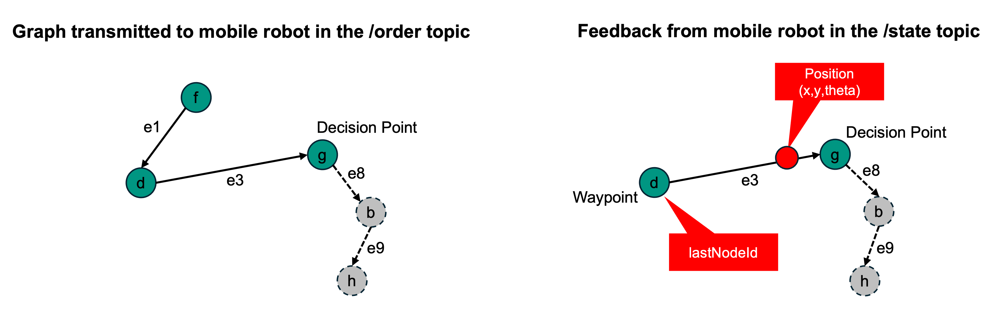
>Figure 19 - Order information provided by the state topic. Only the ID of the last node and the remaining nodes and edges are transmitted


### 6.6.2 Traversal of nodes and entering/leaving edges, triggering of actions

The mobile robot decides on its own, when a node should count as traversed.
A requirement for the traversal is that the mobile robot's control point should be within the node's `allowedDeviationXY` and its orientation within `allowedDeviationTheta`.
The `allowedDeviationXY` defines at what point a line-guided mobile robot can deviate from its predefined trajectory, to cut the corner along a smoother path rather than reaching the node's exact position. When leaving the `allowedDeviationXY` the mobile robot shall be back on its predefined trajectory of the subsequent edge.
If the edge attribute `corridor` of the subsequent edge is set, these boundaries should be met additionally.

In case the mobile robot is located too far away from the first node of an order, the fleet control can add an extended `allowedDeviationXY` to this node to include the mobile robot's current position.

The mobile robot reports the traversal of a node by removing its `nodeState` from the `nodeStates` array and setting the `lastNodeId`, `lastNodeSequenceId` to the traversed node's values.

As soon as the mobile robot reports the node as traversed, the mobile robot shall trigger the actions associated with the node, if any.
The traversal of a node also necessarily implies leaving the edge that is leading up to the node.
The edge shall then also be removed from the `edgeStates` and the actions that were active on the edge shall be finished.

The traversal of the node also marks the moment when the mobile robot enters the following edge, if there is one.
The edge's actions shall be triggered, if any.
An exception to this rule is if the mobile robot shall pause on the node (because of a soft or hard blocking action, or otherwise) – then the mobile robot only enters the following edge once it begins driving again.

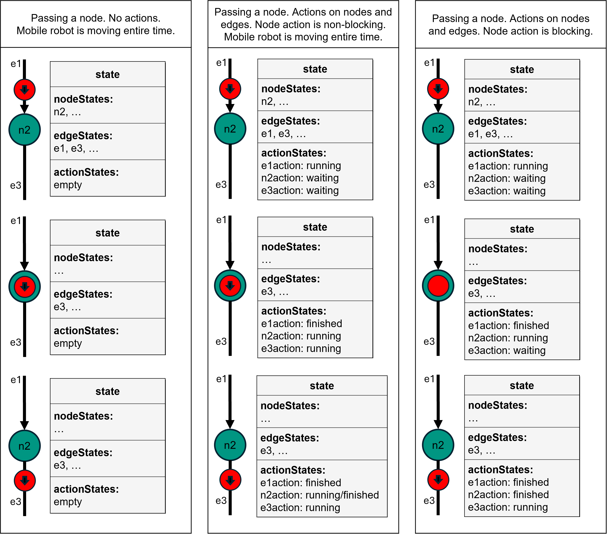
>Figure 20 - Depiction of `nodeStates`, `edgeStates`, and `actionStates` during order handling

#### 6.6.2.1 Definition of allowedDeviationXY as an ellipse

The allowedDeviationXY is defined as an ellipse around the node position to allow more flexible approaches to the node.

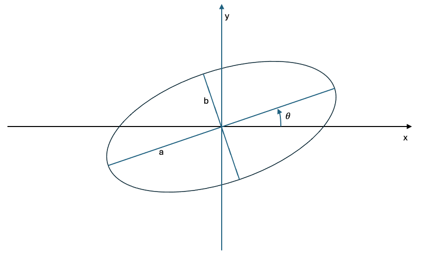
>Figure 22 - allowedDeviation ellipse

A fleet control system which doesn't support internally ellipses can choose `a` = `b` and `theta` = 0.0 to define a circle. A mobile robot which doesn't support internally ellipses can choose the smaller half axis as a circle radius and ignore `theta` and behaves still standard conform.

### 6.6.3 Base request

If the mobile robot detects that its base is running short, it can set the `newBaseRequest` flag to "true" to attempt to prevent unnecessary braking.

### 6.6.4 Information

The mobile robot can submit arbitrary additional information to the fleet control via the `information` array.
It is up to the mobile robot to decide how long it reports information via an information message.

The fleet control shall not use the information for logic; they shall only be used for visualization and debugging purposes.

### 6.6.5 Errors

The mobile robot reports issues that it wants to inform the operator about via the `errors` array.
The issues can have four levels: 'WARNING', 'URGENT', 'CRITICAL', and 'FATAL'.

- A 'WARNING' level issue does not require immediate attention. The mobile robot can continue its current order and take new orders. The error might be self-resolving, e.g., a dirty LiDar-scanner.
- An 'URGENT' level issue requires immediate attention, e.g., a low battery level. The mobile robot can continue its current order, and is able to take new orders.
- A 'CRITICAL' level issue requires immediate attention, e.g., trying to pick an object, that is not there. The mobile robot can not continue its current order, but is able to take new orders.
- A 'FATAL' level issue requires user intervention, e.g., losing localization. The mobile robot can neither continue its currently active order nor take any new orders.

The mobile robot can add references that help with finding the cause of the error via the `errorReferences` array as well as `errorHints` to propose a possible resolution. Regardless of the level of the issue, the mobile robot shall never clear its order due to it.


#### 6.6.5.1 Error references

If an error occurs due to an erroneous order or execution failure, the mobile robot can return meaningful error references in the field `errorReferences` to support finding the cause of the error.
This can include the following information:

- `headerId`
- Topic (`order` or `instantAction`)
- `orderId` and `orderUpdateId` if error was caused by an order update
- `actionId` if error was caused by an action
- List of parameters if error was caused by erroneous action parameters

Additional hints can be put to the `errorHints` array.


### 6.6.6 Operating Mode
For regular order execution, fleet control must be in full control of the mobile robot. There are however situations where this is not possible, e.g., when manual human interaction on the mobile robot is required. The mobile robot shall report this using the field `operatingMode`.

The following lists describe the values of the field `operatingMode`, their meaning, and implications on the interaction between mobile robot and fleet control:

Operating Mode | Description
---|---
AUTOMATIC | Fleet control is in full control of the mobile robot. <br>Mobile robot moves and executes actions based on orders from the fleet control.
SEMIAUTOMATIC | Fleet control is in control of the mobile robot.<br> Mobile robot moves and executes actions based on orders from the fleet control. <br>The driving speed is controlled by the HMI (speed can't exceed the speed of automatic mode).<br>The steering is under automatic control.
INTERVENED | Fleet control is not in control of the mobile robot. The mobile robot is reporting its state correctly.<br>HMI can be used to control the steering, velocity and handling devices of the mobile robot.<br>Fleet control is allowed to send orders or order updates to the mobile robot to be executed after changing back into operating mode 'AUTOMATIC' or 'SEMI-AUTOMATIC'. Fleet control shall not send any instant action except `cancelOrder`.<br>The mobile robot shall not clear the order but shall remove all zone requests from the state, also if the mobile robot is already inside a 'RELEASE' zone. (*Remark: If necessary, the fleet control can continue to track the position of the mobile robot and decide whether clearance for other mobile robots is possible.*) The mobile robot shall not request any permissions to enter a 'RELEASE' zone or for replanning inside a 'COORDINATED_REPLANNING' zone.<br>If entering operating mode 'INTERVENED' has any impact on running actions the mobile robot shall reflect this in the state message accordingly.<br>If the mobile robot leaves this operating mode and does not directly switch into 'AUTOMATIC' or 'SEMI-AUTOMATIC' mode it shall act according to new operating mode. If the mobile robot leaves this operating mode and switches directly into 'AUTOMATIC' or 'SEMI-AUTOMATIC' mode the mobile robot shall continue executing any current order. If the mobile robot detects during operating mode 'INTERVENED' that a continuation of the current order is not possible the mobile robot shall switch into operating mode 'MANUAL' and act accordingly.
MANUAL | Fleet control is not in control of the mobile robot. <br>Fleet control shall not send orders or actions to the mobile robot. <br>HMI can be used to control the steering, velocity and handling devices of the mobile robot.<br>The position of the mobile robot is sent to the fleet control.<br>When the mobile robot enters or leaves this mode, it immediately clears any current order.<br>If, while being in this mode, the mobile robot detects that it is being moved to a position where the current value of `lastNodeId` cannot be used as a start node of a new order, it shall set `lastNodeId` to an empty string ("").
STARTUP | Fleet control is not in control of the mobile robot. The mobile robot is starting up and not ready to receive orders. State message parameters may be incomplete or invalid until startup is finished.
SERVICE | Fleet control is not in control of the mobile robot. <br>Fleet control shall not send orders or actions to the mobile robot. <br>When the mobile robot enters or leaves this mode, it immediately clears any current order.<br>The mobile robot shall set `lastNodeId` to an empty string ("").<br>Authorized personnel can reconfigure the mobile robot.
TEACH_IN | Fleet control is not in control of the mobile robot. <br>Fleet control shall not send orders or actions to the mobile robot. <br>When the mobile robot enters or leaves this mode, it immediately clears any current order.<br>The mobile robot shall set `lastNodeId` to an empty string ("").<br>The mobile robot is being taught, e.g., mapping is done by an operator.

>Table 9 - Operating modes of the mobile robot


Operating Mode | Fleet Control in control | Valid state message content | Clear order when entering | Set `lastNodeId` to empty | Clear zone requests when entering | Sending instant actions allowed | Sending orders allowed
--- | --- | --- | --- | --- | --- | --- | ---
AUTOMATIC | YES | YES | NO | NO | NO | YES | YES
SEMIAUTOMATIC | YES | YES | NO | NO | NO | YES | YES
INTERVENED | NO | YES | NO | NO | YES | Only `cancelOrder` allowed | YES
MANUAL | NO | YES | YES | YES, if continuation of order is not possible | YES | NO | NO
STARTUP | NO | NO | YES | YES | YES | NO | NO
SERVICE | NO | YES | YES | YES | YES | NO | NO
TEACH_IN | NO | YES | YES | YES | YES | NO | NO

>Table 10 - Overview of operating modes and their implications

### 6.6.7 Clearing the order

In response to one of the following events, not triggered by fleet control, the mobile robot has to stop executing the current order:
- The mobile robot is changing the operating mode to 'MANUAL', 'STARTUP', 'SERVICE' or 'TEACH_IN' (see also [6.6.6 Operating Mode](#666-operating-mode)).
- The mobile robot cannot determine its position anymore.

In these cases the mobile robot has to clear any current order which means that similar to a cancellation:

- Any scheduled actions in the `actionStates` shall be cancelled and be reported as 'FAILED' in `actionStates`.
- Any running actions in the `actionStates` action should also be cancelled and be reported as 'FAILED' in `actionStates`.
- Any running actions in the `actionStates` action that cannot be interrupted shall be reflected by reporting 'RUNNING' as long as it is running, and afterwards be reported by the respective state ('FINISHED', if successful and 'FAILED', if not).
- `orderId` and `orderUpdateId` are kept.
- `nodeStates` and `edgeStates` are emptied.
- Any requests shall be removed from the state.

As long as the actions of an order are not in state 'FINISHED' or 'FAILED' the mobile robot shall not report operating mode 'MANUAL', 'STARTUP', 'SERVICE' or 'TEACH_IN'. `nodesStates` and `edgeStates` shall not be emptied before the operating mode 'MANUAL', 'STARTUP', 'SERVICE' or 'TEACH_IN' is reported.


### 6.6.8 Idle state of the mobile robot

A mobile robot is idle if its `nodeStates` and `edgeStates` are empty and all actions in the `actionStates` are either 'FINISHED' or 'FAILED'. A new order shall only be accepted if the mobile robot is idle. An order update can be accepted when the mobile robot is idle or during order execution. When idle, a mobile robot can execute instantActions.


### 6.6.9 Action states

When a mobile robot receives an `action` as part of the order (attached to a `node` or `edge` of an order), it shall report this `action` with an `actionState` in its `actionStates` array.
When a mobile robot receives an `instantAction`, it shall report this `action` with an `actionState` in its `instantActionStates` array.
When a mobile robot executes a `zoneAction`, it shall report this `action` with an `actionState` in its `zoneActionStates` array. Optionally, a mobile robot can report planned `zoneAction` here.

The current stage of an action is reflected in the field `actionStatus` of the corresponding `actionState` (see Table 2). The possible 

actionStatus | Description
---|---
'WAITING' | Action was received by the mobile robot but the corresponding node was not yet traversed or the corresponding edge was not yet entered.
'INITIALIZING' | Action was triggered, preparatory measures are initiated.
'RUNNING' | The action is running.
'PAUSED' | The action is paused because of a pause instantAction or external trigger (pause button on the mobile robot)
'RETRIABLE' | Actions that failed, but can be retried, specified by the retriable parameter in the action of an order. Transition from this state is triggered by a retry or skipRetry instantAction or an external trigger.
'FINISHED' | The action is finished. <br>A result is reported via the `actionResult`.
'FAILED' | Action could not be finished for whatever reason.

>Table 11 - Feasible values for the `actionStatus` field

All possible action state transitions are visualized in Figure 21 and examples are given in the following matrix:


| **from / to →** | **WAITING** | **INITIALIZING** | **PAUSED** | **RUNNING** | **RETRIABLE** | **FAILED** | **FINISHED** |
|---|---|---|---|---|---|---|---|
| **Initial state** | Queued for later execution | starts initialization immediately (e.g., instantAction) | - | starts execution immediately (e.g., instantAction) | - | instantActions failed to execute (unknown to mobile robot, invalid parameters) | action finishes immediately (e.g., setting a parameter) |
| **WAITING** | - | preparation necessary (lifting, sensor power up) | - | no preparation necessary | - | aborted via cancel, switch to manual mode, action removed after changing horizon | action succeeds instantly, e.g., after reaching node/edge |
| **INITIALIZING** | - | - | external trigger | initialization finished, action starting | - | initialization failed, aborted via cancel, switch to manual mode | - |
| **PAUSED** | - | external trigger | - | external trigger | - | aborted via cancelOrder, switch to manual mode | - |
| **RUNNING** | - | - | external trigger | - | action not completed successfully but is retriable | aborted via cancel, switch to manual mode, action finally failed due to not returning the desired results | action returned desired result, possible after abort via cancelOrder, if action can not be interrupted and has to finish. |
| **RETRIABLE** | - | retries action via retry, external trigger | - | retries action via retry, external trigger | - | failed via skipRetry, failed via cancelOrder, external trigger, switch to manual mode | fixed by operator via external input |

>Table 12 Examples for possible action state transitions


>Figure 21 - All possible status transitions for actionStates


#### 6.6.9.1 Reporting of horizon actions in the mobile robot's state

The mobile robot's state shall always represent the full status of the order it currently has. Therefore, the robot shall report both the `actionsStates` of actions included in its base as well as horizon at all times. All horizon actions are reported as 'WAITING'. If the mobile robot receives an order update where part of its former horizon is removed or changed, all actions that were attached to these nodes and edges shall be removed from the `actionStates` to reflect this. `actionStates` of base actions shall never be removed in the context of an `orderUpdate` as the base cannot be modified once released.

### 6.6.10 Request Use of Corridors

If the corridors within a mobile robot's currently active order have the `releaseRequired` flag set to true, it shall issue a request prior to deviating from the predefined trajectory of an edge. For this purpose, the robot shall add an `edgeRequest` object to its state message. Note that the `requestId` shall be unique across all requests (e.g. `zoneRequest`, `edgeRequest`) issued by the mobile robot. Fleet control shall only release the corridor for edges that are part of the base.

The `requestStatus` is set to REQUESTED and the combination of `edgeId` and `sequenceId` references the edge's trajectory the robot asks to deviate from. The mobile robot has the option to request the approval for several edges simulatenously as long as they are part of its current base. The usage of each corridor shall be requested in a dedicated `edgeRequest` and each request must be approved inidivdually by fleet control. 

The robot shall remain on the predefined trajectory of its current edge until a `respone` is received from the fleet control. Once the robot has received the approval to start maneuvering, it sets the `requestStatus` to 'GRANTED' and may now use the corridor. As long as the robot requires the corridor, it shall keep the `edgeRequest` in its state. If the mobile robot no longer requires the use of a corridor (e.g., because it might have successfully completed its avoidance procedure, no more need to avoid an obstacle, etc.), it indicates this to the fleet control by removing the corresponding `edgeRequest` object from its state. From there on, the mobile robot shall act as a line-guided mobile robot again. If it wishes to deviate from the predefined trajectory once more, it shall issue a new `edgeRequest`. 
If during the avoidance procedure the robot reaches the end of its current edge's `corridor` and wishes to continue to the upcoming corridor, which is not yet released, it must stop at the border of its current `corridor`, send a dedicated edge request, and await its approval through the fleet control. If the robot's approval expires or the fleet control revokes a granted request, it must initiate the fallback action predefined in the `releaseLossBehavior` of the corridor of the edge.


## 6.7 Visualization

For a near real-time position and planned trajectory update the mobile robot can broadcast its position, velocity and planned trajectory on the topic `visualization`.

The fields of the visualization object use the same structure as the position, velocity, planned path and intermediate path object in the state.
For additional information see [Implementation of the visualization message](#79-implementation-of-the-visualization-message).
The update rate for this topic is defined by the integrator.


## 6.8 Sharing of planned paths for freely navigating mobile robots

Freely navigating mobile robots shall communicate their planned trajectory to the fleet control system. This is done via the state message. For a higher frequency of sharing, the `visualization` topic can be used.
Mobile robots share their `intermediatePath`, which represents the estimated time of arrival at closer waypoints that the mobile robot is able to perceive with its sensors, and their `plannedPath`, which represents a longer path within the mobile robot's currently active order. Both paths shall start from the mobile robot's current position, independent of any nodes that are part of the order. The mobile robot can decide on the length of the shared paths, as it may be situation dependent. If the mobile robot is freely navigating both `intermediatePath` and `plannedPath` shall be shared in each state.
The `plannedPath` is defined as NURBS as defined in the `trajectory` field of the `edgeState`. The `plannedPath` can contain an array of nodes, referenced by their `nodeId`, that will be traversed as part of the current path. It should be updated whenever a significant change has occurred in the mobile robot's `plannedPath`. The `plannedPath` should at least cover the mobile robot's current base.
The `intermediatePath` is defined as a polyline. The polyline consists of linear line segments between waypoints. Each `waypoint` consists of its `x` and `y` position, an optional orientation of the mobile robot and the `ETA` indicating the estimated time of arrival.
The `intermediatePath` shall be updated with every sent state or visualization message and always begin at the mobile robot's current position.

The parameters `plannedPath` and `intermediatePath` shall be used only for trajectories planned by the mobile robot. The trajectory fields in the `edgeState` shall only be used to 'acknowledge' trajectories that have already been defined a priori within a layout or the order.


## 6.9 Request/response mechanism

Certain coordination tasks between mobile robots and the fleet control require explicit permission from the fleet control before the mobile robot is allowed to perform an operation. For these cases, a request/response mechanism is used.

A request is always initiated by the mobile robot and communicated as part of the state message. The fleet control evaluates the request and returns its decision via the response topic.

Each request is represented on the mobile robot by a request object (e.g. zoneRequest) which is included in the state message. The request object shall contain at minimum:

	- a `requestId` that is unique per mobile robot for all currently active requests,
	- a `requestType` that specifies the kind of operation the request refers to (access, replanning, use of corridor),
	- a reference to the resource the request addresses (e.g. zone, zone set, map, edgeId, sequenceId), and
	- a `requestStatus`.

The field `requestStatus` describes the life cycle of the request and shall support the following values:
- 'REQUESTED': Mobile robot states a request.
- 'GRANTED': The fleet control grants the request.
- 'REVOKED': Fleet control revokes previously granted request. 
- 'EXPIRED': request has expired. 
- 'QUEUED': Acknowledge the mobile robot's request to the fleet control, but no permission is given yet. Request was added to some sort of a queue.
Fleet control receives requests from the state topic and shall answer via the response topic containing a respone object that includes:
- The `requestId` of the corresponding request,
- a decision with one of the values 'GRANTED', 'QUEUED', 'REJECTED', or 'REVOKED', and
- optionally a `leaseExpiry` timestamp that limits the validity of a 'GRANTED' decision.

If a request is answered with 'QUEUED', fleet control acknowledges reception of the request but does not yet grant permission. The mobile robot shall then continue to wait and shall not perform the requested operation. If a request is answered with 'REJECTED', the mobile robot shall not perform the requested operation and may remove the corresponding request object from its state when it is no longer needed.

If a request is answered with 'GRANTED', the mobile robot is allowed to perform the requested operation in accordance with the semantics of the request type. If a `leaseExpiry` is present, the permission shall only be considered valid until this time. Fleet control can extend a lease by sending an updated response with the same `requestId` and a new `leaseExpiry`.

If a request is answered with 'REVOKED', or if the `leaseExpiry` is reached, the mobile robot shall update the `requestStatus` accordingly ('REVOKED' or 'EXPIRED') and shall act according to the `releaseLossBehavior` and shall keep the request in its state until the zone is exited. If the zone was not entered, the vehicle shall remove the request from its state.

If no response is received within the time frame required by the application, the mobile robot shall behave as if the request had not been granted and shall not perform the operation that requires explicit permission. The handling of timeouts and retries shall be defined during integration.

A request shall be removed from the mobile robot’s state once the corresponding operation has been completed, aborted, or rejected and no further decision from fleet control is required.

### 6.9.1 Response for edge requests

As with zone requests, the fleet control can grant edge requests through a `response` object sent on the dedicated /response topic.

Additionally, the fleet control has the option to add a `leaseExpiry` timestamp to the response. If the robot hasn't finished its request by the time of expiry, it must then execute the defined `releaseLossBehavior`. Feasible recovery strategies for loss of release are either the robot returning to the predefined trajectory of the edge along the path it took to deviate from it or stopping in its current position and awaiting manual intervention.

## 6.10 Factsheet

The factsheet provides basic information about a specific mobile robot type series.
This information allows comparison of different mobile robot types and can be applied for the planning, dimensioning, and simulation of a mobile robot system.
The factsheet also includes information about mobile robot communication interfaces which are required for the integration of a mobile robot type series into a VDA-5050-compliant fleet control.

The values for some fields in the mobile robot factsheet can only be specified during system integration, for example the assignment of project-specific load and station types, together with the list of station and load types which are supported by this mobile robot.
The factsheet is intended as both a human-readable document and for machine processing, e.g., an import by the fleet control application, and thus is specified as a JSON document.

The fleet control can request the factsheet from the mobile robot by sending the instant action `factsheetRequest`.

All messages on this topic shall be sent with a `retained` flag.

# 7 Message specification

The different messages are presented in tables describing the contents of the fields of the JSON that is sent as an order, state, etc.

In addition, JSON schemas are available for validation in the public git repository (https://github.com/VDA5050/VDA5050).
The JSON schemas are updated with every release of the VDA5050. If there are differences between the JSON schemas and this document, the variant in this document applies.

## 7.1 Symbols of the tables and meaning of formatting

The object structure tables contain the name of the identifier, its unit, its data type, and a description, if any.

Identification | Description
---|---
standard | Variable is an elementary data type
**bold** | Variable is a non-elementary data type (e.g., JSON object or array) and defined separately
*italic* | Variable is optional
***italic and bold***| Variable is optional and a non-elementary data type
arrayName[arrayDataType] | Variable (here arrayName) is an array of the data type included in the square brackets (here the data type is arrayDataType)

>Table 13 - Symbols of the tables and meaning of formatting

All keywords are case sensitive.
All field names are in camelCase.


### 7.1.1 Optional fields

If a variable is marked as optional, it is optional for the sender as the variable might not be applicable in certain cases (e.g., when the fleet control sends an order to a mobile robot, some mobile robots plan their trajectory themselves and the field `trajectory` within the `edge` object of the order can be omitted).

If the mobile robot receives a message that contains a field which is marked as optional in this protocol, the mobile robot is expected to act accordingly and cannot ignore the field.
If the mobile robot cannot process the message accordingly then the expected behavior is to communicate this with an error of type 'UNSUPPORTED_PARAMETER' and error level 'CRITICAL' and to reject the order.

Fleet control shall only send optional information that the mobile robot supports.

Example: Trajectories are optional.
If a mobile robot cannot process trajectories, fleet control shall not send a trajectory to the mobile robot.

The mobile robot shall communicate which optional parameters it needs via a mobile robot `factsheet` message.


### 7.1.2 Permitted characters and field lengths

All communication is encoded in UTF-8 to enable international adaption of descriptions.
The recommendation is that IDs should only use the following characters:

A-Z a-z 0-9 _ - . :

A maximum message length is not defined, but limited by the MQTT protocol specification and possibly by technical constraints defined by the factsheet.

If a mobile robot's memory is insufficient to process an incoming order, it is to reject the order.

The matching of maximum field lengths, string lengths or value ranges is up to the integrator.

For ease of integration, mobile robot vendors shall supply a mobile robot factsheet that is detailed in [Factsheet](#710-implementation-of-the-factsheet-message).


### 7.1.3 Notation of fields, topics and enumerations

Topics and fields in this document are highlighted in the following style: `exampleField` and `exampleTopic`.
Enumerations shall be written in uppercase, using an underscore to separate words, e.g., 'EXAMPLE_ENUMERATION'. These values are enclosed in single quotation marks in the document.
This includes keywords such as in the `actionStatus` field ('WAITING', 'FINISHED', etc.).
An extensible enum includes but is not limited to the predefined values for the paramter.


### 7.1.4 JSON data types

Where possible, JSON data types shall be used.
A Boolean value is thus encoded by "true" or "false", not with an enumeration ('TRUE', 'FALSE') or magic numbers.
Numerical data types are specified with type and precision, e.g., float64 or uint32. Special number values from the IEEE 754 like NaN and infinity are not supported.


## 7.2 Protocol header

Each JSON message starts with a header.
In the following sections, the following fields will be referenced as header for readability.
The header consists of the following individual elements.
The header is not a JSON object.

Object structure | Data type | Description
---|---|---
headerId | uint32 | Header ID of the message.<br> The headerId is defined per topic and incremented by 1 with each sent (but not necessarily received) message.
timestamp | string | Timestamp (ISO 8601, UTC); YYYY-MM-DDTHH:mm:ss.fffZ (e.g., "2017-04-15T11:40:03.123Z").
version | string | Version of the protocol [Major].[Minor].[Patch] (e.g., 1.3.2).
manufacturer | string | Manufacturer of the mobile robot.
serialNumber | string | Serial number of the mobile robot.


## 7.3 Implementation of the order message

Object structure | Unit | Data type | Description
---|---|---|---
headerId | | uint32 | Header ID of the message.<br> The header ID is defined per topic and incremented by 1 with each sent (but not necessarily received) message.
timestamp | | string | Timestamp (ISO 8601, UTC); YYYY-MM-DDTHH:mm:ss.fffZ (e.g., "2017-04-15T11:40:03.123Z").
version | | string | Version of the protocol [Major].[Minor].[Patch] (e.g., 1.3.2)
manufacturer | | string | Manufacturer of the mobile robot.
serialNumber | | string | Serial number of the mobile robot.
orderId | | string | Order identification.<br> This is to be used to identify multiple order messages that belong to the same order.
orderUpdateId | | uint32 | Order update identification.<br>Is unique per orderId.<br>If an order update is rejected, this field is to be passed in the rejection message.
*orderDescription* | | string | Additional human-readable information only for visualization purposes; this may not be used for any logical processes.
**nodes [node]** | | array | Array of node objects to be traversed for fulfilling the order.
**edges [edge]** | | array | Array of edge objects to be traversed for fulfilling the order.

Object structure | Unit | Data type | Description
---|---|---|---
**node** { | | JSON object|
nodeId | | string | Unique node identification
sequenceId | | uint32 | Number to track the sequence of nodes and edges in an order and to simplify order updates. <br>The main purpose is to distinguish between a node, which is passed more than once within one orderId. <br>The variable sequenceId runs across all nodes and edges of the same order and is reset when a new orderId is issued.
*nodeDescriptor* | | string | Additional information on the node
released | | boolean | "true" indicates that the node is part of the base. <br> "false" indicates that the node is part of the horizon.
***nodePosition*** | | JSON object | Node position. <br>Optional for mobile robot types that do not require the node position (e.g., line-guided mobile robots).
**actions [action]** <br> } | | array | Array of actions to be executed on a node. <br>Empty array, if no actions required.

Object structure | Unit | Data type | Description
---| --- |--- | ---
**nodePosition** { | | JSON object | Defines the position on a map in a global project-specific world coordinate system. <br>Each floor has its own map. <br>All maps shall use the same project-specific global origin.
x | m | float64 | X-position on the map in reference to the global project-specific coordinate system. <br>Precision is up to the specific implementation.
y | m | float64 | Y-position on the map in reference to the global project-specific coordinate system. <br>Precision is up to the specific implementation.
*theta* | rad | float64 | Range: [-Pi ... Pi] <br><br>Absolute orientation a mobile robot shall match on a node for it to be considered traversed.<br>If defined, the mobile robot shall match the orientation on this node.<br>If previous edge disallows rotation, the mobile robot shall rotate on the node.<br>If following edge has a differing orientation defined but disallows rotation, the mobile robot shall rotate on the node to the edges desired rotation before entering the edge.
***allowedDeviationXY*** | m | JSON object | Indicates how precisely a mobile robot shall match the position of a node for it to be considered traversed.<br>(see also Section [Order cancellation](#614-order-cancellation) and [Traversal of nodes](#662-traversal-of-nodes-and-enteringleaving-edges-triggering-of-actions)).
*allowedDeviationTheta* | rad | float64 | Range: [0.0 ... Pi] <br><br>If defined, indicates how precisely a mobile robot shall match the orientation of a node for it to be considered traversed.<br>The lowest acceptable angle is *`theta` - `allowedDeviationTheta`* and the highest acceptable angle is *`theta` + `allowedDeviationTheta`*. If `theta` is not specified no requirement exists for the mobile robot orientation.<br>If = 0.0: no deviation is allowed, which means the mobile robot shall reach the node orientation as precisely as is technically possible for the mobile robot. This applies also if `allowedDeviationTheta` is smaller than the technical tolerance of the mobile robot. If the mobile robot supports this attribute, but it is not defined for this node by fleet control the mobile robot shall assume this value as 0.0.
mapId | | string | Unique identification of the map on which the position is referenced. <br> Each map has the same project-specific global origin of coordinates. <br>When a mobile robot uses an elevator, e.g., leading from a departure floor to a target floor, it will disappear off the map of the departure floor and spawn in the related lift node on the map of the target floor.
*mapDescriptor* <br> } | | string | Additional information on the map.

Object structure | Unit | Data type | Description
---| --- |--- | ---
**allowedDeviationXY** { | | JSON object | Indicates how precisely a mobile robot shall match the position of a node for it to be considered traversed.<br> If `a` = `b`= 0.0: no deviation is allowed, which means the mobile robot shall reach or pass the node position with the mobile robot control point as precisely as is technically possible for the mobile robot. This applies also if `allowedDeviationXY` is smaller than what is technically viable for the mobile robot. If the mobile robot supports this attribute, but it is not defined for this node by fleet control the mobile robot shall assume the value of `a` and `b` as 0.0.<br> The coordinates of the node defines the center of the ellipse.
a | m | float64 | Length of the ellipse semi-major axis	in meters.
b | m | float64 | Length of the ellipse semi-minor axis in meters.
theta<br>} | rad | float64 | Rotation angle (the angle from the positive horizontal axis to the ellipse's major axis inside the project-specific coordinate system).

Object structure | Unit | Data type | Description
---|---|---|---
**action** { | | JSON object | Describes an action that the mobile robot can perform.
actionType | | string | Name of action as described in the first column of "Actions and Parameters". <br> Identifies the function of the action.
actionId | | string | Unique ID to identify the action and map them to the `actionState` in the state. <br>Suggestion: Use UUIDs.
*actionDescriptor* | | string | A user-defined, human-readable name or descriptor. This shall not be used for logical purposes.
blockingType | | string | Enum {'NONE', 'SINGLE', 'SOFT', 'HARD'}: <br> 'NONE': allows driving and other actions;<br> 'SINGLE': allows driving but no other actions;<br>'SOFT': allows other actions but not driving;<br>'HARD': is the only allowed action at that time.
***actionParameters [actionParameter]*** | | array | Array of actionParameter objects for the indicated action, e.g., "deviceId", "loadId", "external triggers". <br><br> An example implementation can be found in [7.3.1 Format of action parameters]((#731-format-of-action-parameters)).
*retriable* <br> } | | boolean | "true": action can enter RETRIABLE state if it fails.<br>"false": action enters FAILED state directly after it fails.<br>Default: "false".

Object structure | Unit | Data type | Description
---|---|---|---
**edge** { | | JSON object | Directional connection between two nodes.
edgeId | | string | Unique edge identification.
sequenceId | | uint32 | Number to track the sequence of nodes and edges in an order and to simplify order updates. <br>The variable sequenceId runs across all nodes and edges of the same order and is reset when a new orderId is issued.
*edgeDescriptor* | | string | A user-defined, human-readable name or descriptor. This shall not be used for logical purposes.
released | | boolean | "true" indicates that the edge is part of the base.<br>"false" indicates that the edge is part of the horizon. 
startNodeId | | string | Node defining the origin of the edge.
endNodeId | | string | Node defining the end of the edge.
*maximumSpeed* | m/s | float64 | Permitted maximum speed on the edge. <br>Speed is defined by the fastest measurement of the mobile robot.
*maximumMobileRobotHeight* | m | float64 | Permitted maximum height of the mobile robot, including the load, on the edge.
*minimumLoadHandlingDeviceHeight* | m | float64 | Permitted minimal height of the load handling device on the edge.
*orientation* | rad | float64 | Orientation of the mobile robot on the trajectory of the edge. The value `orientationType` defines whether it shall be interpreted relative to the global project-specific map coordinate system or tangential to the trajectory of the edge. In case of tangential to the the trajectory, 0.0 denotes driving forwards and PI denotes driving backwards. <br>Example: orientation Pi/2 rad may lead to a rotation of 90 degrees.<br><br>If the mobile robot starts in a different orientation, and if `reachOrientationBeforeEntering` is set to "false", rotate the mobile robot on the edge to the desired orientation.<br>If `reachOrientationBeforeEntering` is "true", rotate before entering the edge.<br>If this is not possible, the order shall be rejected.<br><br>If no trajectory is defined, apply the orientation and any rotation to the direct path between the two connecting nodes of the edge.
*orientationType* | | string | Enum {'GLOBAL', 'TANGENTIAL'}: <br>'GLOBAL': relative to the global project-specific map coordinate system, only valid for omnidirectional mobile robots.<br>'TANGENTIAL': tangential to the trajectory of the edge. Example use: for an omnidirectional mobile robot, any orientation is possible, for differential drive mobile robots, only orientations 0.0 (forward) and Pi (backward) may be possible.<br><br>If not defined, the default value is 'TANGENTIAL'.
*direction* | | string | Sets direction at junctions for navigation type physical line guided mobile robots, possible values shall be pre-defined (mobile robot-individual).<br> Examples: "left", "right", "straight", "580 Hz".
*reachOrientationBeforeEntering* | | boolean | This parameter is only valid for omni-directional mobile robots. "true": Desired edge orientation shall be reached before entering the edge.<br>"false": Mobile robot can rotate into the desired orientation on the edge.<br>Default: "false".
*maximumRotationSpeed* | rad/s | float64| Maximum rotation speed<br><br>Optional:<br>No limit, if not set.
***trajectory*** | | JSON object | Trajectory JSON object for this edge as NURBS. <br>Defines the path, on which the mobile robot should move between the start node and the end node of the edge.<br><br>Optional:<br>Can be omitted, if the mobile robot cannot process trajectories or if the mobile robot plans its own trajectory.
*length* | m | float64 | Length of the path from the start node to the end node<br><br>Optional:<br>This value is used by line-guided mobile robots to decrease their speed before reaching a stop position.
***corridor*** | | JSON object | Definition of boundaries in which a mobile robot can deviate from its trajectory, e.g., to avoid obstacles.<br>
**actions [action]**<br><br><br> } | | array | Array of actions to be executed on the edge. <br>Empty array, if no actions required. <br>An action triggered by an edge will only be active for the time that the mobile robot is traversing the edge which triggered the action.  


Object structure | Unit | Data type | Description
---|---|---|---
**trajectory** { | | JSON object |
*degree* | | uint32 | Degree of the NURBS curve defining the trajectory.<br><br>Range: [1 ... uint32.max]<br>Default: 1
***knotVector [float64]*** | | array | Array of knot values of the NURBS.<br>The size of `knotVector` is exactly `degree` + 1 larger than the size of `controlPoints`.<br>The multiplicities of the first and last knot, both, must be `degree` + 1 (clamped NURBS).<br>The multiplicity of knots other than the first or last knot must not be greater than `degree` (continuity).<br><br>Range of knots: [0.0 ... 1.0]<br>Default: Equidistant knots from 0.0 to 1.0 with a multiplicity of `degree` + 1 for the first and last knot, and multiplicity 1 for all other knots (uniform knots).
**controlPoints [controlPoint]** | | array | Array of controlPoint objects defining the control points of the NURBS, explicitly including the start and end point (clamped NURBS).<br>The number of control points needs to be at least `degree` + 1.
} | | |

Object structure | Unit | Data type | Description
---|---|---|---
**controlPoint** { | | JSON object |
x | m | float64 | X-coordinate described in the project-specific coordinate system.
y | m | float64 | Y-coordinate described in the project-specific coordinate system.
*weight* | | float64 | The weight of the control point on the curve.<br><br>Range: ]0.0 ... float64.max]<br>Default: 1.0
} | | |

Object structure | Unit | Data type | Description
---|---|---|---
***corridor*** { | | JSON object |
leftWidth | m | float64 | Range: [0.0 ... float64.max]<br>Defines the width of the corridor in meters to the left related to the trajectory of the mobile robot (see Figure 11).
rightWidth | m | float64 | Range: [0.0 ... float64.max]<br>Defines the width of the corridor in meters to the right related to the trajectory of the mobile robot (see Figure 11).
*corridorReferencePoint*| | string | Defines whether the boundaries are valid for the kinematic center or the contour of the mobile robot. If not specified the boundaries are valid to the mobile robot's kinematic center.<br> Enum { 'KINEMATIC_CENTER' , 'CONTOUR' }
*releaseRequired* | | boolean | Optional flag that indicates whether the robot must request approval from fleet control.<br>Default: "false".
*releaseLossBehavior* <br> } | | string | Enum { 'STOP' , 'RETURN' }<br>Defines how the robot shall behave in the case of either its release of a corridor expiring or the release being revoked by the fleet control.<br>Default: "RETURN".

### 7.3.1 Format of action parameters

Parameters for errors, information and actions are designed as an array of JSON objects with key-value pairs.

| **Field** | **data type** | **description** |
|---|---|---|
**actionParameter** { | JSON object | actionParameter for the indicated action, e.g., deviceId, loadId, external triggers.
key | string | The key of the parameter.
value <br><br><br>} | One of:</br>array,</br>boolean,</br>number,</br>integer,</br>string,</br>object | The value of the parameter that belongs to the key.

Examples for the `actionParameter` of an action "someAction" with key-value pairs for stationType and loadType:

"actionParameters":[
{"key":"stationType", "value": "floor"},
{"key":"weight", "value": 8.5},
{"key": "loadType", "value": "pallet_eu"}
]

The reason for using the proposed scheme of "key": "actualKey", "value": "actualValue" is to keep the implementation generic. The "actualValue" can be of any possible JSON data type, such as array, boolean, integer, number, string or even an object.


## 7.4 Implementation of the instantAction message

Object structure | Data type | Description
---|---|---
headerId | uint32 | Header ID of the message.<br> The header ID is defined per topic and incremented by 1 with each sent (but not necessarily received) message.
timestamp | string | Timestamp (ISO 8601, UTC); YYYY-MM-DDTHH:mm:ss.fffZ (e.g., "2017-04-15T11:40:03.123Z").
version | string | Version of the protocol [Major].[Minor].[Patch] (e.g., 1.3.2).
manufacturer | string | Manufacturer of the mobile robot.
serialNumber | string | Serial number of the mobile robot.
**actions [action]** | array | Array of actions that need to be performed immediately and are not part of the regular order.

Object `action` is defined in [7.3 Implementation of the order message](#73-implementation-of-the-order-message).


## 7.5 Implementation of the response message

Object structure/Identifier | Data type | Description
| --- | --- | --- |
|headerId | | uint32 | Header ID of the message.<br> The headerId is defined per topic and incremented by 1 with each sent (but not necessarily received) message.
|timestamp | | string | Timestamp (ISO 8601, UTC); YYYY-MM-DDTHH:mm:ss.fffZ (e.g., "2017-04-15T11:40:03.123Z").
|version | | string | Version of the protocol [Major].[Minor].[Patch] (e.g., 1.3.2).
|manufacturer | | string | Manufacturer of the mobile robot.
|serialNumber | | string | Serial number of the mobile robot.
|**responses[response]** | array | Array of response objects. |

Object structure/Identifier | Data type | Description
| --- | --- | --- |
| response <br> { | JSON object | Object which contains the fleet control's answer to a specific request. |
| requestId | string | Unique per mobile robot identifier within all active requests. |
| grantType | enum | Enum {'GRANTED','QUEUED','REVOKED','REJECTED'}<br>'GRANTED': The fleet control has granted the request. 'REVOKED': The fleet control revokes previously granted request. 'REJECTED': The Fleet control rejects a request. 'QUEUED': Acknowledge the mobile robot's request to the fleet control, but no permission is given yet. Request was added to some sort of a queue. |
| *leaseExpiry* <br><br> } | string | Timestamp (ISO 8601, UTC); YYYY-MM-DDTHH:mm:ss.fffZ (e.g.“2017-04-15T11:40:03.123Z”). A timestamp for the release to expire shall only be sent with reponses granting a request.


## 7.6 Implementation of the zoneSet message

Object structure | Data type | Description
---|---|---
headerId | uint32 | Header ID of the message.<br> The header ID is defined per topic and incremented by 1 with each sent (but not necessarily received) message.
timestamp | string | Timestamp (ISO 8601, UTC); YYYY-MM-DDTHH:mm:ss.fffZ (e.g., "2017-04-15T11:40:03.123Z").
version | string | Version of the protocol [Major].[Minor].[Patch] (e.g., 1.3.2).
manufacturer | string | Manufacturer of the mobile robot.
serialNumber | string | Serial number of the mobile robot.
**zoneSet** | JSON object| The zone set.

| Object structure | Data type | Description |
| --- | --- | --- |
| zoneSet{ | JSON object | Zone set detailing a dedicated map. | 
| mapId | string | Globally unique identifier of the map the zone set particularizes. | 
| zoneSetId | string | Globally unique identifier of the zone set. |
| *zoneSetDescriptor* | string | A user-defined, human-readable name or descriptor. This shall not be used for logical purposes. | 
| **zones[zone]** <br> } | array | Array of zone objects. | 

A single zone object has the following structure: 

| **Object structure** | **Data type** | **Description** |
| --------------------- | ------------- | ------------------- |
| zone{ | JSON object | |
| zoneId | string | Locally (within the zone set) unique identifier. |
| zoneType | string | Enum {'BLOCKED', 'LINE_GUIDED', 'RELEASE', 'COORDINATED_REPLANNING', 'SPEED_LIMIT', 'ACTION', 'PRIORITY', 'PENALTY', 'DIRECTED', 'BIDIRECTED'}, Zone type according to section [6.3.1 Zone types](#631-zone-types). |
| *zoneDescriptor* | string | A user-defined, human-readable name or descriptor. This shall not be used for logical purposes. | 
| **vertices[vertex]**| array | Array of vertices that define the geometric shape of the zone in a counterclockwise direction. |
| *maximumSpeed* | float64 | Required only for SPEED_LIMIT zone as defined in chapter  [6.3.1 Zone types](#631-zone-types).| 
| ***entryActions[Action]***| array | Required only for ACTION zone as defined in chapter [6.3.1 Zone types](#631-zone-types).| 
| ***duringActions[Action]*** | array | Required only for ACTION zone as defined in chapter [6.3.1 Zone types](#631-zone-types).| 
| ***exitActions[Action]*** | array | Required only for ACTION zone as defined in chapter [6.3.1 Zone types](#631-zone-types).| 
| *releaseLossBehavior* | string | Required only for RELEASE zone as defined in chapter [6.3.1 Zone types](#631-zone-types).|
| *priorityFactor* | float64 | Required only for PRIORITY zone as defined in chapter [6.3.1 Zone types](#631-zone-types).|
| *penaltyFactor* | float64 | Required only for PENALTY zone as defined in chapter [6.3.1 Zone types](#631-zone-types).|
| *direction* | float64 | Required only for DIRECTED and BIDIRECTED zone as defined in chapter [6.3.1 Zone types](#631-zone-types).|
| *directedLimitation* | string | Required only for a DIRECTED zone as defined in chapter [6.3.1 Zone types](#631-zone-types).|
| *bidirectedLimitation* | string | Required only for a BIDIRECTED zone as defined in chapter [6.3.1 Zone types](#631-zone-types).|

Object `action` is defined in [7.3 Implementation of the order message](#73-implementation-of-the-order-message).


The shape of each zone object is defined through a polygon, which is communicated through its vertices. A zone with less than three vertices is invalid and shall be rejected. If the first entry of the vertex array is not identical to the last, the polygon is implicitly closed by a connecting line to the first vertex. Only simple polygons (i.e. without intersections) shall be used. The array of vertices defining a zone is provided as a list of x-y tuples in the globally defined project-specific coordinate system in a counterclockwise direction: 

| **Object structure** | **Data type** | **Description** |
| --------------------- | ------------- | ------------------- |
| vertex{| JSON object| |
| x | float64 | X-coordinate described in the project-specific coordinate system |
| y <br>} | float64 | Y-coordinate described in the project-specific coordinate system |


## 7.7 Implementation of the connection message

The suggested last will topic structure is:

**uagv/v2/manufacturer/SN/connection**

The last will message is defined as a JSON structure message with the following fields:

Identifier | Data type | Description
---|---|---
headerId | uint32 | Header ID of the message. <br>The headerId is defined per topic and incremented by 1 with each sent (but not necessarily received) message.
timestamp | string | Timestamp (ISO 8601, UTC); YYYY-MM-DDTHH:mm:ss.fffZ (e.g., "2017-04-15T11:40:03.123Z").
version | string | Version of the protocol [Major].[Minor].[Patch] (e.g., 1.3.2).
manufacturer | string | Manufacturer of the mobile robot.
serialNumber | string | Serial number of the mobile robot.
connectionState | string | Enum {'ONLINE', 'OFFLINE', 'HIBERNATING', 'CONNECTION_BROKEN'}<br><br>'ONLINE': connection between mobile robot and broker is active.<br><br>'OFFLINE': connection between mobile robot and broker has gone offline in a coordinated way. <br><br>'HIBERNATING': The mobile robot enters a low‑power state and stops sending state messages. A connection to the MQTT broker shall remain active. This mode is intended for power saving or communication reduction. The mobile robot can later transition to ONLINE when instructed or via a configured wake‑up mechanism.<br><br> 'CONNECTION_BROKEN': the connection between mobile robot and broker has unexpectedly ended.


## 7.8 Implementation of the state message

Object structure | Unit | Data type | Description
---|---|---|---
headerId | | uint32 | Header ID of the message.<br> The headerId is defined per topic and incremented by 1 with each sent (but not necessarily received) message.
timestamp | | string | Timestamp (ISO 8601, UTC); YYYY-MM-DDTHH:mm:ss.fffZ (e.g., "2017-04-15T11:40:03.123Z").
version | | string | Version of the protocol [Major].[Minor].[Patch] (e.g., 1.3.2).
manufacturer | | string | Manufacturer of the mobile robot.
serialNumber | | string | Serial number of the mobile robot.
***maps[map]*** | | array | Array of map objects that are currently stored on the mobile robot.
***zoneSets[zoneSet]*** | | Array of zoneSet | Array of zoneSet objects that are currently stored on the mobile robot.
orderId| | string | Unique order identification of the current order or the previously finished order. <br>The orderId is kept until a new order is received. <br>Empty string (""), if no previous orderId is available.
orderUpdateId | | uint32 | Order update identification to identify, that an order update has been accepted by the mobile robot. <br>"0" if no previous orderUpdateId is available.
lastNodeId | | string | Node ID of last reached node or, if the mobile robot is currently on a node, current node (e.g., "node7"). Empty string (""), if no `lastNodeId` is available.
lastNodeSequenceId | | uint32 | Sequence ID of the last reached node or, if the mobile robot is currently on a node, Sequence ID of current node. <br>This value is only valid if `lastNodeId` is not an empty string (\"\"). If `lastNodeId` is an empty string (\"\"), the value of `lastNodeSequenceId` can be arbitrary and shall be ignored.
**nodeStates [nodeState]** | |array | Array of nodeState objects that need to be traversed for fulfilling the order<br>(empty array if idle)
**edgeStates [edgeState]** | |array | Array of edgeState objects that need to be traversed for fulfilling the order<br>(empty array if idle)
***plannedPath*** | | JSON object | Represents a path within the robot's currently active order as NURBS.
***intermediatePath*** | | JSON object | Represents the estimated time of arrival at closer waypoints that the mobile robot is able to perceive with its sensors.
***mobileRobotPosition*** | | JSON object | Current position of the mobile robot on the map.<br><br>Optional: Can only be omitted for mobile robots without the capability to localize themselves, e.g., line-guided mobile robots.
***velocity*** | | JSON object | The mobile robot velocity in its coordinates.
***loads [load]*** | | array | Loads, that are currently handled by the mobile robot.<br><br>Optional: If the mobile robot cannot determine the load state, this field shall be omitted completely and not be reported as an empty array. <br>If the mobile robot can determine the load state, but the array is empty, the mobile robot is considered unloaded.
driving | | boolean | "true": indicates, that the mobile robot is driving (manual or automatic). Other movements (e.g., lift movements) are not included here.<br>"false": indicates that the mobile robot is not driving.
*paused* | | boolean | "true": the mobile robot is currently in a paused state, either because of the push of a physical button on the mobile robot or because of an instantAction. <br>The mobile robot can resume the order.<br><br>"false": the mobile robot is currently not in a paused state.
*newBaseRequest* | | boolean | "true": the mobile robot is almost at the end of the base and will reduce speed, if no new base is transmitted. <br>Trigger for fleet control to send a new base.<br><br>"false": no base update required.
***zoneRequests [zoneRequest]*** | | array | Array of zoneRequest objects that are currently active on the mobile robot. <br>Empty array if no zone requests are active.
***edgeRequests [edgeRequest]*** | | array | Array of edgeRequest objects that are currently active on the mobile robot. <br>Empty array if no edge requests are active.
*distanceSinceLastNode* | m | float64 | Used by line-guided mobile robots to indicate the distance it has been driving past the lastNodeId. <br>Distance in meters.
**actionStates [actionState]** | | array | Contains an array of all actions from the current order. The action states are kept as long as the order remains active and cleared when accepting a new order. <br>This may include actions from previous nodes, that are still in progress.<br><br>When an action is completed, an updated state message is published with `actionStatus` set to 'FINISHED' and if applicable with the corresponding `resultDescription`.
**instantActionStates [actionState]** | | array | An array of all instant action states that the mobile robot received. Instant actions are kept in the state message until action clearInstantActions is executed. The robot may throw an errorType 'INSTANT_ACTION_STATES_FULL' with errorLevel 'URGENT' if the list is becoming too long to manage. It is recommended that the fleet control always clears this list as soon as it practically can.
***zoneActionStates [actionState]*** | | array | An array of all zone action states that are in an end state or are currently running; sharing upcoming actions is optional. Zone action states are kept in the state message until action clearZoneActions is executed. If action zones are supported, this field is required. The robot may throw an errorType 'ZONE_ACTION_STATES_FULL' with errorLevel 'URGENT' if the list is becoming too long to manage. It is recommended that the fleet control always clears this list as soon as it practically can.
**batteryState** | | JSON object | Contains all battery-related information.
operatingMode | | string | Enum {'STARTUP', 'AUTOMATIC', 'SEMIAUTOMATIC', 'INTERVENED', 'MANUAL', 'SERVICE', 'TEACH_IN'}<br>For additional information, see Table in Section [6.6.6 Operating Mode](#666-operating-mode).
**errors [error]** | | array | Array of error objects. <br>All active errors of the mobile robot shall be in the array.<br>An empty array indicates that the mobile robot has no active errors.
***information [info]*** | | array | Array of info objects. <br>An empty array indicates, that the mobile robot has no information. <br>This should only be used for visualization or debugging – it shall not be used for logic in fleet control.
**safetyState** | | JSON object | Contains all safety-related information.

Object structure | Unit | Data type | Description
---|---|---|---
**map**{ | | JSON object|
mapId | | string | ID of the map describing a defined area of the mobile robot's workspace.
mapVersion | | string | Version of the map.
mapStatus <br>}| | string | Enum {'ENABLED', 'DISABLED'}<br>'ENABLED': Indicates this map is currently actively used on the mobile robot. At most one map with the same `mapId` can have its status set to 'ENABLED'.<br>'DISABLED': Indicates this map version is currently not enabled on the mobile robot and thus could be enabled or deleted by request.

Object structure | Unit | Data type | Description
---|---|---|---
**zoneSet**{ | | JSON object|
zoneSetId | | string | Unique identifier of the zone set that is currently enabled for the map.<br> This field shall be left empty only if the mobile robot has no zones defined for the corresponding map.
mapId | | string | Identifier of the corresponding map.
zoneSetStatus <br>}| | string | Enum {ENABLED, DISABLED}<br>'ENABLED': Indicates this zone set is currently actively used on the mobile robot. At most one zone set for each map can have its status set to 'ENABLED' .<br>'DISABLED': Indicates this zone set is currently not enabled on the mobile robot and thus could be enabled or deleted by fleet control.

Object structure | Unit | Data type | Description
---|---|---|---
**nodeState** { | JSON object | |
nodeId | | string | Unique node identification.
sequenceId | | uint32 | Sequence ID to discern multiple nodes with same nodeId.
*nodeDescriptor* | | string | A user-defined, human-readable name or descriptor. This shall not be used for logical purposes.
released| | boolean | "true" indicates that the node is part of the base.<br>"false" indicates that the node is part of the horizon.
***nodePosition***<br><br>}| | JSON object | Node position. <br>Optional: Fleet control has this information. Can be sent additionally, e.g., for debugging purposes.

Object structure | Unit | Data type | Description
---| --- |--- | ---
**nodePosition** { | | JSON object | Defines the position on a map in the project-specific coordinate system. <br>Each floor has its own map. <br>All maps shall use the same project-specific global origin.
x | m | float64 | X-position on the map in the project-specific coordinate system. <br>Precision is up to the specific implementation.
y | m | float64 | Y-position on the map in the project-specific coordinate system. <br>Precision is up to the specific implementation. 
*theta* | rad | float64 | Range: [-Pi ... Pi] <br><br>Absolute orientation a mobile robot shall match on a node for it to be considered traversed.<br> Optional: Mobile robot can plan the path by itself.<br>If defined, the mobile robot has to assume the theta angle on this node.<br>If previous edge disallows rotation, the mobile robot shall rotate on the node.<br>If following edge has a differing orientation defined but disallows rotation, the mobile robot is to rotate on the node to the edges desired rotation before entering the edge.
mapId | | string | Unique identification of the map on which the position is referenced. <br> Each map has the same project-specific global origin of coordinates. <br>When a mobile robot uses an elevator, e.g., leading from a departure floor to a target floor, it will disappear off the map of the departure floor and spawn in the related lift node on the map of the target floor.
} | | |

Object structure | Unit | Data type | Description
---|---|---|---
**edgeState** { | | JSON object | |
edgeId | | string | Unique edge identification.
sequenceId | | uint32 | sequence ID to differentiate between multiple edges with the same edgeId.
*edgeDescriptor* | | string | A user-defined, human-readable name or descriptor. This shall not be used for logical purposes.
released | | boolean | "true" indicates that the edge is part of the base.<br>"false" indicates that the edge is part of the horizon.
***trajectory*** <br><br>} | | JSON object | Reports the trajectory that has been defined a priori within a layout or was sent for this edge as part of the order.<br><br>The trajectory is to be communicated as NURBS and is defined in Section [7.3 Implementation of the order message](#73-implementation-of-the-order-message)<br><br>Trajectory segments start from the point, where the mobile robot enters the edge, and terminate at the point, where the mobile robot reports that the end node was traversed.

Object structure | Unit | Data type | Description
---|---|---|---
**plannedPath** { | | JSON object |
**trajectory** | | JSON object | The trajectory is to be communicated as a NURBS and is defined in chapter [7.3 Implementation of the order message](#73-implementation-of-the-order-message). 
***traversedNodes[nodeId]*** | | array | Array of `nodeId`s as communicated in the currently executed order that are traversed within the shared planned path. 
} | | |

Object structure | Unit | Data type | Description
 ---|---|---|---
 **trajectory** { | | JSON object |
 *degree* | | uint32 | Degree of the NURBS curve defining the trajectory.<br><br>Range: [1 ... uint32.max]<br>Default: 1
 ***knotVector [float64]*** | | array | Array of knot values of the NURBS.<br>The size of `knotVector` is exactly `degree` + 1 larger than the size of `controlPoints`.<br>The multiplicities of the first and last knot, both, must be `degree` + 1 (clamped NURBS).<br>The multiplicity of knots other than the first or last knot must not be greater than `degree` (continuity).<br><br>Range of knots: [0.0 ... 1.0]<br>Default: Equidistant knots from 0.0 to 1.0 with a multiplicity of `degree` + 1 for the first and last knot, and multiplicity 1 for all other knots (uniform knots).
 **controlPoints [controlPoint]** | | array | Array of controlPoint objects defining the control points of the NURBS, explicitly including the start and end point (clamped NURBS).<br>The number of control points needs to be at least `degree` + 1.
 } | | |

Object structure | Unit | Data type | Description
---|---|---|---
**controlPoint** { | | JSON object |
x | m | float64 | X-coordinate described in the project-specific coordinate system.
y | m | float64 | Y-coordinate described in the project-specific coordinate system.
*weight* | | float64 | The weight of the control point on the curve.<br><br>Range: ]0.0 ... float64.max]<br>Default: 1.0
} | | |


Object structure | Unit | Data type | Description
---|---|---|---
**intermediatePath** { | | JSON object |
**polyline[waypoint]** | | array | Array of end points of segments of a polyline. 
} | | |

Object structure | Unit | Data type | Description
---|---|---|---
**waypoint** { | | JSON object | Endpoint of a segment within a defined polyline.
x | m | float64 | X-coordinate described in the project-specific coordinate system.
y | m | float64 | Y-coordinate described in the project-specific coordinate system.
*theta* | rad | float64 | Absolute orientation of the mobile robot in the project-specific coordinate system. <br> Range: [-Pi ... Pi] </br>
eta | | string | Estimated time of arrival/traversal. ETA is formatted as a `timestamp` (ISO 8601, UTC); YYYY-MM-DDTHH:mm:ss.fffZ (e.g., "2017-04-15T11:40:03.123Z").
} | | |


Object structure | Unit | Data type | Description
---|---|---|---
**mobileRobotPosition** { | | JSON object | Defines the position on a map in project-specific coordinates. Each floor has its own map.
localized | | boolean | "true": Mobile robot is localized. `x`, `y`, and `theta` can be trusted.<br>"false": Mobile robot is not localized. `x`, `y`, and `theta` cannot be trusted.<br>Changing to the state to "false" is only allowed if the mobile robot cannot determine its position anymore. The mobile robot shall report this state via an error (`errorType` = 'LOCALIZATION_ERROR', `errorLevel` = 'FATAL'). While this is set to "false", the mobile robot shall not resume automatic driving or continue its order.
*localizationScore* | | float64 | Range: [0.0 ... 1.0]<br>Describes the quality of the localization and can therefore be used, e.g., by SLAM mobile robots to describe how accurate the current position information is.<br>0.0: lowest possible confidence<br>1.0: highest possible confidence.<br>Only for logging and visualization purposes.
*deviationRange* | m | float64 | Value for the deviation range of the position in meters.<br>Only for logging and visualization purposes.
x | m | float64 | X-position on the map in reference to the project-specific coordinate system. <br>Precision is up to the specific implementation.
y | m | float64 | Y-position on the map in reference to the project-specific coordinate system. <br>Precision is up to the specific implementation.
theta | | float64 | Range: [-Pi ... Pi]<br><br>Orientation of the mobile robot.
mapId | | string | Unique identification of the map in which the position is referenced.<br><br>Each map has the same origin of coordinates.<br>When a mobile robot uses an elevator from a departure floor to a destination floor, it leaves the map of the departure floor and spawns on the corresponding elevator node on the map of the destination floor.
*mapDescriptor*<br>} | | string | A user-defined, human-readable name or descriptor. This shall not be used for logical purposes.

Object structure | Unit | Data type | Description
---|---|---|---
**velocity** { | | JSON object |
*vx* | m/s | float64 | The mobile robot's velocity in its X-direction.
*vy* | m/s | float64 | The mobile robot's velocity in its Y-direction.
*omega*<br>}| rad/s | float64 | The mobile robot's turning speed around its Z-axis.

Object structure | Unit | Data type | Description
---|---|---|---
**load** { | | JSON object |
*loadId* | | string | Unique identification of the load (e.g., barcode or RFID).<br><br>Empty field, if the mobile robot can identify the load but didn't identify the load yet.<br><br>Optional if the mobile robot cannot identify the load.
*loadType* | | string | Type of load.
*loadPosition* | | string | Indicates, which load handling/carrying unit of the mobile robot is used, e.g., in case the mobile robot has multiple spots/positions to carry loads.<br><br>For example: "front", "back", "positionC1", etc.<br><br>Optional for mobile robots with only one loadPosition
***boundingBoxReference*** | | JSON object | Point of reference for the location of the bounding box. <br>The point of reference is always the center of the bounding box's bottom surface (at height = 0) and is described in coordinates of the mobile robot's coordinate system.
***loadDimensions*** | | JSON object | Dimensions of the load's bounding box in meters.
*weight*<br>} | kg | float64 | Range: [0.0 ... float64.max]<br><br>Absolute weight of the load measured in kg.

| **Object structure** | **Data type** | **Description** |
| --- | --- | --- |
| zoneRequest <br> { | JSON object | Request information sent by the mobile robot to fleet control. |
| requestId | string | Unique per mobile robot identifier within all active requests. |
| requestType | string | Enum {'ACCESS', 'REPLANNING'} </br> Specifying the type of zone the request relates to. Feasible values are 'ACCESS' or 'REPLANNING'. |
| zoneId | string | Locally (within the zone set) unique identifier referencing the zone the request is related to. |
| zoneSetId | string | Due to the `zoneId` only being unique to a `zoneSet`, the `zoneSetId` is part of the request. |
| requestStatus | string | Enum {'REQUESTED', 'GRANTED', 'REVOKED', 'EXPIRED'}<br>When stating a request, this is set to 'REQUESTED'. After response or update from fleet control set to 'GRANTED' or 'REVOKED'. If lease time expires set to 'EXPIRED'.|
| ***trajectory*** <br> } | object | Optional for 'COORDINATED_REPLANNING' requests only with the planned trajectory through the zone. |

| **Object structure** | **Data type** | **Description** |
| --- | --- | --- |
| edgeRequest <br> { | JSON object | Request information sent by the mobile robot to fleet control. |
| requestId | string | Unique per mobile robot identifier within all active requests. |
| requestType | enum | Enum {'CORRIDOR'}<br> Enum specifying the type of request. Set to CORRIDOR if requesting to deviate from the predefined trajectory within the defined work space. |
| edgeId | string | Globally unique identifier referencing the edge the request is related to. |
| sequenceId | uint32 | Tracking number for sequence of edge within order. Required to uniquely identify the referenced edge within the order. |
| requestStatus <br><br> } | enum | Enum {'REQUESTED', 'GRANTED', 'REVOKED', 'EXPIRED'}<br>When stating a request, this is set to 'REQUESTED'. After response or update from fleet control set to 'GRANTED' or 'REVOKED'. If lease time expires set to 'EXPIRED'.|

Object structure | Unit | Data type | Description
---|---|---|---
**boundingBoxReference** { | | JSON object | Point of reference for the location of the bounding box. <br>The point of reference is always the center of the bounding box's bottom surface (at height = 0) and is described in coordinates of the mobile robot's coordinate system.
x | | float64 | X-coordinate of the point of reference.
y | | float64 | Y-coordinate of the point of reference.
z | | float 64 | Z-coordinate of the point of reference.
*theta*<br> } | | float64 | Orientation of the loads bounding box. <br>Important for tuggers, trains, etc.

Object structure | Unit | Data type | Description
---|---|---|---
**loadDimensions** { | | JSON object | Dimensions of the load's bounding box in meters.
length | m | float64 | Absolute length (along the mobile robot’s coordinate system's x-axis) of the load's bounding box.
width | m | float64 | Absolute width (along the mobile robot’s coordinate system's y-axis) of the load's bounding box.
*height* <br>}| m | float64 | Absolute height of the load's bounding box.<br><br>Optional: Set value only if known.

Object structure | Unit | Data type | Description
---|---|---|---
**actionState** { | | JSON object |
actionId | |string | Unique identifier of the action.
*actionType* | | string | Type of the action.<br><br>Optional: Only for informational or visualization purposes. Fleet control is aware of action type as dispatched in the order.
*actionDescriptor* | | string | A user-defined, human-readable name or descriptor. This shall not be used for logical purposes.
actionStatus | | string | Enum {'WAITING', 'INITIALIZING', 'RUNNING', 'PAUSED', 'FINISHED', 'FAILED'}<br><br>See Section [6.5.8 Action states](#658-action-states).
*actionResult*<br>} | | string | Description of the result, e.g., the result of an RFID reading.<br><br>Errors will be transmitted in errors.

Object structure | Unit | Data type | Description
---|---|---|---
**batteryState** { | | JSON object | 
batteryCharge | % | float64 | State of Charge: <br> If mobile robot only provides values for good or bad battery levels, these will be indicated as 20% (bad) and 80% (good). 
*batteryVoltage* | V | float64 | Battery voltage.
*batteryCurrent* | A | float64 | Battery current.
*batteryHealth* | % | int8 | Range: [0 ... 100]<br><br>State describing the battery's health. 
charging | | boolean | “true”: charging in progress.<br>“false”: the mobile robot is currently not charging. Only to be reported as "false" if the robot is available to take orders.
*range* <br>}| m | uint32 | Range: [0 ... uint32.max]<br><br>Estimated distance to drive with current state of charge. 

Object structure | Unit | Data type | Description
---|---|---|---
**error** { | | JSON object |
errorType | | string | Error type, extensible enumeration including the following predefined values <br>Enum {'UNSUPPORTED_PARAMETER', 'NO_ORDER_TO_CANCEL', 'VALIDATION_FAILURE', 'INVALID_ORDER', 'OUTDATED_ORDER_UPDATE', 'OUTSIDE_OF_CORRIDOR', 'DUPLICATE_MAP', 'BLOCKED_ZONE_VIOLATION', 'RELEASE_LOST', 'ZONE_ACTION_CONFLICT', 'NODE_UNREACHABLE', 'LOCALIZATION_ERROR', ...}.
***errorReferences [errorReference]*** | | array | Array of references (e.g., `nodeId`, `edgeId`, `orderId`, `actionId`, etc.) to provide more information related to the error.<br>For additional information see [8 Best practice](#8-best-practice).
*errorDescription* | | string | Verbose description providing details and possible causes of the error.
***errorDescriptionTranslations[translation]*** || array | Array of translations of the error description. If a particular language is not included in the collection, the value of the errorDescription field, if present, shall be used as the default. 
*errorHint* | | string | Hint on how to approach or solve the reported error.
***errorHintTranslations[translation]*** || array | Array of translations of the error hint. If a particular language is not included in the collection, the value of the errorHint field, if present, shall be used as the default.
errorLevel <br> }| | string | Enum {'WARNING', 'URGENT', 'CRITICAL', 'FATAL'}<br><br>'WARNING': No immediate attention required, mobile robot is able to continue active order, if any, and accept order updates or new orders.<br> 'URGENT': Immediate attention required, mobile robot is able to continue active order, if any, and accept order updates or new orders.<br> 'CRITICAL': Immediate attention required, mobile robot is unable to continue active order, but is able to accept a new order.<br> 'FATAL': User intervention is required, mobile robot is unable to continue active order, and unable to accept order updates or new orders.

Object structure | Unit | Data type | Description
---|---|---|---
**errorReference** { | | JSON object |
referenceKey | | string | Specifies the type of reference used (e.g., `nodeId`, `edgeId`, `orderId`, `actionId`, etc.).
referenceValue <br>} | | string | The value that belongs to the reference key. For example, the ID of the node where the error occurred.

Object structure | Unit | Data type | Description
---|---|---|---
**translation** { | | JSON object |
translationKey | | string | Specifies the language of the translation according to ISO 639-1.
translationValue <br>} | | string | Translation in language of translation key.

Object structure | Unit | Data type | Description
---|---|---|---
**info** { | | JSON object |
infoType | | string | Type/name of information.
*infoReferences [infoReference]* | | array | Array of references.
*infoDescriptor* | | string | A user-defined, human-readable name or descriptor. This shall not be used for logical purposes.
infoLevel <br>}| | string | Enum {'DEBUG', 'INFO'}<br><br>'DEBUG': used for debugging.<br> 'INFO': used for visualization.

Object structure | Unit | Data type | Description
---|---|---|---
**infoReference** { | | JSON object |
referenceKey | | string | References the type of reference (e.g., headerId, orderId, actionId, etc.).
referenceValue <br>} | | string | References the value, which belongs to the reference key.

Object structure | Unit | Data type | Description
---|---|---|---
**safetyState** { | | JSON object |
activeEmergencyStop | | string | Enum {'MANUAL', 'REMOTE', 'NONE'}<br><br> Defining what type of emergency stop has been activated: <br>'MANUAL': emergency stop shall be acknowledged manually on the mobile robot.<br>'REMOTE': facility emergency stop shall be acknowledged remotely.<br>'NONE': no emergency stop activated.
fieldViolation<br>} | | boolean | Protective field violation (e.g., by laser or bumper).<br>"true":field is violated<br>"false":field is not violated.


## 7.9 Implementation of the visualization message

| **Field** | **data type** | **description** |
| --- | --- | --- |
| headerId | uint32 | Header ID of the message. <br>The headerId is defined per topic and incremented by 1 with each sent (but not necessarily received) message. |
| timestamp | string | Timestamp (ISO 8601, UTC); YYYY-MM-DDTHH:mm:ss.fffZ (e.g., "2017-04-15T11:40:03.123Z"). |
| version | string | Version of the protocol [Major].[Minor].[Patch] (e.g., 1.3.2). |
| manufacturer | string | Manufacturer of the mobile robot. |
| serialNumber | string | Serial number of the mobile robot. |
| referenceStateHeaderId | uint32 | Header ID of the state message this visualization message refers to. |
| ***plannedPath*** | JSON object | Represents a path within the robot's currently active order as NURBS. |
| ***intermediatePath*** | JSON object | Represents the estimated time of arrival at closer waypoints that the mobile robot is able to perceive with its sensors. |
| ***mobileRobotPosition*** | JSON object | Current position of the mobile robot on the map. |
| ***velocity*** | JSON object | The mobile robot velocity in mobile robot coordinates. |

Objects `plannedPath`, `intermediatePaht`, `mobileRobotPosition` and `velocity` are defined in [7.8 Implementation of the state message](#78-implementation-of-the-state-message).


## 7.10 Implementation of the factsheet message

The factsheet consists of the JSON objects listed in the following table.

| **Field** | **data type** | **description** |
| --- | --- | --- |
| headerId | uint32 | Header ID of the message. <br>The headerId is defined per topic and incremented by 1 with each sent (but not necessarily received) message. |
| timestamp | string | Timestamp (ISO 8601, UTC); YYYY-MM-DDTHH:mm:ss.fffZ (e.g., "2017-04-15T11:40:03.123Z"). |
| version | string | Version of the protocol [Major].[Minor].[Patch] (e.g., 1.3.2). |
| manufacturer | string | Manufacturer of the mobile robot. |
| serialNumber | string | Serial number of the mobile robot. |
| **typeSpecification** | JSON object | These parameters generally specify the class and the capabilities of the mobile robot. |
| **physicalParameters** | JSON object | These parameters specify the basic physical properties of the mobile robot. |
| **protocolLimits** | JSON object | Limits for length of identifiers, arrays, strings, and similar in MQTT communication. |
| **protocolFeatures** | JSON object | Supported features of VDA5050 protocol. |
| **mobileRobotGeometry** | JSON object | Detailed definition of mobile robot geometry. |
| **loadSpecification** | JSON object | Abstract specification of load capabilities. |
| ***mobileRobotConfiguration*** | JSON object | Summary of current software and hardware versions on the mobile robot and optional network information. |

#### typeSpecification

This JSON object describes general properties of the mobile robot type.

| **Field** | **data type** | **description** |
|---|---|---|
| seriesName | string | Free text generalized series name as specified by manufacturer. |
| *seriesDescription* | string | Free text human-readable description of the mobile robot type series. |
| mobileRobotKinematics | string | Simplified description of the mobile robot kinematics type.<br/> Extensible enum: {'DIFFERENTIAL', 'OMNIDIRECTIONAL', 'THREEWHEEL',...}<br/>'DIFFERENTIAL': differential drive,<br/>'OMNIDIRECTIONAL': omnidirectional mobile robot,<br/>'THREEWHEEL': three-wheel-driven mobile robot or mobile robot with similar kinematics. |
| mobileRobotClass | string | Simplified description of the mobile robot class.<br/> Extensible enum: {FORKLIFT, CONVEYOR, TUGGER, CARRIER, ...}<br/>FORKLIFT: forklift,<br/>CONVEYOR: Mobile robot with conveyors on it,</br>TUGGER: tugger,<br/>CARRIER: load carrier with or without lifting unit. |
| maximumLoadMass | float64 | [kg], Maximum loadable mass. |
| localizationTypes | array of string | Simplified description of localization type.<br/>Extensible enum: {'NATURAL', 'REFLECTOR', 'RFID','DMC','SPOT','GRID',...}<br/>NATURAL: natural landmarks,<br/>REFLECTOR: laser reflectors,<br/>RFID: RFID tags,<br/>DMC: data matrix code,<br/>SPOT: magnetic spots,<br/>GRID: magnetic grid.<br/>
| navigationTypes | array of string | Array of path planning types supported by the mobile robot, sorted by priority.</br>Extensible enum: {'PHYSICAL_LINE_GUIDED', 'VIRTUAL_LINE_GUIDED', 'FREELY_NAVIGATING', ...}<br/>'PHYSICAL_LINE_GUIDED': no path planning, the mobile robot follows physical installed paths,<br/>'VIRTUAL_LINE_GUIDED': the mobile robot follows fixed (virtual) paths,<br/>'FREELY_NAVIGATING': the mobile robot plans its path by itself.|
| *supportedZones* | array of string | Array of zone types supported by the mobile robot.<br/>Enum {'BLOCKED', 'LINE_GUIDED', 'RELEASE', 'COORDINATED_REPLANNING', 'SPEED_LIMIT', 'ACTION', 'PRIORITY', 'PENALTY', 'DIRECTED', 'BIDIRECTED'}.

#### physicalParameters

This JSON object describes physical properties of the mobile robot.

| **Field** | **data type** | **description** |
|---|---|---|
| minimumSpeed | float64 | [m/s] Minimal controlled continuous speed of the mobile robot. |
| maximumSpeed | float64 | [m/s] Maximum speed of the mobile robot. |
| *minimumAngularSpeed* | float64 | [rad/s] Minimal controlled continuous rotation speed of the mobile robot. |
| *maximumAngularSpeed* | float64 | [rad/s] Maximum rotation speed of the mobile robot. |
| maximumAcceleration | float64 | [m/s²] Maximum acceleration with maximum load. |
| maximumDeceleration | float64 | [m/s²] Maximum deceleration with maximum load. |
| minimumHeight | float64 | [m] Minimum height of the mobile robot. |
| maximumHeight | float64 | [m] Maximum height of the mobile robot. |
| width | float64 | [m] Width of the mobile robot. |
| length | float64 | [m] Length of the mobile robot. |

#### protocolLimits

This JSON object describes the protocol limitations of the mobile robot.
If a parameter is not defined or set to zero then there is no explicit limit for this parameter.

| **Field** | **data type** | **description** |
|---|---|---|
| **maximumStringLengths** { | JSON object | Maximum lengths of strings. |
| &emsp;*maximumMessageLength* | uint32 | Maximum MQTT message length. |
| &emsp;*maximumTopicSerialLength* | uint32 | Maximum length of serial number part in MQTT-topics.<br/><br/>Affected parameters:<br/>order.serialNumber<br/>instantActions.serialNumber<br/>state.SerialNumber<br/>visualization.serialNumber<br/>connection.serialNumber<br/>zoneSet.serialNumber<br/>response.serialNumber |
| &emsp;*maximumTopicElementLength* | uint32 | Maximum length of all other parts in MQTT topics.<br/><br/>Affected parameters:<br/>order.timestamp<br/>order.version<br/>order.manufacturer<br/>instantActions.timestamp<br/>instantActions.version<br/>instantActions.manufacturer<br/>state.timestamp<br/>state.version<br/>state.manufacturer<br/>visualization.timestamp<br/>visualization.version<br/>visualization.manufacturer<br/>connection.timestamp<br/>connection.version<br/>connection.manufacturer<br/>zoneSet.timestamp<br/>zoneSet.version<br/>zoneSet.manufacturer<br/>response.timestamp<br/>response.version<br/>response.manufacturer |
| &emsp;*maximumIdLength* | uint32 | Maximum length of ID strings.<br/><br/>Affected parameters:<br/>order.orderId<br/>node.nodeId<br/>nodePosition.mapId<br/>action.actionId<br/>edge.edgeId<br/>edge.startNodeId<br/>edge.endNodeId<br/>map.mapId<br/>zoneSet.zoneSetId<br/>zone.zoneId<br/>zoneRequest.requestId<br/>edgeRequest.requestId | 
| &emsp;*idNumericalOnly* | boolean | If "true" ID strings need to contain numerical values only. |
| &emsp;*maximumLoadIdLength* | uint32 | Maximum length of loadId strings. |
| } | | |
| **maximumArrayLengths** { | JSON object | Maximum lengths of arrays. |
| &emsp;*order.nodes* | uint32 | Maximum number of nodes per order processable by the mobile robot. |
| &emsp;*order.edges* | uint32 | Maximum number of edges per order processable by the mobile robot. |
| &emsp;*node.actions* | uint32 | Maximum number of actions per node processable by the mobile robot. |
| &emsp;*edge.actions* | uint32 | Maximum number of actions per edge processable by the mobile robot. |
| &emsp;*actions.actionsParameters* | uint32 | Maximum number of parameters per action processable by the mobile robot. |
| &emsp;*instantActions* | uint32 | Maximum number of instant actions per message processable by the mobile robot. |
| &emsp;*trajectory.knotVector* | uint32 | Maximum number of knots per trajectory processable by the mobile robot. |
| &emsp;*trajectory.controlPoints* | uint32 | Maximum number of control points per trajectory processable by the mobile robot. |
| &emsp;*state.nodeStates* | uint32 | Maximum number of nodeStates sent by the mobile robot, maximum number of nodes in base of mobile robot. |
| &emsp;*state.edgeStates* | uint32 | Maximum number of edgeStates sent by the mobile robot, maximum number of edges in base of mobile robot. |
| &emsp;*state.loads* | uint32 | Maximum number of load objects sent by the mobile robot. |
| &emsp;*state.actionStates* | uint32 | Maximum number of objects in actionStates sent by the mobile robot. |
| &emsp;*state.instantActionStates* | uint32 | Maximum number of objects in instantActionStates sent by the mobile robot. |
| &emsp;*state.zoneActionStates* | uint32 | Maximum number of objects in zoneActionStates sent by the mobile robot. |
| &emsp;*state.errors* | uint32 | Maximum number of errors sent by the mobile robot in one state message. |
| &emsp;*state.information* | uint32 | Maximum number of information sent by the mobile robot in one state message. |
| &emsp;*error.errorReferences* | uint32 | Maximum number of error references sent by the mobile robot for each error. |
| &emsp;*information.infoReferences* | uint32 | Maximum number of info references sent by the mobile robot for each information. |
| &emsp;*zoneSet.zones* | uint32 | Maximum number of zones sent by the mobile robot for each zoneSet. | 
| } | | |
| **timing** { | JSON object | Timing information. |
| &emsp;minimumOrderInterval | float32 | [s], Minimum interval sending order messages to the mobile robot. |
| &emsp;minimumStateInterval | float32 | [s], Minimum interval for sending state messages. |
| &emsp;*defaultStateInterval* | float32 | [s], Default interval for sending state messages, *if not defined, the default value from the main document is used*. |
| &emsp;*visualizationInterval* | float32 | [s], Default interval for sending messages on visualization topic. |
| } | | |

#### protocolFeatures

This JSON object defines order handling processes, actions and parameters which are supported by the mobile robot.

| **Field** | **data type** | **description** |
|---|---|---|
| ***orderHandling***  | JSON object | Defines the mobile robot’s behavior and capabilities related to order processing, including special conditions such as HIBERNATING connection state. |
| { | | |
| &emsp;*clearOrderOnStopHibernation* | boolean | Indicates whether the mobile robot retains its current order when entering the HIBERNATING connection state. If true, the mobile robot will keep the active order and will resume execution after returning to ONLINE. <br/>If not defined, the default value is 'true'.|
| } | | |
| **optionalParameters** [**optionalParameters**] | array | Array of supported and/or required optional parameters.<br/>Optional parameters that are not listed here are assumed to be not supported by the mobile robot. |
| { | | |
| &emsp;parameter | string | Full name of optional parameter, e.g., "*order.nodes.nodePosition.allowedDeviationTheta"*.|
| &emsp;support | enum | Type of support for the optional parameter, the following values are possible:<br/>'SUPPORTED': optional parameter is supported like specified.<br/>'REQUIRED': optional parameter is required for proper mobile robot operation. |
| &emsp;*description*| string | Free-form text: description of optional parameter, e.g., <ul><li>Reason, why the optional parameter direction is necessary for this mobile robot type and which values it can contain.</li><li>The parameter nodeMarker shall contain unsigned integers only.</li><li>NURBS support is limited to straight lines and circle segments.</li>|
| } | | |
| **mobileRobotActions** [**mobileRobotAction**] | array | Array of all actions with parameters supported by this mobile robot. This includes standard actions specified in VDA5050 and manufacturer-specific actions. |
| { | | |
| &emsp;actionType | string | Unique type of action corresponding to action.actionType. |
| &emsp;*actionDescription* | string | Free-form text: description of the action. |
| &emsp;actionScopes | array of enum | Array of allowed scopes for using this action type.<br/><br/>'INSTANT': usable as instantAction.<br/>'NODE': usable on nodes.<br/>'EDGE': usable on edges.<br/>'ZONE': usable as zone action.<br/><br/>For example: ['INSTANT', 'NODE']|
| &emsp;***actionParameters** [**actionParameter**]* | array | Array of parameters an action has.<br/>If not defined, the action has no parameters.<br/> The JSON object defined here is a different JSON object than the one used in Section [7.3 Implementation of the order message](#73-implementation-of-the-order-message) within nodes and edges.|
|&emsp;*{* | | |
|&emsp;&emsp;key | string | Key string for parameter. |
|&emsp;&emsp;valueDataType | enum | Data type of value, possible data types are: 'BOOL', 'NUMBER', 'INTEGER', 'STRING', 'OBJECT', 'ARRAY'. |
|&emsp;&emsp;*description* | string | Free-form text: description of the parameter. |
|&emsp;&emsp;*isOptional* | boolean | "true": optional parameter. |
|&emsp;*}* | | |
|*actionResult* | string | Free-form text: description of the result. |
|*blockingTypes* | array of enum | Array of possible blocking types for defined action. </br> Enum {'NONE', 'SOFT', 'SINGLE', 'HARD'} |
|pauseAllowed | boolean | "true": action can be paused via startPause, "false": action cannot be paused. |
|cancelAllowed | boolean | "true": action can be cancelled via cancelOrder, "false": action cannot be cancelled. |
|*}* | | |

### mobileRobotGeometry

This JSON object defines the geometry properties of the mobile robot, e.g., outlines and wheel positions.

| **Field** | **data type** | **description** |
|---|---|---|
| ***wheelDefinitions** [**wheelDefinition**]* | array | Array of wheels, containing wheel arrangement and geometry. |
| { | | |
| &emsp;type | string | Wheel type <br/> Extensible enum {'DRIVE', 'CASTER', 'FIXED', 'MECANUM', ...}. |
| &emsp;isActiveDriven | boolean | "true": wheel is actively driven. |
| &emsp;isActiveSteered | boolean | "true": wheel is actively steered. |
| &emsp;**position** { | JSON object | |
|&emsp;&emsp; x | float64 | [m], x-position in mobile robot coordinate system. |
|&emsp;&emsp; y | float64 | [m], y-position in mobile robot coordinate system. |
|&emsp;&emsp; *theta* | float64 | [rad], orientation of the wheel in mobile robot coordinate system. Necessary for fixed wheels. |
| &emsp;} | | |
| &emsp;diameter | float64 | [m], nominal diameter of wheel. |
| &emsp;width | float64 | [m], nominal width of wheel. |
| &emsp;*centerDisplacement* | float64 | [m], nominal displacement of the wheel's center to the rotation point (necessary for caster wheels).<br/> If the parameter is not defined, it is assumed to be 0. |
| &emsp;*constraints* | string | Free-form text: can be used by the manufacturer to define constraints. |
| } | | |
| ***envelopes2d** [**envelope2d**]* | array | Array of mobile robot envelope curves in 2D, e.g., the mechanical envelopes for unloaded and loaded state, the safety fields for different speed cases. |
| { | | |
| &emsp;set | string | Name of the envelope curve set. |
| &emsp;**polygonPoints** **[polygonPoint]** | array | Envelope curve as an x/y-polygon polygon is assumed as closed and shall be non-self-intersecting. |
| &emsp;{ | | |
|&emsp;&emsp; x | float64 | [m], X-position of polygon point. |
|&emsp;&emsp; y | float64 | [m], Y-position of polygon point. |
| &emsp;} | | |
| &emsp;*description* | string | Free-form text: description of envelope curve set. |
| *}* | | |
| ***envelopes3d [envelope3d]*** | array | Array of mobile robot envelope curves in 3D. |
| *{* | | |
| &emsp;set | string | Name of the envelope curve set. |
| &emsp;format | string | Format of data, e.g., DXF. |
| &emsp;***data*** | JSON object | 3D-envelope curve data, format specified in 'format'. |
| &emsp;*url* | string | Protocol and URL definition for downloading the 3D-envelope curve data, e.g., <ftp://xxx.yyy.com/ac4dgvhoif5tghji>. |
| &emsp;*description* | string | Free-form text: description of envelope curve set |
| *}* | | |

#### loadSpecification

This JSON object specifies load handling and supported load types of the mobile robot.

| **Field** | **data type** | **description** |
|---|---|---|
| *loadPositions* | array of string | Array of load positions / load handling devices.<br/>This array contains the valid values for the parameter "state.loads[].loadPosition" and for the action parameter "lhd" of the actions pick and drop.<br/>*If this array doesn't exist or is empty, the mobile robot has no load handling device.* |
| ***loadSets [loadSet]*** | array | Array of load sets that can be handled by the mobile robot |
| { | | |
|&emsp; setName | string | Unique name of the load set, e.g., DEFAULT, SET1, etc. |
|&emsp; loadType | string | Type of load, e.g., EPAL, XLT1200, etc. |
|&emsp; *loadPositions* | array of string | Array of load positions btw. load handling devices, this load set is valid for.<br/>*If this parameter does not exist or is empty, this load set is valid for all load handling devices on this mobile robot.* |
|&emsp; ***boundingBoxReference*** | JSON object | Bounding box reference as defined in parameter loads[] in state message. |
|&emsp; ***loadDimensions*** | JSON object | Load dimensions as defined in parameter loads[] in state message. |
|&emsp; *maximumWeight* | float64 | [kg], maximum weight of load type. |
|&emsp; *minimumLoadhandlingHeight* | float64 | [m], minimum allowed height for handling of this load type and weight<br/>references to boundingBoxReference. |
|&emsp; *maximumLoadhandlingHeight* | float64 | [m], maximum allowed height for handling of this load type and weight<br/>references to boundingBoxReference. |
|&emsp; *minimumLoadhandlingDepth* | float64 | [m], minimum allowed depth for this load type and weight<br/>references to boundingBoxReference. |
|&emsp; *maximumLoadhandlingDepth* | float64 | [m], maximum allowed depth for this load type and weight<br/>references to boundingBoxReference. |
|&emsp; *minimumLoadhandlingTilt* | float64 | [rad], minimum allowed tilt for this load type and weight. |
|&emsp; *maximumLoadhandlingTilt* | float64 | [rad], maximum allowed tilt for this load type and weight. |
|&emsp; *maximumSpeed* | float64 | [m/s], maximum allowed speed for this load type and weight. |
|&emsp; *maximumAcceleration* | float64 | [m/s²], maximum allowed acceleration for this load type and weight. |
|&emsp; *maximumDeceleration* | float64 | [m/s²], maximum allowed deceleration for this load type and weight. |
|&emsp; *pickTime* | float64 | [s], approx. time for picking up the load |
|&emsp; *dropTime* | float64 | [s], approx. time for dropping the load. |
|&emsp; *description* | string | Free-form text: description of the load handling set. |
| } | | |

#### mobileRobotConfiguration

This JSON object details the software and hardware versions running on the mobile robot, as well as a brief summary of network information.

| **Field** | **data type** | **description** |
|---|---|---|
| ***versions[versionInfo]*** | array | Array of key-value pair objects containing software and hardware information.| | { | | |
|&emsp; key | string | Key of the software/hardware version used. (e.g., softwareVersion) |
|&emsp; value | string | The version corresponding to the key. (e.g., v1.12.4-beta) |
| } | | |
| ***network*** { | JSON object | Information about the mobile robot's network connection. The listed information shall not be updated while the mobile robot is operating. |
|&emsp;&emsp; *dnsServers* | array of string | Array of Domain Name Servers (DNS) used by the mobile robot. |
|&emsp;&emsp; *ntpServers* | array of string | Array of Network Time Protocol (NTP) servers used by the mobile robot. |
|&emsp;&emsp; *localIpAddress* | string | A priori assigned IP address used to communicate with the MQTT broker. Note that this IP address should not be modified/changed during operations. |
|&emsp;&emsp; *netmask* | string | The subnet mask used in the network configuration corresponding to the local IP address.|
|&emsp;&emsp; *defaultGateway* | string | The default gateway used by the mobile robot, corresponding to the local IP address. |
| &emsp;} | | |
| ***batteryCharging*** { | JSON object | Information about battery charging parameters. |
| *criticalLowChargingLevel* | float64 | Specifies the critical charging level in percent at or below which the fleet control should only send orders that command the mobile robot to a charging station. |
| *maximumDesiredChargingLevel* | float64 | Specifies the maximum desired charging level in percent. |
| *minimumDesiredChargingLevel* | float64 | Specifies the minimum desired charging level in percent. |
| *minimumChargingTime* | uint32 | Specifies the desired minimum charging time in seconds. |
| &emsp;} | | |
