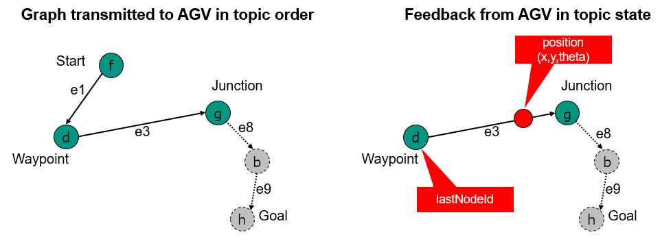

# :warning: **Working Version – Official version can be found on the VDA website!** :warning:

# Interface for the communication between automated guided vehicles (AGV) and a master control 

## VDA 5050

## Version 2.0.0

 


### Brief information

Definition of a communication interface for driverless transport systems (DTS).
This recommendation describes the communication interface for exchanging order and status data between a central master control and automated guided vehicles (AGV) for intralogistics processes.  


### Disclaimer 

The following explanations serve as an indication for the execution of an interface for communication between automated guided vehicles (AGV) and master control and one that is freely applicable to everyone and is non-binding.
Those who apply them must ensure that they are applied properly in the specific case.

They shall take into account the state of the art prevailing at the time of each issue.
By applying the proposals, no one is evasive of responsibility for their own actions. 
The statements do not claim to be exhaustive or to the exact interpretation of the existing legislation.
They may not replace the study of relevant policies, laws and regulations. 
Furthermore, the special features of the respective products as well as their different possible applications must be taken into account.
Everyone acts at his own risk in this regard.
Liability of the VDA and those involved in the development or application of the proposals is excluded.

If you encounter any inaccuracies in the application of the proposals or the possibility of an incorrect interpretation, please inform the VDA immediately so that any defects can be rectified.

**Publisher**
Verband der Automobilindustrie e.v. (VDA)
Behrenstrasse 35, 10117 Berlin 
www.vda.de

**Copyright**
Association of the Automotive Industry (VDA)
Reproduction and any other form of reproduction is only permitted with specification of the source.

Version 2.0


## Table of contents

[1 Foreword](#1-foreword)<br>
[2 Objective of the document](#2-objective-of-the-document)<br>
[3 Scope](#3-scope)<br>
[3.1 Other applicable documents](#31-other-applicable-documents)<br>
[4 Requirements and protocol definition](#4-requirements-and-protocol-definition)<br>
[5 Process and content of communication](#5-process-and-content-of-communication)<br>
[6 Protocol specification](#6-protocol-specification)<br>
[6.1 Symbols of the tables and meaning of formatting](#61-symbols-of-the-tables-and-meaning-of-formatting)<br>
[6.1.1 Optional fields](#611-optional-fields)<br>
[6.1.2 Permitted characters and field lengths](#612-permitted-characters-and-field-lengths)<br>
[6.1.3 Notation of enumerations](#613-notation-of-enumerations) <br>
[6.1.4 JSON Datatypes](#614-json-datatypes)<br>
[6.2 MQTT connection handling, security and QoS](#62-mqtt-connection-handling-security-and-qos)<br>
[6.3 MQTT-Topic Levels](#63-mqtt-topic-levels)<br>
[6.4 Protocol Header](#64-protocol-header)<br>
[6.5 Subtopics for communication](#65-subtopics-for-communication)<br>
[6.6 Topic: "order" (from master control to AGV)](#66-topic-orderfrom-master-control-to-agv)<br>
[6.6.1 Concept and Logic](#661-concept-and-logic)<br>
[6.6.2 Orders and order updates](#662-orders-and-order-update)<br>
[6.6.3 Order Cancellation (by Master Control)](#663-order-cancellation-by-master-control)<br>
[6.6.3.1 Receiving a new order after cancellation](#6631-receiving-a-new-order-after-cancellation)<br>
[6.6.3.2 Receiving a cancelOrder action when AGV has no order](#6632-receiving-a-cancelorder-action-when-agv-has-no-order)<br>
[6.6.4 Order rejection](#664-order-rejection)<br>
[6.6.4.1 Vehicle gets a malformed new order](#6641-vehicle-gets-a-malformed-new-order)<br>
[6.6.4.2 Vehicle receives an order with actions it cannot perform (e.g. lifting height higher than maximum lifting height, or lifting actions although no stroke is installed), or with fields that it cannot use (e.g. Trajectory)](#6642-vehicle-receives-an-order-with-actions-it-cannot-perform-eg-lifting-height-higher-than-maximum-lifting-height-or-lifting-actions-although-no-stroke-is-installed-or-with-fields-that-it-cannot-use-eg-trajectory)<br>
[6.6.4.3 Vehicle gets a new order with the same orderId but a lower orderUpdateId than the current orderUpdateId](#6643-vehicle-gets-a-new-order-with-the-same-orderid-but-a-lower-orderupdateid-than-the-current-orderupdateid)<br>
[6.6.5 Maps](#665-maps)<br>
[6.7 Implementation of the order message](#67-implementation-of-the-order-message)<br>
[6.8 Actions](#68-actions)<br>
[6.8.1 Predefined action definitions, their parameters, effects and scope](#681-predefined-action-definition-their-parameters-effects-and-scope)<br>
[6.8.2 Predefined action definitions, their parameters, effects and scope](#682-predefined-action-definitions-description-of-their-states)<br>
[6.9 Topic: "instantActions" (from master control to AGV)](#69-topic-instantactions-from-master-to-control-to-agv)<br>
[6.10 Topic: "state" (from AGV to master control)](#610-topic-state-from-agv-to-master-control)<br>
[6.10.1 Concept and Logic](#6101-concept-and-logic)<br>
[6.10.2 Traversal of nodes and entering/leaving edges, triggering of actions](#6102-traversal-of-nodes-and-enteringleaving-edges-triggering-of-actions)<br>
[6.10.3 Base request](#6103-base-request)<br>
[6.10.4 Information](#6104-information)<br>
[6.10.5 Errors](#6105-errors)<br>
[6.10.6 Implementation](#6106-implementation)<br>
[6.11 actionStates](#611-actionstates)<br>
[6.12 Action Blocking Types and sequence](#612-action-blocking-types-and-sequence)<br>
[6.13 Topic "visualization"](#613-topic-visualization)<br>
[6.14 Topic "connection"](#614-topic-connection)<br>
[6.15 Topic "factsheet"](#615-topic-factsheet)<br>
[7 Best practice](#7-best-practice)<br>
[7.1 Error reference](#71-error-reference)<br>
[7.2 Format of parameters](#72-format-of-parameters)<br>
[8 Glossary](#8-glossary)<br>
[8.1 Definition](#81-definition)<br>


# 1 Foreword 


The interface was established in cooperation between the Verband der Automobilindustrie e. V. (German abbreviation VDA) and Verband Deutscher Maschinen-und Anlagenbau e. V. (German abbreviation VDMA). 
The aim of both parties is to create an universally applicable interface. 
Proposals for changes to the interface shall be submitted to the VDA, are evaluated jointly with the VDMA and adopted into a new version status in the event of a positive decision.
The contribution to this document via GitHub is greatly appreciated.
The Repository can be found at the following link: http://github.com/vda5050/vda5050.


# 2 Objective of the document 

The objective of the recommendation is to simplify the connection of new vehicles to an existing master control and thus to integrate into an existing automated guided vehicles (AGV) system when used in the automotive industry and to enable parallel operation with AGV from different manufacturers and conventional systems (inventory systems) in the same working environment.

Uniform interface between master control and AGV shall be defined. 
In detail, this should be achieved by the following points: 

- Description of a standard for communication between AGV and master control and thus a basis for the integration of transport systems into a continuous process automation using co-operating transport vehicles.
- Increase in flexibility through, among other things, increased vehicle autonomy, process modules and interface, and preferably the separation of a rigid sequence of event-controlled command chains. 
- Reduction of implementation time due to high "Plug & Play" capability, as required information (e.g. order information) are provided by central services and are generally valid. Vehicles should be able to be put into operation independently of the manufacturer with the same implementation effort taking into account the requirements of occupational safety.
- Complexity reduction and increase of the "Plug & Play" capability of the systems through the use of uniform, overarching coordination with the corresponding logic for all transport vehicles, vehicle models and manufacturers.
- Increase in manufacturers independence using common interfaces between vehicle control and coordination level.
- Integration of proprietary DTS inventory systems by implementing vertical communication between the proprietary master control and the superordinate master control (cf.  Figure 1).


>Figure 1 Integration of DTS inventory systems

In order to implement the above-mentioned objectives, this document describes an interface for the communication of order and status information between AGV and master control.

Other interfaces required for operation between AGV and master control (e.g., for exchanging map information, taking special skills freely into account with regard to path planning, etc.) or for communicating with other system components (e.g., external peripherals, fire protection gates, etc.) are not initially included in this document. 


# 3 Scope

This recommendation contains definitions and best practice regarding communication between automated guided vehicles (AGVs) and master control.
The goal is to allow AGV with different characteristics (e.g., underrun tractor or fork lift AGV) to communicate with master control in uniform language. 
This creates the basis for operating any combination of AGV in a master control.
The master control provides orders and coordinates the AGV traffic.

The interface is based on the requirements from production and plant logistics in the automotive industry.
According to the formulated requirements, the requirements of intralogistics cover the requirements of the logistics department, i.e., the logistical processes from goods receiving to production supply to goods out, through control free navigating vehicles and guided vehicles.

In contrast to automated vehicles, autonomous vehicles solve problems that occur on the basis of the corresponding sensor system and algorithms independently and can react accordingly to changes in a dynamic environment or be adapted to them shortly afterwards. 
Autonomous properties such as the independent bypassing of obstacles can be fulfilled by free navigating vehicles as well as guided vehicles. 
However, as soon as the path planning is carried out on the vehicle itself, this document describes free navigating vehicles (see glossary).
Autonomous systems are not completely decentralized (swarm intelligence) and have defined behavior through predefined rules.

For the purpose of a sustainable solution, an interface is described below which can be expanded in its structure.
This should enable a complete coverage of the master control for vehicles that are guided. 
Vehicles that are free navigating can be integrated into the structure; a detailed specification required for this is not part of this recommendation.

For the integration of proprietary stock systems, individual definitions of the interface may be required, which are not considered as part of this recommendation.


## 3.1 Other applicable documents

Document (Dokument) | Description 
----------------------------------| ----------------
VDI Guideline 2510 | Driverless transport systems (DTS)
VDI Guideline 4451 Sheet 7 | Compatibility of driverless transport systems (DTS) - DTS master control 
DIN EN ISO 3691-4 | Industrial Trucks Safety Requirements and Verification-Part 4: Driverless trucks and their systems 


# 4 Requirements and protocol definition 

The communication interface is designed to support the following requirements: 

- Control of min. 1000 vehicles
- Enabling the integration of vehicles with different degrees of autonomy
- Enable decision, e.g., with regard to the selection of routes or the behavior at intersections 

Vehicles should transfer their status at a regular interval or when their status changes. 

Communication is done over wireless networks, taking into account the effects of connection failures and loss of messages. 

The message log is Message Queuing Telemetry Transport (MQTT), which is to be used in conjunction with a JSON structure.
MQTT 3.1.1 was tested during the development of this protocol and is the minimum required version for compatibility.
MQTT allows the distribution of messages to subchannels, which are called "topics". 
Participants in the MQTT network subscribe to these topics and receive information that concerns or interests them.

The JSON structure allows for a future extension of the protocol with additional parameters.
The parameters are described in English to ensure that the protocol is readable, comprehensible and applicable outside the German-speaking area.


# 5 Process and content of communication

As shown in the information flow to the operation of AGV, there are at least the following participants (see Figure 2): 

- the operator provides basic information
- the master control organizes and manages the operation 
- the AGV carries out the orders

Figure 2 describes the communication content during the operational phase.
During implementation or modification, the AGV and master control are manually configured. 


>Figure 2 Structure of the Information Flow

During the implementation phase, the driverless transport systems (DTS) consisting of master control and AGV is set up.
The necessary framework conditions are defined by the operator and the required information is either entered manually by him or stored in the master control by importing from other systems. 
Essentially, this concerns the following content:

- Definition of  routes: Using CAD import,  routes can be taken over in the master control.
Alternatively, routes can also be implemented manually in the master control by the operator.
Routes can be one-way streets,  restricted for certain vehicle groups (based on the size ratios), etc.
- Route network configuration:
Within the routes, stations for loading and unloading, battery charging stations, peripheral environments (gates, elevators, barriers), waiting positions, buffer stations, etc. are defined. 
- Vehicle configuration: The physical properties of an AGV (size, available load carrier mounts, etc.) are stored by the operator.
The AGV must communicate this information via the subtopic `factsheet` in a specific way that is defined in the [AGV Factsheet section](#factsheet) of this document.

The configuration of routes and the route network described above is not part of this document.
It forms the basis for enabling order control and driving course assignment by the master control based on this information and the transport requirements to be completed. 
The resulting orders for an AGV are then transferred to the vehicle via an MQTT message broker.
This then continuously reports its status to the master control in parallel with the execution of the job. 
This is also done using the MQTT message broker.

Functions of the master control are: 

- Assignment of orders to the AGV
- Route calculation and guidance of the AGV (taking into account the limitations of the individual physical properties of each AGV, e.g., size, maneuverability, etc.)
- Detection and resolution of blockages ("deadlocks")
- Energy management: Charging orders can interrupt transfer orders
- Traffic control: Buffer routes and waiting positions
- (temporary) changes in the environment, such as freeing certain areas or changing the maximum speed
- Communication with peripheral systems such as doors, gates, elevators, etc. 
- Detection and resolution of communication errors 

Functions of the AGV are: 

- Localization
- Navigation along associated routes (guided or autonomous) 
- Continuous transmission of vehicle status 

In addition, the integrator must take into account the following when configuring the overall system (incomplete list): 

- Map configuration: The coordinate systems of the master control and the AGV must be matched.
- Pivot point: The use of different points of the AGV or points of charge as a pivot point leads to different envelopes of the vehicle. The reference point may vary depending on the situation, e.g., it may be different for an AGV carrying a load and for an AGV that does not carry a load.


# 6 Protocol specification 

The following section describes the details of the communication protocol.
The protocol specifies the communication between the master control and the AGV.
Communication between the AGV and peripheral equipment, e.g., between the AGV and a gate, is excluded.

The different messages are presented in tables describing the contents of the fields of the JSON that is sent as an order, state, etc.

In addition, JSON schemas are available for validation in the public Git repository (https://github.com/VDA5050/VDA5050/json_schemas).
The JSON schemas are updated with every release of the VDA5050.


## 6.1 Symbols of the tables and meaning of formatting

The table contains the name of the identifier, its unit, its data type, and a description, if any.

Identification | Description [ENG]
---|----
standard | Variable is an elementary data type 
**bold** | Variable is a non-elementary data type (e.g., JSON-object or array) and defined separately
*italic* | Variable is optional 
[Square brackets] | Variable (here arrayName) is an array of the data type included in the square brackets (here the data type is squareBrackets)

All keywords are case sensitive.
All field names are in camelCase. 
All enumerations are in UPPERCASE.


### 6.1.1 Optional fields

If a variable is marked as optional, it means that it is optional for the sender because the variable might not be applicable in certain cases (e.g., when the master control sends an order to an AGV, some AGV plan their trajectory themselves and the field trajectory within the edge object of the order can be omitted). 

If the AGV receives a message that contains a field which is marked as optional in this protocol, the AGV is expected to act accordingly and cannot ignore the field. 
If the AGV cannot process the message accordingly then the expected behavior is to communicate this within an error message and to reject the order.

Master control shall only send optional information that the AGV supports.

Example: Trajectories are optional. 
If an AGV cannot process trajectories, master control shall not send a trajectory to the vehicle.

The AGV must communicate which optional parameters it needs via an AGV factsheet message.


### 6.1.2 Permitted characters and field lengths

All communication is encoded in UTF-8 to enable international adaption of descriptions.
The recommendation is that IDs should only use the following characters:

A-Z a-z 0-9 _ - . :

A maximum message length is not defined. 
If an AGV memory is insufficient to process an incoming order, it is to reject the order.
The matching of maximum field lengths, string lengths or value ranges is up to the integrator.
For ease of integration, AGV vendors must supply an AGV factsheet that is detailed in [section 7 - AGV Factsheet](#factsheet).


### 6.1.3 Notation of enumerations 

Enumerations must be written in uppercase. 
This includes keywords such as the states of the actions (WAITING, FINISHED, etc...) or values of the "direction" field (LEFT, RIGHT, 443MHZ, etc...).


### 6.1.4 JSON Datatypes 

Where possible, JSON data types must be used.
A Boolean value is thus encoded by "true / false", NOT with an enumeration (TRUE, FALSE) or magic numbers.
Numerical data types are specified with type and precision, e.g. float64 or uint32. Special number values from the IEEE 754 like NaN and infinity are not supported.


## 6.2 MQTT connection handling, security and QoS

The MQTT protocol provides the option of setting a last will message for a client.
If the client disconnects unexpectedly for any reason, the last will is distributed by the broker to other subscribed clients.
The use of this feature is described in section 6.14.

If the AGV disconnects from the broker, it keeps all the order information and fulfills the order up to the last released node. 

Protocol-Security needs to be taken in account by broker configuration.

To reduce the communication overhead, the MQTT QoS level 0 (Best Effort) is to be used for the topics `order`, `state`, `factsheet` and `visualization`.
The topic `connection` shall use the QoS level 1 (At Least Once).


## 6.3 MQTT-Topic Levels 

The MQTT-Topic structure is not strictly defined due to the mandatory topic structure of cloud providers.
For a cloud-based MQTT-Broker the topic structure has to be adapted individually to match the topics defined in this protocol. 
This means that the topic names defined in the following sections are mandatory.

For a local broker the MQTT topic levels are suggested as followed:

**interfaceName/majorVersion/manufacturer/serialNumber/topic**

Example: uagv/v2/KIT/0001/order


MQTT Topic Level | Data type | Description 
---|-----|-----
interfaceName | string | Name of the used interface 
majorVersion | string | Major version number, preceded by "v"
manufacturer | string | Manufacturer of the AGV (e.g., RobotCompany)
serialNumber | string | Unique AGV Serial Number consisting of the following characters: <br>A-Z <br>a-z <br>0-9 <br>_ <br>. <br>: <br>-
topic | string | Topic (e.g. Order or System State) see Cap. 6.5

Note: Since the `/` character is used to define topic hierarchies, it must not be used in any of the aforementioned fields.
The `$` character is also used in some MQTT brokers for special internal topics, so it should not be used either.

## 6.4 Protocol Header

Each JSON starts with a header.
In the following sections, the following fields will be referenced as header for readability. 
The header consists of the following individual elements. 
The header is not a JSON object.

Object structure/Identifier | Data type | Description 
---|---|---
headerId | uint32 | header ID of the message.<br> The headerId is defined per topic and incremented by 1 with each sent (but not necessarily received) message. 
timestamp | string | Timestamp (ISO 8601, UTC); YYYY-MM-DDTHH:mm:ss.ffZ (e.g.“2017-04-15T11:40:03.12Z”)
version | string | Version of the protocol [Major].[Minor].[Patch] (e.g. 1.3.2)
manufacturer | string | Manufacturer of the AGV 
serialNumber | string | Serial number of the AGV 

### Protocol version

The protocol version uses semantic versioning as versioning schema.

Examples for major version changes: 

- Breaking changes, e.g., new non-optional fields

Examples for minor version changes: 

- New features like an additional topic for visualization 

Examples for patch version: 

- Higher available precision for a batteryCharge 


## 6.5 Subtopics for communication

The AGV protocol uses the following topics for information exchange between master control and AGV

Subtopic name | Published by | Subscribed by | Used for | Implementation | Schema 
---|---|---|---|---|---
order | master control | AGV | Communication of driving orders from master control to the AGV | mandatory | order.schema 
instantActions | master control | AGV | Communication of the actions that are to be executed immediately | mandatory | instantActions.schema
state | AGV | master control | Communication of the AGV state | mandatory | state.schema
visualization | AGV | Visualization systems | Higher frequency of position topic for visualization purposes only | optional | visualization.schema
connection | Broker/AGV | master control | Indicates when AGV connection is lost, not to be used by master control for checking the vehicle health, added for an MQTT protocol level check of connection | mandatory | connection.schema 
factsheet | AGV | master control | Setup of AGV in master control | mandatory | factsheet.schema


## 6.6 Topic: "order"(from master control to AGV)

The topic "order" is the MQTT topic via which the AGV receives a JSON encapsulated order. 


### 6.6.1 Concept and Logic 

The basic structure of an order is a graph of nodes and edges.
The AGV is expected to traverse the nodes and edges to fulfill the order.
The full graph of all connected nodes and edges is held by master control.

The graph representation in the master control contains restrictions, e.g., which AGV is allowed to traverse which edge.
These restrictions will not be communicated to the AGV.
The master control only includes edges in an AGV order which the concerning AGV is allowed to traverse.

It is to be avoided that the master control has a separate graph representation for each type of AGV.
Whenever possible, one location, e.g., a waiting position in front of fire door, should only have one node for all types of AGV.
However, due to the different sizes and specifications of AGV, it might be necessary to deviate from this standard in certain situations.

 
>Figure 3 Graph representation in Master Control and graph transmitted in orders

The nodes and edges are passed as two lists in the order message.
The lists order also governs in which sequence the nodes and edges must be traversed.

For a valid order, at least one node must be present. 
The number of acceptable edges is the number of nodes minus one, not more or less.

The first node of an order must be trivially reachable for the AGV. 
This means either that the AGV is already standing on the node, or that the AGV is in the nodes deviation range.

Nodes and edges both have a boolean attribute “released”.
If a node or edge is released, the AGV is expected to traverse it. 
If a node or edge is not released, the AGV must not traverse it.

An edge only can be released, if both the start and end node of the edge are released.

After an unreleased edge, no released nodes or edges can follow in the sequence. 

The set of released nodes and edges are called the “base”. 
The set of unreleased nodes and edges are called the “horizon”.

It is valid to send an order without a horizon.

An order message does not necessarily describe the full transport order. 
For traffic control and to accommodate resource constrained vehicles, the full transport order (which might consist of many nodes and edges) can be split up into many sub-orders, which are connected via their orderId and orderUpdateId. 
The process of updating an order is described in the next section.


### 6.6.2 Orders and order update 

For traffic control the order-topic includes only the path to a decision point. 
Before reaching the decision point, the master control will send an updated path with additional path segments.
To communicate to the AGV what it will most likely have to do after reaching the decision point, an order consists of two separate parts: 

- <u>Drive to the decision point "Base":</u> The "Base" is the defined route that the AGV travels. All nodes and edges of the "Base" route have already been approved by the control panel for the vehicle. 
- <u>Estimated journey from the decision point "Horizon":</u> The "Horizon" is the route that the AGV is likely to drive, if there is no traffic jam. The "Horizon" route has not yet been approved by the control panel. However, the AGV will initially only travel to the last junction of the "Base" route.

Since MQTT is an asynchronous protocol and transmission via wireless networks is not reliable, it is important to note, that the "base" cannot be changed. 
The master control can therefore assume that the "base" is executed by the AGV.
A later section describes a procedure for cancelling an order, but this is also considered unreliable due to the communication restrictions mentioned above.

The master control has the possibility to change the driving commands of the "Horizon" route. 
Before the AGV arrives at the decision point via the "base" route, the master control will send an updated route to the AGV, which includes the other nodes. 
The procedure for changing the Horizon route is shown in Figure 4.


>Figure 4 Procedure for changing the driving route "Horizon"

In Figure 4, an initial job is first sent by the control panel at time t = 1.
Figure 5 shows the pseudocode of a possible job.
For the sake of readability, a complete JSON example has been omitted here.

```
{
	orderId: "1234"
	orderUpdateId:0,
	nodes: [
	 	 6 {released: True},
	 	 4 {released: True},
	 	 7 {released: True},
	 	 2 {released: False},
	 	 8 {released: False}
	],
	edges: [
		e1 {released: True},
		e3 {released: True},
		e8 {released: False},
		e9 {released: False}
	]
}
```
>Figure 5 Pseudocode of an order

At time t = 3, the order is updated by sending an extension of the order (see example in Figure 6). 
Note that the "orderUpdateId" is incremented and that the first node of the job update corresponds to the last shared base node of the previous order message.

This ensures that the AGV can also perform the job update, i.e., that the first node of the job update is reachable by executing the edges already known to the AGV.

```
}
	orderId: 1234,
	orderUpdateId: 1,
	nodes: [
		7 {released: True},
		2 {released: True},
		8 {released: True},
		9 {released: False}
	],
	edges: [
		e8 {released: True},
		e9 {released: True},
		e10 {released: False}
	]
}
```
>Figure 6 Pseudocode of an order update. Please look out for the change of the "orderUpdateId"

This also aids in the event that an orderUpdate goes missing (because of unreliable wireless network). 
The AGV can always check that the last known base node has the same nodeId (and nodeSequenceId, more on that later) as the first new base node.

Also note that node 7 is the only base node that is sent again.
Since the base cannot be changed, a retransmission of nodes 6 and 4 is not valid.

It is important, that the contents of the stitching node (node 7 in the example case) are not changed. 
For actions, deviation range, etc. the AGV must use the instructions provided in the first order (Figure 5, orderUpdateId 0).


>Figure 7 Regular update process - order extension

Figure 7 describes how an order should be extended.
It shows the information, that is currently available on the AGV. 
The orderId stays the same and the orderUpdateId is incremented. 

The last node of the previous base is the first base node in the updated order.
With this node the AGV can add the updated order onto the current order (stitching). 
The other nodes and edges from the previous base are not resent.

Master control has the option to make changes to the horizon by sending entirely different nodes as the new base.
The horizon can also be deleted.

To allow loops in orders (like going from node 1 to 2 and then back to 1) a sequenceId is assigned to the node and edge objects. 
This sequenceId runs over the nodes and edges (first node of an order receives a 0, the first edge then gets the 1, the second node then gets the 2, and so on). 
This allows for easier tracking of the order progress.

Once a sequenceId is assigned, it does not change with order updates (see Figure 7). 
This is necessary to determine on AGV side to which node the master control refers to. 

Figure 8 describes the process of accepting an order or orderUpdate.


>Figure 8 The process of accepting an order or orderUpdate

1)	**is received order valid?**:
All formatting and JSON data types are correct?

2)	**is received order new or an update of the current order?**:
Is `orderId` of the received order different to  `orderId` of order the vehicle currently holds?

3)	**is vehicle still executing an order or waiting for an update?**:
Is `nodeStates` not empty or is `actionStates` containing states which are neither FAILED or FINISHED? Nodes and edges and the corresponding action states of the order horizon are also included inside the state. Vehicle might still have a horizon and therefore waiting for an update and executing an order.

4) **is start of new order close enough to current position?**:	Is the vehicle already standing on the node, or is in the nodes deviation range (see also chapter 6.6.1)?

5) **is received order update deprecated?**: Is `orderUpdateId` smaller than the one currently on the vehicle?

6)	**is received order update currently on vehicle?**: Is `orderUpdateId` equal to the one currently on the vehicle?

7)	**is the received update a valid continuation of the currently still running order?**:	Is the first node of the received order equal to the current decision point (last node of the current base)? The vehicle is still moving or executing actions related to the base released in previous order updates or still has a horizon and is therefore waiting for a continuation of the order. In this case, the order update is only accpeted if the first node of the new base is equal to the last node of the previous base.

8)	**is the received update a valid continuation of the previously completed order?**: Is `nodeId` and `sequenceId` of the first node of the received order update equal to `lastNodeId` and `lastNodeSequenceId`? The vehicle is not executing any actions anymore neither is it waiting for a continuation of the order (meaning that it has completed its base with all related actions and does not have a horizon). The order update is now accepted if it continues from the last travesered node, therefore the first node of the new base needs to match the vehicle's `lastNodeId` as well as `lastNodeSequenceId`.

9)	populate/ append states	refers to the action-/node-/edgeStates.


### 6.6.3 Order Cancellation (by Master Control)

In the event of an unplanned change in the base nodes, the order must be canceled by using the instantAction cancelOrder.

After receiving the instantAction cancelOrder, the vehicle stops (based on its capabilities, e.g., right where it is or on the next node).

If there are actions scheduled, these actions must be cancelled and should report “failed” in their actionState. 
If there are running actions, those actions should be cancelled and also be reported as failed.
If the action cannot be interrupted, the actionState of that action should reflect that by reporting “running” while it is running, and after that the respective state (“finished”, if  successful and “failed”, if not).
While actions are running, the cancelOrder action must report “running”, until all actions are cancelled/finished. 
After all vehicle movements and all actions are stopped, the cancelOrder action status must report “finished”.

The orderId and orderUpdateId is kept. 

Figure 9 shows the expected behavior for different AGV capabilities.


>Figure 9 Expected behavior after a cancelOrder


#### 6.6.3.1 Receiving a new order after cancellation

After the cancellation of an order, the vehicle must be in a state to receive a new order. 

In the case of an AGV that localizes itself on nodes via a tag, the new order has to begin on the node the AGV is now standing on (see also Figure 5).

In case of an AGV that can stop in-between nodes, the choice is up to master control how the next order should be started. 
The AGV must accept both methods.

There are two options:

- Send an order, where the first node is a temporary node that is positioned where the AGV currently stands. The AGV must then realize that this node is trivially reachable and accept the order.
- Send an order, where the first node is the last traversed node of the previous order but set the deviation range so large that the AGV is within this range. Thus, the AGV must realize that this node must be counted as traversed and accept the order.


#### 6.6.3.2 Receiving a cancelOrder action when AGV has no order

If the AGV receives a cancelOrder action but the AGV currently has no order, or the previous order was cancelled, the cancelOrder action must report as failed.

The AGV must report a “noOrderToCancel” error with the errorLevel set to warning. 
The actionId of the instantAction must be passed as an errorReference.


### 6.6.4 Order rejection

There are several scenarios, when an order must be rejected. 
These are explained in Figure 8.


#### 6.6.4.1 Vehicle gets a malformed new order

Resolution:

1. Vehicle does NOT take over the new order in its internal buffer. 
2. The vehicle reports the warning "validationError"
3. The warning must be reported until the vehicle has accepted a new order.


#### 6.6.4.2 Vehicle receives an order with actions it cannot perform (e.g. lifting height higher than maximum lifting height, or lifting actions although no stroke is installed), or with fields that it cannot use (e.g. Trajectory)

Resolution: 

1. Vehicle does NOT take over the new order in its internal buffer 
2. Vehicle reports the warning "orderError" with the wrong fields as error references
3. The warning must not be reported until the vehicle has accepted a new order. 


#### 6.6.4.3 Vehicle gets a new order with the same orderId, but a lower orderUpdateId than the current orderUpdateId

Resolution: 

1. Vehicle does NOT take over the new order in its internal buffer. 
2. Vehicle keeps the PREVIOUS order in its buffer. 
3. The vehicle reports the warning "orderUpdateError"
4. The vehicle continues with the executing the previous order. 

If the AGV receives an order with the same orderId and orderUpdateId twice, the second order will be ignored. 
This might happen, if the master control sends the order again, because the status message came too late and the master control could not verify that the first order was received.


### 6.6.5 Maps

To ensure consistent navigation among different types of AGV, the position is always specified in reference to the local map coordinate system (see Figure 10).
For the differentiation between different levels a unique mapId is used.
The map coordinate system is to be specified as a right-handed coordinate system with the z-axis pointing skywards. 
A positive rotation therefore is to be understood as a counterclockwise rotation. 
The vehicle coordinate system is also specified as a right-handed coordinate system with the x-axis pointing in the forward direction of the vehicle and the z-axis pointing skywards. 
This is in accordance with chapter 2.11 in DIN ISO 8855.


>Figure 10 Coordinate system with sample AGV and orientation

The X, Y and Z coordinates must be in meters. 
The orientation must be in radians and must be within +Pi and –Pi.


>Figure 11 Coordinate systems for map and vehicle


## 6.7 Implementation of the order message

Object structure | Unit | Data type | Description 
---|---|---|---
headerId | | uint32 | Header ID of the message.<br> The headerId is defined per topic and incremented by 1 with each sent (but not necessarily received) message. 
timestamp | | string | Timestamp (ISO 8601, UTC); YYYY-MM-DDTHH:mm:ss.ffZ (e.g.“2017-04-15T11:40:03.12Z”)
version | | string | Version of the protocol [Major].[Minor].[Patch] (e.g. 1.3.2)
manufacturer | | string | Manufacturer of the AGV 
serialNumber | | string | Serial number of the AGV 
orderId |  | string | Order identification.<br> This is to be used to identify multiple order messages that belong to the same order. 
orderUpdateId |  | uint32 | Order update identification.<br>Is unique per orderId.<br>If an order update is rejected, this field is to be passed in the rejection message
zoneSetId |  | string | Unique identifier of the zone set, that the AGV has to use for navigation or that was used by master control for planning. <br> <br> Optional: Some master control systems do not use zones.<br> Some AGV do not understand zones.<br> Do not add to message, if no zones are used. 
**nodes [node]** |  | array | Array of nodes objects to be traversed for fulfilling the order. <br>One node is enough for a valid order. <br>Leave edge list empty for that case. 
**edges [edge]** |  | array | Array of edge objects to be traversed for fulfilling the order. <br>One node is enough for a valid order. <br>Leave edge list empty for that case.

Object structure | Unit | Data type | Description
---|---|---|---
**node** { |  | JSON-object|   
nodeId |   |  string | Unique node identification
sequenceId |  | uint32 | Number to track the sequence of nodes and edges in an order and to simplify order updates. <br>The main purpose is to distinguish between a node, which is passed more than once within one orderId. <br>The variable sequenceId runs across all nodes and edges of the same order and is reset when a new orderId is issued. 
*nodeDescription* |  | string | Additional information on the node 
released |  | boolean | "true" indicates that the node is part of the base. <br> "false" indicates that the node is part of the horizon. 
***nodePosition*** |  | JSON-object | Node position. <br>Optional for vehicle-types that do not require the node position (e.g., line-guided vehicles).
**actions [action]** <br> } |  | array | Array of actions to be executed on a node. <br>Empty array, if no actions required. 

Object structure | Unit | Data type | Description 
---| --- |--- | ---
**nodePosition** { |  | JSON-object | Defines the position on a map in a global project specific world coordinate system. <br>Each floor has its own map. <br>All maps must use the same project specific global origin. 
x | m | float64 | X-position on the map in reference to the map coordinate system. <br>Precision is up to the specific implementation. 
y | m | float64 | Y-position on the map in reference to the map coordinate system. <br>Precision is up to the specific implementation. 
*theta* | rad | float64 | Range: [-Pi ... Pi] <br><br>Absolute orientation of the AGV on the node.<br> Optional: vehicle can plan the path by itself.<br>If defined, the AGV has to assume the theta angle on this node.<br>If previous edge disallows rotation, the AGV must rotate on the node.<br>If following edge has a differing orientation defined but disallows rotation, the AGV is to rotate on the node to the edges desired rotation before entering the edge.
*allowedDeviationXY* | m | float64 | Indicates how exact an AGV has to drive over a node in order for it to count as traversed. <br><br> If = 0: no deviation is allowed (no deviation means within the normal tolerance of the AGV manufacturer). <br><br> If > 0: allowed deviation-radius in meters. <br>If the AGV passes a node within the deviation-radius, the node is considered to have been traversed.
*allowedDeviationTheta* | rad | float64 | Range: [0.0 ... Pi] <br><br> Indicates how big the deviation of theta angle can be. <br>The lowest acceptable angle is theta - allowedDeviationTheta and the highest acceptable angle is theta + allowedDeviationTheta.
mapId |  | string | Unique identification of the map in which the position is referenced. <br> Each map has the same project specific global origin of coordinates. <br>When an AGV uses an elevator, e.g., leading from a departure floor to a target floor, it will disappear off the map of the departure floor and spawn in the related lift node on the map of the target floor.
*mapDescription* <br> } |  | string | Additional information on the map.

Object structure | Unit | Data type | Description 
---|---|---|---
**action** { |  | JSON-object | Describes an action that the AGV can perform. 
actionType |  | string | Name of action as described in the first column of “Actions and Parameters”. <br> Identifies the function of the action. 
actionId |  | string | Unique ID to identify the action and map them to the actionState in the state. <br>Suggestion: Use UUIDs.
*actionDescription* |  | string | Additional information on the action
blockingType |  | string | Enum {NONE, SOFT, HARD}: <br> "NONE"- allows driving and other actions;<br>"SOFT"- allows other actions, but not driving;<br>"HARD"- is the only allowed action at that time.
***actionParameters [actionParameter]*** <br><br> } |  | array | Array of actionParameter-objects for the indicated action, e.g., deviceId, loadId, external Triggers. <br><br> See "Actions and Parameters"

Object structure | Unit | Data type | Description 
---|---|---|---
**edge** { |  | JSON-object | Directional connection between two nodes.
edgeId |  | string | Unique edge identification.
sequenceId |  | uint32 | Number to track the sequence of nodes and edges in an order and to simplify order updates. <br>The variable sequenceId runs across all nodes and edges of the same order and is reset when a new orderId is issued.
*edgeDescription* |  | string | Additional information on the edge.
released |  | boolean | "true" indicates that the edge is part of the base.<br>"false" indicates that the edge is part of the horizon. 
startNodeId |  | string | nodeId of startNode.
endNodeId |  | string | nodeId of endNode.
*maxSpeed* | m/s | float64 | Permitted maximum speed on the edge. <br>Speed is defined by the fastest measurement of the vehicle.
*maxHeight* | m | float64 | Permitted maximum height of the vehicle, including the load, on edge.
*minHeight* | m | float64 | Permitted minimal height of the load handling device on the edge.
*orientation* | rad | float64 | Orientation of the AGV on the edge. The value *orientationType* defines if it has to be interpreted relative to the global project specific map coordinate system or tangential to the edge. In case of interpreted tangential to the edge 0.0 = forwards and PI = backwards. <br>Example: orientation Pi/2 rad will lead to a rotation of 90 degrees.<br><br>If AGV starts in different orientation, rotate the vehicle on the edge to the desired orientation if rotationAllowed is set to “true”.<br>If rotationAllowed is “false", rotate before entering the edge.<br>If that is not possible, reject the order.<br><br>If no trajectory is defined, apply the rotation to the direct path between the two connecting nodes of the edge.<br>If a trajectory is defined for the edge, apply the orientation to the trajectory. 
*orientationType* |  | string | Enum {`GLOBAL`, `TANGENTIAL`}: <br>"GLOBAL"- relative to the global project specific map coordinate system;<br>"TANGENTIAL"- tangential to the edge.<br><br>If not defined, the default value is "TANGENTIAL".
*direction* |  | string | Sets direction at junctions for line-guided or wire-guided vehicles, to be defined initially (vehicle-individual).<br> Examples: left,  right, straight, 433MHz.
*rotationAllowed* |  | boolean | “true”: rotation is allowed on the edge.<br>“false”: rotation is not allowed on the edge.<br><br>Optional:<br>No limit, if not set.
*maxRotationSpeed* | rad/s | float64| Maximum rotation speed<br><br>Optional:<br>No limit, if not set.
***trajectory*** |  | JSON-object | Trajectory JSON-object for this edge as a NURBS. <br>Defines the curve, on which the AGV should move between startNode and endNode.<br><br>Optional:<br>Can be omitted, if AGV cannot process trajectories or if AGV plans its own trajectory.
*length* | m | float64 | Length of the path from startNode to endNode<br><br>Optional:<br>This value is used by line-guided AGVs to decrease their speed before reaching a stop position. 
**actions [action]**<br><br><br> } |  | array | Array of actionIds to be executed on the edge. <br>Empty array, if no actions required. <br>An action triggered by an edge will only be active for the time that the AGV is traversing the edge which triggered the action. <br>When the AGV leaves the edge, the action will stop and the state before entering the edge will be restored.

Object structure | Unit | Data type | Description 
---|---|---|---
**trajectory** { |  | JSON-object |  
degree |  | float64 | Range: [1.0 ... float64.max]<br><br>Defines the number of control points that influence any given point on the curve. Increasing the degree increases continuity.<br><br>If not defined, the default value is 1.
**knotVector [float64]** |  | array | Range: [0.0 ... 1.0]<br><br>Sequence of parameter values that determines where and how the control points affect the NURBS curve.<br><br>knotVector has size of number of control points + degree + 1.
**controlPoints [controlPoint]**<br><br> } |  | array | List of JSON controlPoint objects defining the control points of the NURBS, which includes the beginning and end point.

Object structure | Unit | Data type | Description 
---|---|---|---
**controlPoint** { |  | JSON-object |  
x |  | float64 | X coordinate described in the world coordinate system. 
y |  | float64 | Y coordinate described in the world coordinate system.
*weight* |  | float64 | Range: [0.0 ... float64.max]<br><br>The weight, with which this control point pulls on the curve.<br>When not defined, the default will be 1.0.
} |  |  |


## 6.8 Actions

If the AGV supports actions other than driving, these actions are executed via the action field that is attached to either a node or an edge, or sent via the separate topic instantActions (see 6.9).

Actions that are to be executed on an edge must only run while the AGV is on the edge (see 6.10.2).

Actions that are triggered on nodes can run as long as they need to run. 
Actions on nodes should be self-terminating (e.g., an audio signal that lasts for five seconds or a pick action, that is finished after picking up a load) or should be formulated pairwise (e.g., activateWarningLights and deactivateWarningLights), although there may be exceptions. 

The following section presents predefined actions that must be used by the AGV, if the AGVs capabilities map to the action description.
If there is a sensible way to use the defined parameters, they must be used. 
Additional parameters can be defined, if they are needed to execute an action successfully.

If there is no way to map some action to one of the actions of the following section, the AGV manufacturer can define additional actions that must be used by master control.


### 6.8.1 Predefined action definition, their parameters, effects and scope

general |  | scope 
:---:|--- | :---:
action, counter action, Description, idempotent, Parameter | linked state |  instant, node, edge 

action | counter action | Description | idempotent | Parameter | linked state | instant | node | edge
---|---|---|---|---|---|---|---|---
startPause | stopPause | Activates the pause mode. <br>A linked state is required, because many AGVs can be paused by using a hardware switch. <br>No more AGV driving movements - reaching next node is not necessary.<br>Actions can continue. <br>Order is resumable. | yes | - | paused | yes | no | no 
stopPause | startPause | Deactivates the pause mode. <br>Movement and all other actions will be resumed (if any).<br>A linked state is required because many AGVs can be paused by using a hardware switch. <br>stopPause can also restart vehicles that were stopped with a hardware button that triggered startPause (if configured). | yes | - | paused | yes | no | no 
startCharging | stopCharging | Activates the charging process. <br>Charging can be done on a charging spot (vehicle standing) or on a charging lane (while driving). <br>Protection against overcharging is responsibility of the vehicle. | yes | - | .batteryState.charging | yes | yes | no
stopCharging | startCharging | Deactivates the charging process to send a new order. <br>The charging process can also be interrupted by the vehicle / charging station, e.g., if the battery is full. <br>Battery state is only allowed to be “false”, when AGV is ready to receive orders. | yes | - |.batteryState.charging | yes | yes | no
initPosition | - | Resets (overrides) the pose of the AGV with the given paramaters. | yes | x  (float64)<br>y  (float64)<br>theta  (float64)<br>mapId  (string)<br>lastNodeId  (string) | .agvPosition.x<br>.agvPosition.y<br>.agvPosition.theta<br>.agvPosition.mapId<br>.lastNodeId | yes | yes<br>(Elevator) | no 
stateRequest | - | Requests the AGV to send a new state report. | yes | - | - | yes | no | no 
logReport | - | Requests the AGV to generate and store a log report. | yes | reason<br>(string) | - | yes | no | no 
pick | drop<br><br>(if automated) | Request the AGV to pick a load. <br>AGVs with multiple load handling devices can process multiple pick operations in parallel. <br>In this case, the paramater lhd needs to be present (e.g. LHD1). <br>The paramater stationType informs how the pick operation is handled in detail (e.g., floor location, rack location, passive conveyor, active conveyor, etc.). <br>The load type informs about the load unit and can be used to switch field for example (e.g., EPAL, INDU, etc). <br>For preparing the load handling device (e.g., pre-lift operations based on the height parameter), the action could be announced in the horizon in advance. <br>But, pre-Lift operations, etc., are not reported as running in the AGV state, because the associated node is not released yet.<br>If on an edge, the vehicle can use its sensing device to detect the position for picking the node. | no |lhd (string, optional)<br>stationType (string)<br>stationName(string, optional)<br>loadType (string) <br>loadId(string, optional)<br>height (float64) (optional)<br>defines bottom of the load related to the floor<br>depth (float64) (optional) for forklifts<br>side(string) (optional) e.g. conveyor | .load | no | yes | yes 
drop | pick<br><br>(if automated) | Request the AGV to drop a load. <br>See action pick for more details. | no | lhd (string, optional)<br>stationType (string, optional)<br>stationName (string, optional)<br>loadType (string, optional)<br>loadId(string, optional)<br>height (float64, optional)<br>depth (float64, optional) <br>… | .load | no | yes | yes
detectObject | - | AGV detects object (e.g. load, charging spot, free parking position). | yes | objectType(string, optional) | - | no | yes | yes 
finePositioning | - | On a node, AGV will position exactly on a target.<br>The AGV is allowed to deviate from its node position.<br>On an edge, AGV will e.g. align on stationary equipment while traversing an edge.<br>InstantAction: AGV starts positioning exactly on a target. | yes | stationType(string, optional)<br>stationName(string, optional) | - | no | yes | yes
waitForTrigger | - | AGV has to wait for a trigger on the AGV (e.g. button press, manual loading). <br>Master control is responsible to handle the timeout and has to cancel the order if necessary. | yes | triggerType(string) | - | no | yes | no 
cancelOrder | - | AGV stops as soon as possible. <br>This could be immediately or on the next node. <br>Then the order is deleted. All actions are canceled. | yes | - | - | yes | no | no 
factsheetRequest | - | Requests the AGV to send a factsheet | yes | - | - | yes | no | no 


### 6.8.2 Predefined action definitions, description of their states 

action | action states 
---|---
  | initializing, running, paused, finished, failed 

action | initializing | running | paused | finished | failed
---|---|---|---|---|---
startPause | - | Activation of the mode is in preperation. <br>If the AGV supports an instant transition, this state can be omitted. | - | Vehicle stands still. <br>All actions will be paused. <br>The pause mode is activated. <br>The AGV reports .paused: true. | The pause mode can not be activated for some reason (e.g., overridden by hardware switch).
stopPause | - | Deactivation of the mode is in preparation. <br>If the AGV supports an instant transition, this state can be omitted. | - | The pause mode is deactivated. <br>All paused actions will be resumed. <br>The AGV reports .paused: false. | The pause mode can not be deactivated for some reason (e.g., overwritten by hardware switch). 
startCharging | - | Activation of the charging process is in progress (communication with charger is running). <br>If the AGV supports an instant transition, this state can be omitted. | - | The charging process is started. <br>The AGV reports .batteryState.charging: true. | The charging process could not be started for some reason (e.g., not aligned to charger). Charging problems should correspond with an error. 
stopCharging | - | Deactivation of the charging process is in progress (communication with charger is running). <br>If the AGV supports an instant transition, this state can be omitted. | - | The charging process is stopped. <br>The AGV reports .batteryState.charging: false | The charging process could not be stopped for some reason (e.g., not aligned to charger).<br> Charging problems should correspond with an error. 
initPosition | - | Initializing of the new pose in progress (confidence checks etc.). <br>If the AGV supports an instant transition, this state can be omitted. | - | The pose is reset. <br>The AGV reports <br>.agvPosition.x = x, <br>.agvPosition.y = y, <br>.agvPosition.theta = theta <br>.agvPosition.mapId = mapId <br>.agvPosition.lastNodeId = lastNodeId | The pose is not valid or can not be reset. <br>General localization problems should correspond with an error.
stateRequest | - | - | - | The state has been communicated | - 
logReport | - | The report is in generating. <br>If the AGV supports an instant generation, this state can be omitted. | - | The report is stored. <br>The name of the log will be reported in status. | The report can not be stored (e.g., no space).
pick | Initializing of the pick process, e.g., outstanding lift operations. | The pick process is running (AGV is moving into station, load handling device is busy, communication with station is running, etc.). | The pick process is being paused, e.g., if a safety field is violated. <br>After removing the violation, the pick process continues. | Pick is done. <br>Load has entered the AGV and AGV reports new load state. | Pick failed, e.g., station is unexpected empty. <br> Failed pick operations should correspond with an error.
drop | Initializing of the drop process, e.g., outstanding lift operations. | The drop process is running (AGV is moving into station, load handling device is busy, communication with station is running, etc.). | The drop process is being paused, e.g., if a safety field is violated. <br>After removing the violation the drop process continues. | Drop is done. <br>Load has left the AGV and AGV reports new load state. | Drop failed, e.g., station is unexpected occupied.  <br>Failed drop operations should correspond with an error. 
detectObject | - | Object detection is running. | - | Object has been detected. | AGV could not detect the object. 
finePositioning | - | AGV positions itself exactly on a target. | The fine positioning process is being paused, e.g., if a safety field is violated. <br>After removing the violation, the fine positioning continues. | Goal position in reference to the station is reached. | Goal position in reference to the station could not be reached. 
waitForTrigger | - | AGV is waiting for the Trigger | - | Trigger has been triggered. | waitForTrigger fails, if order has been canceled. 
cancelOrder | - | AGV is stopping or driving, until it reaches the next node. | - | AGV stands still and has canceled the order. | - 
factsheetRequest | - | - | - | The factsheet has been communicated | - 


## 6.9 Topic: "instantActions" (from master to control to AGV)

In certain cases, it is necessary to send actions to the AGV, that need to be performed immediately. 
This is made possible by publishing an instantAction message to the topic instantActions.
instantActions must not conflict with the content of the AGV’s current order (e.g., instantAction to lower fork, while order says to raise fork).

Some examples for which instant actions could be relevant are: 
- pause the AGV without changing anything in the current order;
- resume order after pause ;
- activate signal (optical, audio, etc.).

For additional information, see chapter 8 Best practices.

Object structure | | Data type | Description 
---|---|---|---
headerId | | uint32 | header ID of the message.<br> The headerId is defined per topic and incremented by 1 with each sent (but not necessarily received) message. 
timestamp | | string | Timestamp (ISO 8601, UTC); YYYY-MM-DDTHH:mm:ss.ffZ (e.g., “2017-04-15T11:40:03.12Z”)
version | | string | Version of the protocol [Major].[Minor].[Patch] (e.g., 1.3.2).
manufacturer | | string | Manufacturer of the AGV. 
serialNumber | | string | Serial number of the AGV.
actions [action] | | array | Array of actions that need to be performed immediately and are not part of the regular order. 

When an AGV receives an instantAction, an appropriate actionStatus is added to the actionStates array of the AGV state.
The actionStatus is updated according to the progress of the action.
See also Figure 12 for the different transitions of an actionStatus.


## 6.10 Topic: "state" (from AGV to master control)

The AGV-State will be transmitted on only one topic.
Compared to separate messages (e.g., for orders, battery-state and errors) using one topic will reduce the workload of the broker and the master control for handling messages, while also keeping the information about the AGV state synchronized.

AGV-State message will be published with occurrence of relevant events or at the latest every 30s via MQTT-broker to master control. 

Events that trigger the transmission of the state message are:
- Receiving an order 
- Receiving an order update 
- Changes in the load status 
- Errors or warnings 
- Driving over a node 
- Switching the operating mode 
- Change in the "driving" field 
- Change in the nodeStates, edgeStates or actionStates 

There should be an effort to curb the amount of communication.
If two events correlate with each other (e.g., the receiving of a new order usually forces an update of the node- and edgeStates; as does the driving over a node), it is sensible to trigger one state update instead of multiple.


### 6.10.1 Concept and Logic 

The order progress is tracked by the `nodeStates` and `edgeStates`. 
Additionally, if the AGV is able to derive its current position, it can publish its position via the “position” field.

If the AGV plans the path by itself, it must communicate its calculated trajectory (including base and horizon) in the form of a NURBS via the `trajectory` object in the state message, unless master control cannot use this field and it was agreed during integration, that this field must not be sent.
After nodes are released by master control, the AGV is not allowed to change its trajectory.

The `nodeStates` and `edgeStates` includes all nodes/edges, that the AGV still must traverse.

 
>Figure 12 Order Information provided by the state topic. Only the ID of the last node and the remaining nodes and edges are transmitted


### 6.10.2 Traversal of nodes and entering/leaving edges, triggering of actions 

The AGV decides on its own, when a node should count as traversed.
Generally, the AGV’s control point should be within the node’s `deviationRangeXY` and its orientation within `deviationRangeTheta`.

The AGV reports the traversal of a node by removing its `nodeState` from the `nodeStates` array and setting the `lastNodeId`, `lastNodeSequenceNumber` to the traversed node’s values.

As soon as the AGV reports the node as traversed, the AGV must trigger the actions associated with the node, if any.

The traversal of a node also marks the leaving of the edge leading up to the node. 
The edge must then be removed from the `edgeStates` and the actions that were active on the edge must be finished.

The traversal of the node also marks the moment, when the AGV enters the following edge, if there is one.
The edges actions must now be triggered. 
An exception to this rule is, if the AGV has to pause on the edge (because of a soft or hard blocking edge, or otherwise) – then the AGV enters the edge after it begins moving again.


>Figure 13 nodeStates, edgeStates, actionStates during order handling


### 6.10.3 Base request 

If the AGV detects, that its base is running low, it can set the `newBaseRequest` flag to `true` to prevent unnecessary braking.


### 6.10.4 Information 

The AGV can submit arbitrary additional information to master control via the `information` array.
It is up to the AGV how long it reports information via an information message.

Master control must not use the info messages for logic, it must only be used for visualization and debugging purposes.


### 6.10.5 Errors 

The AGV reports errors via the `errors` array. 
Errors have two levels: `WARNING` and `FATAL`.
A `WARNING` is a self-resolving error, e.g., a field violation. 
A `FATAL` error needs human intervention.
Errors can pass references that help with finding the cause of the error via the errorReferences array.


### 6.10.6 Implementation

Object structure | Unit | Data type | Description 
---|---|---|---
headerId | | uint32 | Header ID of the message.<br> The headerId is defined per topic and incremented by 1 with each sent (but not necessarily received) message. 
timestamp | | string | Timestamp (ISO 8601, UTC); YYYY-MM-DDTHH:mm:ss.ffZ (e.g.“2017-04-15T11:40:03.12Z”).
version | | string | Version of the protocol [Major].[Minor].[Patch] (e.g. 1.3.2).
manufacturer | | string | Manufacturer of the AGV.
serialNumber | | string | Serial number of the AGV.
orderId|  | string | Unique order identification of the current order or the previous finished order. <br>The orderId is kept until a new order is received. <br>Empty string (""), if no previous orderId is available. 
orderUpdateId |  | uint32 | Order Update Identification to identify, that an order update has been accepted by the AGV. <br>“0” if no previous orderUpdateId is available. 
*zoneSetId* |  |string | Unique ID of the zone set, that the AGV currently uses for path planning. <br>Must be the same as the one used in the order, otherwise the AGV has to reject the order.<br><br>Optional: If the AGV does not use zones, this field can be omitted.
lastNodeId |  | string | Node ID of last reached node or, if AGV is currently on a node, current node (e.g., „node7”). Empty string (""), if no lastNodeId is available.
lastNodeSequenceId |  | uint32 | Sequence ID of the last reached node or, if AGV is currently on a node, Sequence ID of current node. <br>"0" if no lastNodeSequenced is available.
**nodeStates [nodeState]** |  |array | Array of nodeState-Objects, that need to be traversed for fulfilling the order<br>(empty list if idle)
**edgeStates [edgeState]** |  |array | Array of edgeState-Objects, that need to be traversed for fulfilling the order<br>(empty list if idle)
***agvPosition*** |  | JSON-object | Current position of the AGV on the map.<br><br>Optional:<br><br>Can only be omitted for AGV without the capability to localize themselves, e.g., line guided AGVs.
***velocity*** |  | JSON-object | The AGV velocity in vehicle coordinates. 
***loads [load]*** |  | array | Loads, that are currently handled by the AGV.<br><br>Optional: If AGV cannot determine load state, leave the array out of the state. <br>If the AGV can determine the load state, but the array is empty, the AGV is considered unloaded.
driving |  | boolean | “true”: indicates, that the AGV is driving and/or rotating. Other movements of the AGV (e.g., lift movements) are not included here.<br><br>“false”: indicates that the AGV is neither driving nor rotating.
*paused* |  | boolean | “true”: AGV is currently in a paused state, either because of the push of a physical button on the AGV or because of an instantAction. <br>The AGV can resume the order.<br><br>“false”: The AGV is currently not in a paused state.
*newBaseRequest* |  | boolean | “true”: AGV is almost at the end of the base and will reduce speed, if no new base is transmitted. <br>Trigger for master control to send a new base.<br><br>“false”: no base update required.
*distanceSinceLastNode* | meter | float64 | Used by line guided vehicles to indicate the distance it has been driving past the „lastNodeId“. <br>Distance is in meters.
**actionStates [actionState]** |  | array | Contains a list of the current actions and the actions, which are yet to be finished. <br>This may include actions from previous nodes, that are still in progress.<br><br>When an action is completed, an updated state message is published with actionStatus set to finished and if applicable with the corresponding resultDescription. <br><br>The action state is kept until a new order is received.
**batteryState** |  | JSON-object | Contains all battery-related information.
operatingMode |  | string | Enum {AUTOMATIC, SEMIAUTOMATIC, MANUAL,  SERVICE,  TEACHIN}<br>For additional information, see the table OperatingModes in the chapter 6.10.6. 
**errors [error]** |  | array | Array of error-objects. <br>All active errors of the AGV should be in the list.<br>An empty array indicates that the AGV has no active errors.
***information [info]*** |  | array | Array of info-objects. <br>An empty array indicates, that the AGV has no information. <br>This should only be used for visualization or debugging – it must not be used for logic in master control.
**safetyState** |  | JSON-object | Contains all safety-related information. 

Object structure | Unit | Data type | Description 
---|---|---|---
**nodeState** { | JSON-object |  |
nodeId |  | string | Unique node identification.
sequenceId |  | uint32 | sequenceId to discern multiple nodes with same nodeId.
*nodeDescription* |  | string | Additional information on the node.
released|  | boolean | “true” indicates that the node is part of the base.<br>“false” indicates that the node is part of the horizon.
***nodePosition***<br><br>}|  | JSON-object | Node position. <br>The object is defined in chapter 6.6 <br>Optional: <br>Master control has this information. <br>Can be sent additionally, e. g. for debugging purposes.

Object structure | Unit | Data type | Description 
---|---|---|---
**edgeState** { |  | JSON-object |  |
edgeId |  | string | Unique edge identification.
sequenceId |  | uint32 | sequenceId to differentiate between multiple edges with the same edgeId.
*edgeDescription* |  | string | Additional information on the edge.
released |  | boolean | “true” indicates that the edge is part of the base.<br>“false” indicates that the edge is part of the horizon.
***trajectory*** <br><br>} |  | JSON-object | The trajectory is to be communicated as a NURBS and is defined in chapter 6.4<br><br>Trajectory segments are from the point, where the AGV starts to enter the edge, until the point, where it reports, that the next node was traversed.

Object structure | Unit | Data type | Description
---|---|---|---
**agvPosition** { |  | JSON-object | Defines the position on a map in world coordinates. Each floor has its own map.
positionInitialized |  | boolean | “true”: position is initialized.<br>“false”: position is not initialized.
*localizationScore* |  | float64 | Range: [0.0 ... 1.0]<br><br>Describes the quality of the localization and therefore, can be used, e.g. by SLAM-AGV to describe, how accurate the current position information is.<br><br>0.0: position unknown<br>1.0: position known<br><br>Optional for vehicles, that cannot estimate their localization score.<br><br>Only for logging and visualization purposes. 
*deviationRange* | m | float64 | Value for the deviation range of the position in meters.<br><br>Optional for vehicles that cannot estimate their deviation e.g. grid-based localization.<br><br>Only for logging and visualization purposes.
x | m | float64 | X-position on the map in reference to the map coordinate system. <br>Precision is up to the specific implementation.
y | m | float64 | Y-position on the map in reference to the map coordinate system. <br>Precision is up to the specific implementation.
theta |  | float64 | Range: [-Pi ... Pi]<br><br>Orientation of the AGV. 
mapId |  | string | Unique identification of the map in which the position is referenced.<br><br>Each map has the same origin of coordinates. <br>When an AGV uses an elevator, e.g., leading from a departure floor to a target floor, it will disappear off the map of the departure floor and spawn in the related lift node on the map of the target floor.
*mapDescription*<br>} |  | string | Additional information on the map. 

Object structure | Unit | Data type | Description 
---|---|---|---
**velocity** { |  | JSON-object |  
*vx* | m/s | float64 | The AGVs velocity in its x direction.
*vy* | m/s | float64 | The AGVs velocity in its y direction.
*omega*<br>}| Rad/s | float64 | The AGVs turning speed around its z axis.

Object structure | Unit | Data type | Description 
---|---|---|---
**load** { |  | JSON-object |  
*loadId* |  | string | Unique identification number of the load (e.g., barcode or RFID).<br><br>Empty field, if the AGV can identify the load, but didn’t identify the load yet.<br><br>Optional, if the AGV cannot identify the load.
*loadType* |  | string | Type of load.
*loadPosition* |  | string | Indicates, which load handling/carrying unit of the AGV is used, e.g., in case the AGV has multiple spots/positions to carry loads.<br><br>For example: “front”, “back”, “positionC1”, etc.<br><br>Optional for vehicles with only one loadPosition
***boundingBoxReference*** |  | JSON-object | Point of reference for the location of the bounding box. <br>The point of reference is always the center of the bounding box’s bottom surface (at height = 0) and is described in coordinates of the AGV’s coordinate system.
***loadDimensions*** |  | JSON-object | Dimensions of the load´s bounding box in meters. 
*weight*<br><br>} | kg | float64 | Range: [0.0 ... float64.max]<br><br>Absolute weight of the load measured in kg. 

Object structure | Unit | Data type | Description 
---|---|---|---
**boundingBoxReference** { |  | JSON-object | Point of reference for the location of the bounding box. <br>The point of reference is always the center of the bounding box’s bottom surface (at height = 0) and is described in coordinates of the AGV’s coordinate system.
x |  | float64 | x-coordinate of the point of reference. 
y |  | float64 | y-coordinate of the point of reference.
z |  | float 64 | z-coordinate of the point of reference. 
*theta*<br> } |  | float64 | Orientation of the loads bounding box. <br>Important for tugger, trains, etc. 

Object structure | Unit | Data type | Description 
---|---|---|---
**loadDimensions** { |  | JSON-object | Dimensions of the load´s bounding box in meters. 
length | m | float64 | Absolute length of the load´s bounding box. 
width | m | float64 | Absolute width of the load´s bounding box. 
*height* <br><br><br><br>}| m | float64 | Absolute height of the load´s bounding box.<br><br>Optional:<br><br>Set value only if known.

Object structure | Unit | Data type | Description 
---|---|---|---
**actionState** { |  | JSON-object |  
actionId |  |string  | action_ID
*actionType* |  | string | actionType of the action.<br><br>Optional: Only for informational or visualization purposes. Order knows the type.
*actionDescription* |  | string | Additional information on the current action. 
actionStatus |  | string | Enum {WAITING; INITIALIZING; RUNNING; PAUSED; FINISHED; FAILED}<br><br>WAITING: waiting for the trigger<br>(passing the mode, entering the edge)<br> PAUSED: paused by instantAction or external trigger<br>FAILED: action could not be performed. 
*resultDescription*<br><br><br><br>} |  | string | Description of the result, e.g., the result of a RFID-read.<br><br>Errors will be transmitted in errors.<br><br>Examples for results are given in 6.5

Object structure | Unit | Data type | Description 
---|---|---|---
**batteryState** { |  | JSON-object |  
batteryCharge | % | float64 | State of Charge: <br> if AGV only provides values for good or bad battery levels, these will be indicated as 20% (bad) and 80% (good). 
*batteryVoltage* | V | float64 | Battery Voltage.
*batteryHealth* | % | int8 | Range: [0 ... 100]<br><br>State of Health. 
charging |  | boolean | “true”: charging in progress.<br>“false”: AGV is currently not charging.
*reach* <br><br>}| m | uint32 | Range: [0 ... uint32.max]<br><br>Estimated reach with current State of Charge. 

Object structure | Unit | Data type | Description 
---|---|---|---
**error** { |  | JSON-object |  
errorType |  | string | Type/name of error 
***errorReferences [errorReference]*** |  | array | Array of references (e.g. nodeId, edgeId, orderId, actionId, etc.) to provide more information related to the error.<br>For additional information see „Best practices“ chapter 8.
*errorDescription* |  | string | Verbose description providing details and possible causes of the error. 
*errorHint* |  | string | Hint on how to approach or solve the reported error. 
errorLevel <br><br> }|  | string | Enum {WARNING, FATAL}<br><br>WARNING: AGV is ready to start (e.g. maintenance cycle expiration warning).<br>FATAL: AGV is not in running condition, user intervention required (e.g. laser scanner is contaminated).

<a id="errorReferenceImpl"></a>
Object structure | Unit | Data type | Description 
---|---|---|---
**errorReference** { |  | JSON-object |  
referenceKey |  | string | Specifies the type of reference used (e.g. "nodeId", "edgeId", "orderId", "actionId", etc.).
referenceValue <br>} |  | string | The value that belongs to the reference key. For example, the id of the node where the error occurred.

Object structure | Unit | Data type | Description 
---|---|---|--- 
**info** { |  | JSON-object |  
infoType |  | string | Type/name of information. 
*infoReferences [infoReference]* |  | array | Array of references. 
*infoDescription* |  | string | Info of description. 
infoLevel <br><br><br>}|  | string | Enum {DEBUG,INFO}<br><br>DEBUG: used for debugging.<br> INFO: used for visualization. 

Object structure | Unit | Data type | Description 
---|---|---|---
**infoReference** { |  | JSON-object |  
referenceKey |  | string | References the type of reference (e.g., headerId, orderId, actionId, etc.).
referenceValue <br>} |  | string | References the value, which belongs to the reference key.


Object structure | Unit | Data type | Description 
---|---|---|---
**safetyState** { |  | JSON-object |  
eStop |  | string | Enum {AUTOACK,MANUAL,REMOTE,NONE}<br><br>Acknowledge-Type of eStop:<br>AUTOACK: auto-acknowledgeable e-stop is activated, e.g., by bumper or protective field.<br>MANUAL: e-stop hast to be acknowledged manually at the vehicle.<br>REMOTE: facility e-stop has to be acknowledged remotely.<br>NONE: no e-stop activated.
fieldViolation<br><br>} |  | boolean | Protective field violation.<br>"true":field is violated<br>"false":field is not violated.

#### Operating Mode Description
The following description lists the operatingMode of the topic "states".

Identifier | Description 
---|---
AUTOMATIC | AGV is under full control of the master control. <br>AGV drives and executes actions based on orders from the master control.
SEMIAUTOMATIC | AGV is under control of the master control.<br> AGV drives and executes actions based on orders from the master control. <br>The driving speed is controlled by the HMI (speed can’t exceed the speed of automatic mode).<br>The steering is under automatic control (non-safe HMI possible).
MANUAL | Master control is not in control of the AGV. <br>Supervisor doesn’t send driving order or actions to the AGV. <br>HMI can be used to control the steering and velocity and handling device of the AGV. <br>Location of the AGV is sent to the master control. <br>When AGV enters or leaves this mode, it immediately clears all the orders (safe HMI required).
SERVICE | Master control is not in control of the AGV. <br>Master control doesn’t send driving order or actions to the AGV. <br>Authorized personnel can reconfigure the AGV. 
TEACHIN | Master control is not in control of the AGV. <br>Supervisor doesn’t send driving order or actions to the AGV. <br>The AGV is being taught, e.g., mapping is done by a master control.


## 6.11 actionStates

When an AGV receives an `action` (either attached to a `node` or `edge` or via an `instantAction`), it must represent this `action` with an `actionState` in its `actionStates` array.

`actionStates` describe in the field `actionStatus` at which stage of the actions lifecycle the action is.

Table 1 describes, which value the enum `actionStatus` can hold. 

actionStatus | Description 
---|---
WAITING | Action was received by AGV but the node where it triggers was not yet reached or the edge where it is active was not yet entered.
INITIALIZING | Action was triggered, preparatory measures are initiated.
RUNNING | The action is running.
PAUSED | The action is paused because of a pause instantAction or external trigger (pause button on AGV)
FINISHED | The action is finished. <br>A result is reported via the result.
FAILED | Action could not be finished for whatever reason.

>Table 1 The acceptable values for the actionStatus field

A state transition diagram is provided in Figure 14. 


>Figure 14 All possible status transitions for actionStates


## 6.12 Action Blocking Types and Sequence 

The order of multiple actions in a list define the sequence, in which those actions are to be executed. 
The parallel execution of actions is governed by their respective `blockingType`.

Actions can have three distinct blocking types, described in Table 2. 

blockingType | Description 
---|---
NONE | Action can be executed in parallel with other actions and while the vehicle is driving.
SOFT | Action can be executed in parallel with other actions. Vehicle must not drive.
HARD | Action must not be executed in parallel with other actions. Vehicle must not drive.

>Table 2 action blocking types

If there are multiple actions on the same node with different blocking types, Figure 15 describes how the AGV should handle these actions.


>Figure 15 Handling multiple actions


## 6.13 Topic "visualization" 

For a near real-time position update the AGV can broadcast its position and velocity on the subtopic `visualization`.

The structure of the position message is the same as the position and velocity message in the state.
For additional information see chapter 6.10 Implementation. 
The update rate for this topic is defined by the integrator.


## 6.14 Topic "connection"

During the connection of an AGV client to the broker, a last will topic and message can be set, which is published by the broker upon disconnection of the AGV client from the broker.
Thus, the master control can detect a disconnection event by subscribing the connection topics of all AGV.
The disconnection is detected via a heartbeat that is exchanged between the broker and the client. 
The interval is configurable in most brokers and should be set around 15 seconds.
The Quality of Service level for the `connection` topic shall be 1 - At Least Once.

The suggested last will topic structure is:

**uagv/v2/manufacturer/SN/connection**

The last will message is defined as a JSON encapsulated message with the following fields:

Identifier | Data type | Description 
---|---|---
headerId | uint32 | Header ID of the message. <br>The headerId is defined per topic and incremented by 1 with each sent (but not necessarily received) message.
timestamp | string | Timestamp (ISO8601, UTC); YYYY-MM-DDTHH:mm:ss.ffZ(e.g.“2017-04-15T11:40:03.12Z”).
version | string | Version of the protocol [Major].[Minor].[Patch] (e.g. 1.3.2).
manufacturer | string | Manufacturer of the AGV. 
serialNumber | string | Serial number of the AGV. 
connectionState | string | Enum {`ONLINE`, `OFFLINE`, `CONNECTIONBROKEN`}<br><br>`ONLINE`: connection between AGV and broker is active.<br><br>`OFFLINE`: connection between AGV and broker has gone offline in a coordinated way. <br><br> `CONNECTIONBROKEN`: The connection between AGV and broker has unexpectedly ended. 

The last will message will not be sent, when a connection is ended in a graceful way by using a MQTT disconnection command. 
The last will message is only sent by the broker, if the connection is unexpectedly interrupted.

**Note**: Due to the nature of the last will feature in MQTT, the last will message is defined during the connection phase between the AGV and the MQTT Broker.
As a result, the timestamp and headerId fields will always be outdated.

AGV wants to disconnect gracefully: 

1. AGV sends „uagv/v2/manufacturer/SN/connection“ with `connectionState` set to `OFFLINE`.
2. Disconnect the mqtt connection with a disconnect command.

AGV comes online: 

1. Set the last will to „uagv/v2/manufacturer/SN/connection“ with the field `connectionState` set to `CONNECTIONBROKEN`, when the mqtt connection is created.
2. Send the topic „uagv/v2/manufacturer/SN/connection“ with `connectionState` set to `ONLINE`.

All messages on this topic shall be sent with a retained flag.

When connection between the AGV and the broker stops unexpectedly, the broker will send the last will topic: „uagv/v2/manufacturer/SN/connection“ with the field `connectionState` set to `CONNECTIONBROKEN`.

## 6.15 Topic "factsheet"

The factsheet provides basic information about a specific AGV type series.
This information allows comparison of different AGV types and can be applied for the planning, dimensioning and simulation of an AGV system.
The factsheet also includes information about AGV communication interfaces which are required for the integration of an AGV type series into a VDA-5050-compliant master control.

The values for some fields in the AGV factsheet can only be specified during system integration, for example the assignment of project-specific load and station types, together with the list of station and load types which are supported by this AGV.

The factsheet is both intended as a human-readable document and for machine processing, e.g., an import by the master control application, and thus is specified as a JSON document.

The MC can request the factsheet from the AGV by sending the instant action:  `factsheetRequest`

All messages on this topic shall be sent with a retained flag.

### 6.15.1 Factsheet JSON strcture
The factsheet consists of the JSON-objects listed in the following table.

| **Field**                  | **data type** | **description**                                              |
| -------------------------- | ------------- | ------------------------------------------------------------ |
| headerId                   | uint32        | Header ID of the message. <br>The headerId is defined per topic and incremented by 1 with each sent (but not necessarily received) message. |
| timestamp                  | string        | Timestamp (ISO8601, UTC); YYYY-MM-DDTHH:mm:ss.ffZ(e.g.“2017-04-15T11:40:03.12Z”). |
| version                    | string        | Version of the protocol [Major].[Minor].[Patch] (e.g. 1.3.2). |
| manufacturer               | string        | Manufacturer of the AGV.                                     |
| serialNumber               | string        | Serial number of the AGV.                                     |
| **typeSpecification**      | JSON-object   | These parameters generally specify the class and the capabilities of the AGV. |
| **physicalParameters**     | JSON-object   | These parameters specify the basic physical properties of the AGV. |
| **protocolLimits**         | JSON-object   | Limits for length of identifiers, arrays, strings and similar in MQTT communication. |
| **protocolFeatures**       | JSON-object   | Supported features of VDA5050 protocol.                      |
| **agvGeometry**            | JSON-object   | Detailed definition of AGV geometry.                         |
| **loadSpecification**      | JSON-object   | Abstract specification of load capabilities.                 |                   |
| ***agvStatus*** | JSON-object   | Summary of current software, hardware and network configuration.                      |

#### typeSpecification

This JSON object describes general properties of the AGV type.

| **Field**           | **data type**   | **description** |
|---------------------|-----------------|-----------------|
| seriesName          | string          | Free text generalized series name as specified by manufacturer. |
| *seriesDescription* | string          | Free text human readable description of the AGV type series.    |
| agvKinematic        | string          | Simplified description of AGV kinematics-type.<br/> [DIFF, OMNI, THREEWHEEL]<br/>DIFF: differential drive<br/>OMNI: omni-directional vehicle<br/>THREEWHEEL: three-wheel-driven vehicle or vehicle with similar kinematics |
| agvClass            | string          | Simplified description of AGV class.<br/>[FORKLIFT, CONVEYOR, TUGGER, CARRIER]<br/>FORKLIFT: forklift.<br/>CONVEYOR: AGV with conveyors on it.</br>TUGGER: tugger.<br/>CARRIER: load carrier with or without lifting unit. |
| maxLoadMass         | float64         | [kg], Maximum loadable mass. |
| localizationTypes   | Array of String  | Simplified description of localization type.<br/>Example values:<br/>NATURAL: natural landmarks;<br/>REFLECTOR: laser reflectors;<br/>RFID: RFID-tags;<br/>DMC: data matrix code;<br/>SPOT: magnetic spots;<br/>GRID: magnetic grid.<br/>
| navigationTypes     | Array of String | List of path planning types supported by the AGV, sorted by priority.<br/>Example values:<br/>PHYSICAL_LINE_GUIDED: No path planning, AGV follows physical installed paths.<br/>VIRTUAL_LINE_GUIDED: AGV goes fixed (virtual) paths.<br/>AUTONOMOUS: AGV plans its path autonomously.|

#### physicalParameters

This JSON-object describes physical properties of the AGV.

| **Field**       | **data type** | **description**                                       |
|-----------------|---------------|-------------------------------------------------------|
| speedMin        | float64       | [m/s] Minimal controlled continuous speed of the AGV.  |
| speedMax        | float64       | [m/s] Maximum speed of the AGV.                        |
| accelerationMax | float64       | [m/s²] Maximum acceleration with maximum load.         |
| decelerationMax | float64       | [m/s²] Maximum deceleration with maximum load.         |
| heightMin       | float64       | [m] Minimum height of AGV.                             |
| heightMax       | float64       | [m] Maximum height of AGV.                             |
| width           | float64       | [m] Width of AGV.                                      |
| length          | float64       | [m] Length of AGV.                                     |

#### protocolLimits

This JSON-object describes the protocol limitations of the AGV.
If a parameter is not defined or set to zero then there is no explicit limit for this parameter.

| **Field**                     | **data type** | **description**                             |
|-------------------------------|---------------|---------------------------------------------|
| **maxStringLens** {           | JSON-object   | Maximum lengths of strings.                 |
| &emsp;*msgLen*                      | uint32        | Maximum MQTT message length                 |
| &emsp;*topicSerialLen*              | uint32        | Maximum length of serial-number part in MQTT-topics.<br/><br/>Affected parameters:<br/>order.serialNumber<br/>instantActions.serialNumber<br/>state.SerialNumber<br/>visualization.serialNumber<br/>connection.serialNumber   |
| &emsp;*topicElemLen*                | uint32        | Maximum length of all other parts in MQTT-topics.<br/><br/>Affected parameters:<br/>order.timestamp<br/>order.version<br/>order.manufacturer<br/>instantActions.timestamp<br/>instantActions.version<br/>instantActions.manufacturer<br/>state.timestamp<br/>state.version<br/>state.manufacturer<br/>visualization.timestamp<br/>visualization.version<br/>visualization.manufacturer<br/>connection.timestamp<br/>connection.version<br/>connection.manufacturer |
| &emsp;*idLen*                       | uint32        | Maximum length of ID-Strings.<br/><br/>Affected parameters:<br/>order.orderId<br/>order.zoneSetId<br/>node.nodeId<br/>nodePosition.mapId<br/>action.actionId<br/>edge.edgeId<br/>edge.startNodeId<br/>edge.endNodeId |
| &emsp;*idNumericalOnly*             | boolean          | If "true" ID-strings need to contain numerical values only. |
| &emsp;*enumLen*                     | uint32        | Maximum length of ENUM- and Key-Strings.<br/><br/>Affected parameters:<br/>action.actionType action.blockingType<br/>edge.direction<br/>actionParameter.key<br/>state.operatingMode<br/>load.loadPosition<br/>load.loadType<br/>actionState.actionStatus<br/>error.errorType<br/>error.errorLevel<br/>errorReference.referenceKey<br/>info.infoType<br/>info.infoLevel<br/>safetyState.eStop<br/>connection.connectionState                                               |
| &emsp;*loadIdLen*                   | uint32        | Maximum length of loadId Strings |
| }                             |               |                                  |
| **maxArrayLens** {            | JSON-object   | Maximum lengths of arrays.                                 |
| &emsp;*order.nodes*                 | uint32        | Maximum number of nodes per order processable by the AGV.  |
| &emsp;*order.edges*                 | uint32        | Maximum number of edges per order processable by the AGV.  |
| &emsp;*node.actions*                | uint32        | Maximum number of actions per node processable by the AGV. |
| &emsp;*edge.actions*                | uint32        | Maximum number of actions per edge processable by the AGV. |
| &emsp;*actions.actionsParameters*   | uint32        | Maximum number of parameters per action processable by the AGV. |
| &emsp;*instantActions*              | uint32        | Maximum number of instant actions per message processable by the AGV. |
| &emsp;*trajectory.knotVector*       | uint32        | Maximum number of knots per trajectory processable by the AGV. |
| &emsp;*trajectory.controlPoints*    | uint32        | Maximum number of control points per trajectory processable by the AGV. |
| &emsp;*state.nodeStates*            | uint32        | Maximum number of nodeStates sent by the AGV, maximum number of nodes in base of AGV. |
| &emsp;*state.edgeStates*            | uint32        | Maximum number of edgeStates sent by the AGV, maximum number of edges in base of AGV. |
| &emsp;*state.loads*                 | uint32        | Maximum number of load-objects sent by the AGV.                |
| &emsp;*state.actionStates*          | uint32        | Maximum number of actionStates sent by the AGV.                |
| &emsp;*state.errors*                | uint32        | Maximum number of errors sent by the AGV in one state-message. |
| &emsp;*state.informations*          | uint32        | Maximum number of informations sent by the AGV in one state-message.    |
| &emsp;*error.errorReferences*       | uint32        | Maximum number of error references sent by the AGV for each error.      |
| &emsp;*informations.infoReferences* | uint32        | Maximum number of info references sent by the AGV for each information. |
| }                             |               |                                                                        |
| **timing** {                  | JSON-object   | Timing information.                                            |
| &emsp;minOrderInterval              | float32       | [s], Minimum interval sending order messages to the AGV.        |
| &emsp;minStateInterval              | float32       | [s], Minimum interval for sending state-messages.               |
| &emsp;*defaultStateInterval*        | float32       | [s], Default interval for sending state-messages, *if not defined, the default value from the main document is used*. |
|  &emsp;*visualizationInterval*      | float32       | [s], Default interval for sending messages on visualization topic.       |
| }                             |               |                                                               |

#### protocolFeatures

This JSON object defines actions and parameters which are supported by the AGV.

| **Field**    | **data type** | **description**  |
|--------------|---------------|------------------|
| **optionalParameters** [**optionalParameter**] | Array of JSON-object | List of supported and/or required optional parameters.<br/>Optional parameters, that are not listed here, are assumed to be not supported by the AGV. |
| {            |               |                  |
| &emsp;parameter    | string        | Full name of optional parameter, e.g. “*order.nodes.nodePosition.allowedDeviationTheta”*.|
| &emsp;support      | enum      | Type of support for the optional parameter, the following values are possible:<br/>SUPPORTED: optional parameter is supported like specified.<br/>REQUIRED: optional parameter is required for proper AGV-operation. |
| &emsp;*description*| string        | Free-form text: description of optional parameter, e.g.:<ul><li>Reason, why the optional parameter ‘direction’ is necessary for this AGV-type and which values it can contain.</li><li>The parameter ‘nodeMarker’ must contain unsigned interger-numbers only.</li><li>NURBS-Support is limited to straight lines and circle segments.</li>|
| }            |               |                  |
| **agvActions** [**agvAction**] | Array of JSON-object | List of all actions with parameters supported by this AGV. This includes standard actions specified in VDA5050 and manufacturer-specific actions. |
| {            |               |                  |
| &emsp;actionType   | string        | Unique actionType corresponding to action.actionType. |
| &emsp;*actionDescription* | string  | Free-form text: description of the action. |
| &emsp;actionScopes | array of enum  | List of allowed scopes for using this action-type.<br/><br/>INSTANT: usable as instantAction.<br/>NODE: usable on nodes.<br/>EDGE: usable on edges.<br/><br/>For example: ```[„INSTANT“, „NODE“]```|
| &emsp;***actionParameters** [**actionParameter**]* | Array of JSON-object | List of parameters<br/>If not defined, the action has no parameters |
|&emsp;*{*     |               |                  |
|&emsp;&emsp;key     | string        | Key-String for Parameter. |
|&emsp;&emsp;valueDataType | enum    | Data type of Value, possible data types are: BOOL, NUMBER, INTEGER, FLOAT, STRING, OBJECT, ARRAY. |
|&emsp;&emsp;*description* | string  | Free-form text: description of the parameter. |
|&emsp;&emsp;*isOptional*  | boolean    | "true": optional parameter. |
|&emsp;*}*           |         |                          |
|*resultDescription* | string  | Free-form text: description of the resultDescription. |
|*}*                 |         |                          |

### agvGeometry

This JSON object defines the geometry properties of the AGV, e.g., outlines and wheel positions.

| **Field**                            | **data type**        | **description**                                        |
|--------------------------------------|----------------------|--------------------------------------------------------|
| ***wheelDefinitions** [**wheelDefinition**]* | Array of JSON-object | List of wheels, containing wheel-arrangement and geometry. |
| {                                    |                      |                                                        |
| &emsp;type                                 | enum                 | Wheel type<br/>```DRIVE, CASTER, FIXED, MECANUM```.     |
| &emsp;isActiveDriven                       | boolean                 | "true": wheel is actively driven (de: angetrieben).       |
| &emsp;isActiveSteered                      | boolean                 | "true": wheel is actively steered (de: aktiv gelenkt).    |
| &emsp;**position** {                           | JSON-object          |                                                        |
|&emsp;&emsp; x                              | float64              | [m], x-position in AGV-coordinate. system          |
|&emsp;&emsp; y                              | float64              | [m], y-position in AGV-coordinate. system          |
|&emsp;&emsp; *theta*                        | float64              | [rad], orientation of wheel in AGV-coordinate system Necessary for fixed wheels. |
| &emsp;}                                    |                      |                                                        |
| &emsp;diameter                             | float64              | [m], nominal diameter of wheel.                          |
| &emsp;width                                | float64              | [m], nominal width of wheel.                             |
| &emsp;*centerDisplacement*                 | float64              | [m], nominal displacement of the wheel’s center to the rotation point (necessary for caster wheels).<br/> If the parameter is not defined, it is assumed to be 0.            |
| &emsp;*constraints*                        | string               | Free-form text: can be used by the manufacturer to define constraints. |
| }                                    |                      |                                                        |
| ***envelopes2d** [**envelope2d**]*   | Array of JSON-object | List of AGV-envelope curves in 2D (german: „Hüllkurven“), e.g., the mechanical envelopes for unloaded and loaded state, the safety fields for different speed cases. |
| {                                    |                      |                                                        |
| &emsp;set                             | string               | Name of the envelope curve set.                         |
| &emsp;**polygonPoints**  **[polygonPoint]**         | Array of JSON-object | Envelope curve as a x/y-polygon polygon is assumed as closed and must be non-self-intersecting. |
| &emsp;{                                    |                      |                                                        |
|&emsp;&emsp; x                              | float64              | [m], x-position of polygon-point.                        |
|&emsp;&emsp; y                              | float64              | [m], y-position of polygon-point.                        |
| &emsp;}                                    |                      |                                                        |
| &emsp;*description*                        | string               | Free-form text: description of envelope curve set.   |
| *}*                                  |                      |                                                        |
| ***envelopes3d [envelope3d]***       | Array of JSON-object | List of AGV-envelope curves in 3D (german: „Hüllkurven“). |
| *{*                                  |                      |                                                        |
| &emsp;set                                  | string               | Name of the envelope curve set.                         |
| &emsp;format                               | string               | Format of data, e.g., DXF.                                |
| &emsp;***data***                           | JSON-object          | 3D-envelope curve data, format specified in 'format'.   |
| &emsp;*url*                                | string               | Protocol and url-definition for downloading the 3D-envelope curve data, e.g. <ftp://xxx.yyy.com/ac4dgvhoif5tghji>. |
| &emsp;*description*                        | string               | Free-form text: description of envelope curve set           |
| *}*                                  |                      |                                                        |

#### loadSpecification

This JSON object specifies load handling and supported load types of the AGV.

| **Field**                        | **data type**        | **description**                                                      |
|----------------------------------|----------------------|----------------------------------------------------------------------|
| *loadPositions*         | Array of String      | List of load positions / load handling devices.<br/>This lists contains the valid values for the oarameter “state.loads[].loadPosition” and for the action parameter “lhd” of the actions pick and drop.<br/>*If this list doesn’t exist or is empty, the AGV has no load handling device.* |
| ***loadSets [loadSet]*** | Array of JSON-object | list of load-sets that can be handled by the AGV                     |
| {                                    |                      |                                                        |
|&emsp; setName                 | string               | Unique name of the load set, e.g., DEFAULT, SET1, etc.                 |
|&emsp; loadType                | string               | Type of load, e.g., EPAL, XLT1200, etc.                                  |
|&emsp; *loadPositions*         | Array of String      | List of load positions btw. load handling devices, this load-set is valid for.<br/>*If this parameter does not exist or is empty, this load-set is valid for all load handling devices on this AGV.* |
|&emsp; ***boundingBoxReference***  | JSON-object          | Bounding box reference as defined in parameter loads[] in state-message. |
|&emsp; ***loadDimensions***        | JSON-object          | Load dimensions as defined in parameter loads[] in state-message.     |
|&emsp; *maxWeight*             | float64              | [kg], maximum weight of loadtype.                                      |
|&emsp; *minLoadhandlingHeight* | float64              | [m], minimum allowed height for handling of this load-type and –weight<br/>references to boundingBoxReference. |
|&emsp;  *maxLoadhandlingHeight* | float64              | [m], maximum allowed height for handling of this load-type and –weight<br/>references to boundingBoxReference. |
|&emsp; *minLoadhandlingDepth*  | float64              | [m], minimum allowed depth for this load-type and –weight<br/>references to boundingBoxReference. |
|&emsp; *maxLoadhandlingDepth*  | float64              | [m], maximum allowed depth for this load-type and –weight<br/>references to boundingBoxReference. |
|&emsp; *minLoadhandlingTilt*   | float64              | [rad], minimum allowed tilt for this load-type and –weight.            |
|&emsp; *maxLoadhandlingTilt*   | float64              | [rad], maximum allowed tilt for this load-type and –weight.            |
|&emsp; *agvSpeedLimit*         | float64              | [m/s], maximum allowed speed for this load-type and –weight.           |
|&emsp; *agvAccelerationLimit*  | float64              | [m/s²], maximum allowed acceleration for this load-type and –weight.   |
|&emsp; *agvDecelerationLimit*  | float64              | [m/s²], maximum allowed deceleration for this load-type and –weight.   |
|&emsp; *pickTime*              | float64              | [s], approx. time for picking up the load                  |
|&emsp; *dropTime*              | float64              | [s], approx. time for dropping the load.                    |
|&emsp; *description*           | string               | Free-form text: description of the load handling set.            |
| }                       |                      |                                                           |

#### agvStatus

This JSON-object details the software and hardware versions running on the vehicle, as well as a quick summary of network information.

| **Field**       | **data type** | **description**                                       |
|-----------------|---------------|-------------------------------------------------------|
| *versions[versionInfo]*       | Array of JSON-object       | List of key-value pair objects containing software and hardware information.  |
| {                               |                      |                                                        |
|&emsp; key                              | String              | Key of the software/hardware version used. (E.g softwareVersion)         |
|&emsp; value                              | String              | The version corresponding to the key. (E.g v1.12.4-beta)         |
| }                                    |                      |                                                        |
| *network*  {      | JSON-object       | Information about the vehicle's network connection.                        |
|&emsp;&emsp; *dnsServers*                              | Array of String              | List of Domain Name Servers (DNS) used by the vehicle.          |
|&emsp;&emsp; *ntpServers*                              | Array of String              | List of Network Time Protocol (NTP) servers used by the vehicle.         |
|&emsp;&emsp; *localIpAddress*                       | String              | The IP address under which the vehicle can be reached inside the network. |
|&emsp;&emsp; *netmask*                       | String              | The subnet mask used in the network configuration |
|&emsp;&emsp; *defaultGateway*                       | String              | The default gateway used by the vehicle |
| &emsp;}                                    |                      |                                                        |


# 7 Best practice

This section includes additional information, which helps in facilitating a common understanding concurrent with the logic of the protocol. 


## 7.1 Error reference 

If an error occurs due to an erroneous order, the AGV should return a meaningful error reference in the fields errorReference (see [6.10.6 Implementation](#errorReferenceImpl)).
This can include the following information:

- headerId
- Topic (order or instantAction)
- orderId and orderUpdateId if error was caused by an order update 
- actionId if error was caused by an action
- List of parameters if error was caused by erroneous action parameters 

If an action cannot be completed because of external factors (e.g. no load at expected position), the actionId should be referenced.


## 7.2 Format of parameters 

Parameters for errors, information, actions are designed as an array of JSON-Objects with key-value-pairs. 
Sample for the actionParameter of an action “someAction” with key-value-pairs for stationType and loadType:

"actionParameters":[
{"key":"stationType", "value": "floor"},
{"key": "loadType", "value": "pallet_eu"}
]

The reason for using the proposed scheme of “key”: “actualKey”, “value”: “actualValue” is to keep the implementation generic. 
This was thoroughly and controversially discussed in multiple meetings.


# 8 Glossary 


## 8.1 Definition

Concept | Description 
---|---
Free navigation AGV | Vehicles that use a map to plan their own path. <br>The master control sends only start and destination coordinates.<br>The vehicle sends its path to the master control.<br>When the communication to the master control is broken off, the vehicle is able to continue its journey.<br>Free-navigation vehicles may be allowed to bypass local obstacles.<br>It may also be possible that a fine adjustment of the receiving/dispensing position by the vehicle itself is carried out.
Guided vehicles (physical or virtual) | Vehicles that get their path sent by the master control. <br>The calculation of the path takes place in the master control.<br>When communication to the master control is broken off, the vehicle terminates its released nodes and edges (the "base") and then stops.<br>Guided vehicles may be allowed to bypass local obstacles.<br>It may also be possible that a fine adjustment of the receiving/dispensing position by the vehicle itself is carried out.
Central map | The maps that will be held centrally in the master control.<br> This is initially created and then used.<br> A future version of the interface will make it possible to transfer this map to the vehicles (e.g., for free navigation).
