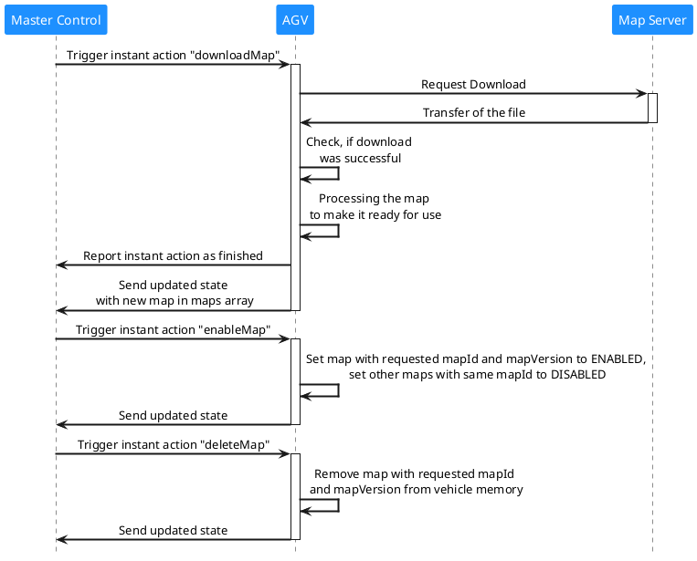

This markdown file is the original UML diagram from which map_distribution_process.png was created. Changes in the diagram can be tracked via changes in this file.

```plantuml
@startuml
!pragma teoz true
skinparam defaultTextAlignment center
skinparam participantFontColor white
skinparam noteFontColor white
skinparam participantBorderColor None
skinparam ArrowThickness 2
participant "Master Control" #dodgerblue
participant AGV #dodgerblue
participant "Map Server" #dodgerblue
hide footbox

"Master Control" -> "AGV": Trigger instant action "downloadMap"
activate AGV
AGV -> "Map Server": Request Download
activate "Map Server"
"Map Server" -> AGV: Transfer of the file
deactivate "Map Server"
AGV -> AGV: Check, if download\n was successful
AGV -> AGV: Processing the map\n to make it ready for use
AGV -> "Master Control": Report instant action as finished
AGV -> "Master Control": Send updated state\n with new map in maps array
deactivate AGV

"Master Control" -> "AGV": Trigger instant action "enableMap"
activate AGV
AGV -> AGV: Set map with requested mapId and mapVersion to ENABLED,\n set other maps with same mapId to DISABLED
"Master Control" <- "AGV": Send updated state
deactivate AGV

"Master Control" -> "AGV": Trigger instant action "deleteMap"
activate AGV
AGV -> AGV: Remove map with requested mapId\n and mapVersion from vehicle memory
"Master Control" <- "AGV": Send updated state
deactivate AGV
@enduml
```